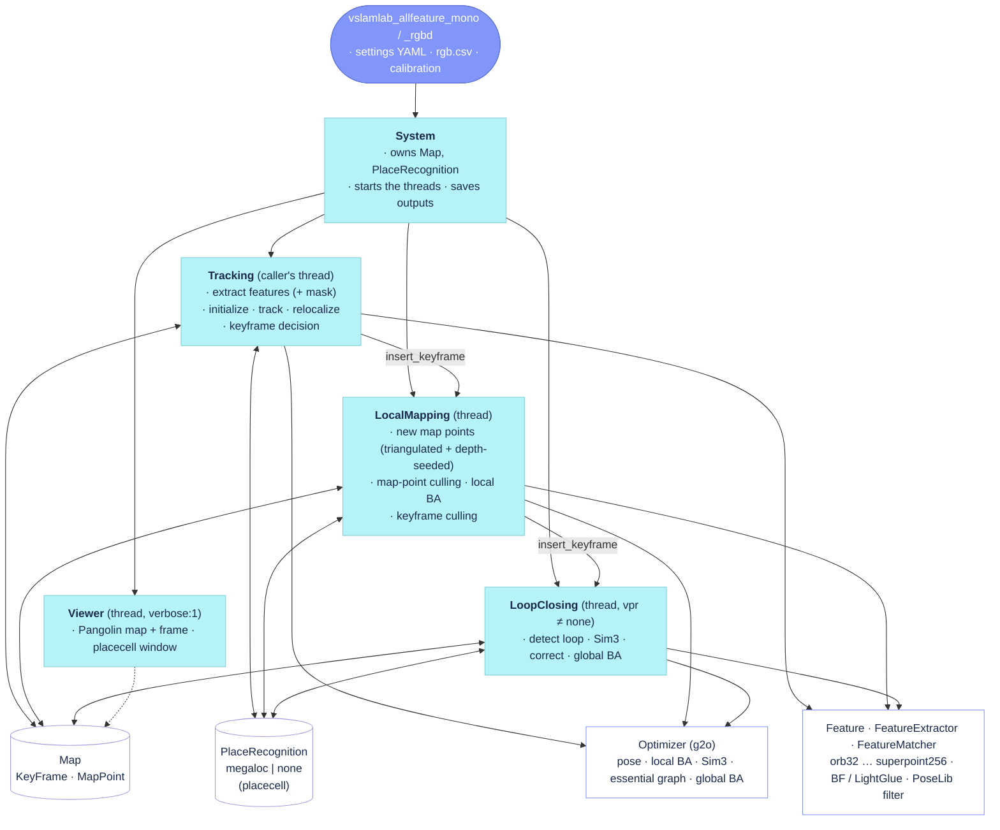

# AllFeature-VSLAM — code reference

Index of the per-file reference pages under [`docs/reference/`](docs/reference/) (format:
[`docs/reference/README.md`](docs/reference/README.md)). The same pages, with clickable diagrams,
are served by the documentation site built from `docs/` (see `mkdocs.yml`). The author's reading
notes are in [`docs/review/`](docs/review/), measured changes in [`docs/gym/`](docs/gym/), dated
investigations in [`docs/notes/`](docs/notes/), plans in [`docs/plans/`](docs/plans/).

## System

## Pages

| Page | Sources | Thread |
|---|---|---|
| [System](docs/reference/System.md) | `src/System.cc`, `include/System.h` | caller's |
| [Tracking](docs/reference/Tracking.md) | `src/Tracking.cc`, `src/Tracking_aux.cc`, `include/Tracking.h` | caller's (per frame) |
| [LocalMapping](docs/reference/LocalMapping.md) | `src/LocalMapping.cc`, `src/LocalMapping_aux.cc`, `include/LocalMapping.h` | local-mapping |
| [LoopClosing](docs/reference/LoopClosing.md) | `src/LoopClosing.cc`, `src/LoopClosing_aux.cc`, `include/LoopClosing.h` | loop-closing (+ GBA thread) |
| [Viewer](docs/reference/Viewer.md) | `src/Viewer.cc`, `include/Viewer.h` (+ `FrameDrawer`, `MapDrawer`) | viewer |

Components without a page yet (next in line, one per review session): `Frame` / `KeyFrame` /
`MapPoint` / `Map`, `FeatureExtractor` / `FeatureMatcher` / `BruteForceMatcher`, `Optimizer`,
`PlaceRecognition` / `PlaceRecognitionMegaLoc`, `Initializer`, `PnPsolver` / `Sim3Solver`,
`Image` / segmentation, the CLI entry points.
