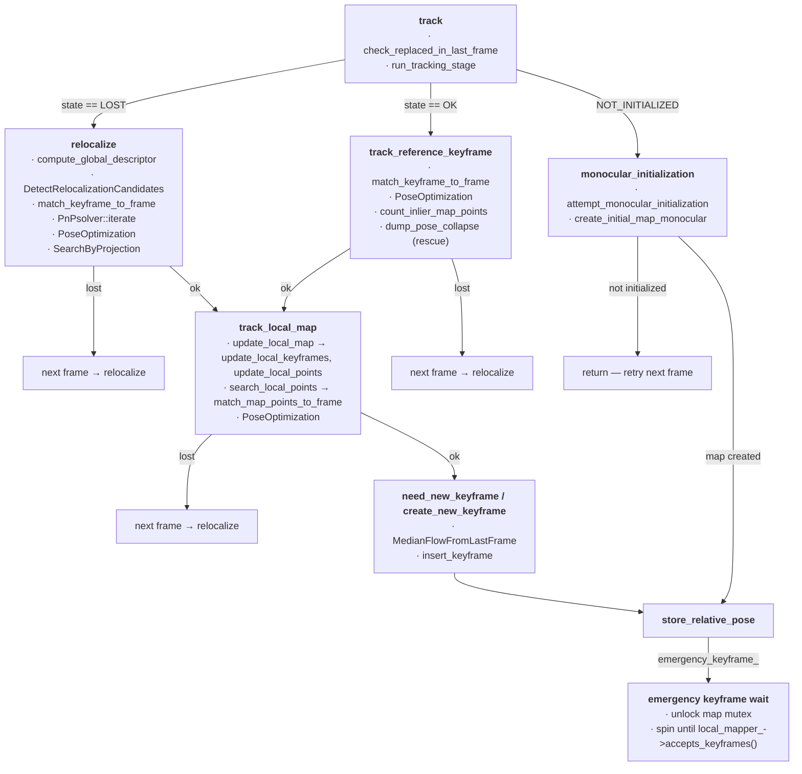
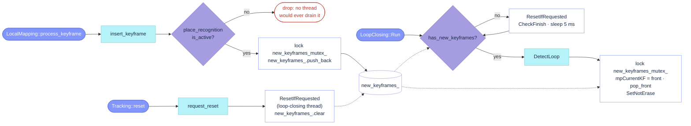
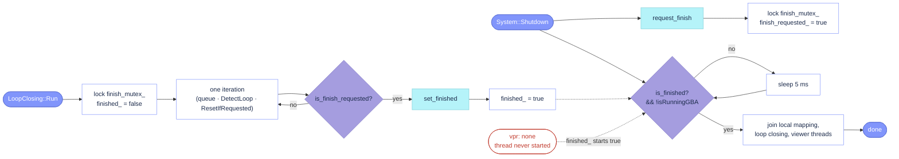

# AllFeature-VSLAM — `src/Tracking.cc`

## Call graph

- **[`track`](src/Tracking.cc#L117)** — [`check_replaced_in_last_frame`](src/Tracking.cc#L430)
- **[`relocalize`](src/Tracking.cc#L888)**
- **[`track_reference_keyframe`](src/Tracking.cc#L450)**
- **[`monocular_initialization`](src/Tracking.cc#L212)** — [`attempt_monocular_initialization`](src/Tracking.cc#L220), [`create_initial_map_monocular`](src/Tracking.cc#L318)
- **[`track_local_map`](src/Tracking.cc#L541)** — [`update_local_map`](src/Tracking.cc#L584), [`update_local_keyframes`](src/Tracking.cc#L593), [`update_local_points`](src/Tracking.cc#L676), [`search_local_points`](src/Tracking.cc#L699)
- **[`need_new_keyframe`](src/Tracking.cc#L734) / [`create_new_keyframe`](src/Tracking.cc#L840)** — [`MedianFlowFromLastFrame`](src/Tracking.cc#L855)
- **[`store_relative_pose`](src/Tracking.cc#L206)**
- Not in the graph (setup / recovery): [`LoadParameters`](src/Tracking.cc#L37), [`Tracking`](src/Tracking.cc#L56), [`loadCameraParameters`](src/Tracking.cc#L1149), [`ChangeCalibration`](src/Tracking.cc#L1116), [`get_feature_extractor`](src/Tracking_aux.cc#L91), [`grab_image`](src/Tracking.cc#L82), [`reset`](src/Tracking.cc#L1066)



# AllFeature-VSLAM — `src/LoopClosing.cc`

**Section:** [`# Keyframe queue`](src/LoopClosing.cc#L117)


```cpp
void LoopClosing::insert_keyframe(const Keyframe& keyframe)
```
- producer side of the loop-closing keyframe queue: appends the keyframe to `new_keyframes_` under `new_keyframes_mutex_`. Every keyframe is queued, keyframe 0 included (the stock ORB-SLAM2 `mnId != 0` filter is gone, so keyframe 0 enters the VPR database like any other).
- early-returns when the VPR backend is inactive (`vpr: none`): System's constructor then never starts the loop-closing thread ([`System.cc`](src/System.cc#L209)), so a queued keyframe would never be popped and its `shared_ptr` would pin the keyframe, culled or not, for the whole run.
- called from: `LocalMapping::process_keyframe` ([`LocalMapping.cc`](src/LocalMapping.cc#L105)), once per keyframe after its full mapping iteration (map points created and fused, local BA, keyframe culling), so the keyframe reaches loop detection already refined.

```cpp
bool LoopClosing::has_new_keyframes() const
```
- consumer-side poll: `!new_keyframes_.empty()` under the same mutex (`mutable`, so the query stays `const`). Only reports; the pop happens in `DetectLoop` ([`LoopClosing.cc`](src/LoopClosing.cc#L136)), which takes the front keyframe, marks it `SetNotErase` so culling cannot delete it mid-detection, and runs the loop pipeline on it.
- called from: `Run` ([`LoopClosing.cc`](src/LoopClosing.cc#L79)), once per 5 ms iteration; `false` means the thread only services `ResetIfRequested`/`CheckFinish` and sleeps.
- queue lifetime: cleared by `ResetIfRequested` (on the loop-closing thread, under the queue mutex) when `Tracking::reset` calls `request_reset`; that call returns at once when the backend is inactive, since no thread would ever clear the request.

**Section:** [`# Finish protocol`](src/LoopClosing.cc#L801)


```cpp
void LoopClosing::request_finish()
```
- raises `finish_requested_` under `finish_mutex_`. It only asks: `Run` notices at the end of its current iteration, so a loop closure in flight completes first. A running global BA is not stopped by this (inherited from ORB-SLAM2), which is why `Shutdown` also waits on `isRunningGBA()`.
- called from: `System::Shutdown` ([`System.cc`](src/System.cc#L401)), right after LocalMapping's `request_finish`.

```cpp
bool LoopClosing::is_finish_requested() const
```
- the thread's own poll of that flag, once per iteration in `Run` ([`LoopClosing.cc`](src/LoopClosing.cc#L107)) after `ResetIfRequested`; `true` breaks the loop. Protected: nobody outside the thread needs it.

```cpp
void LoopClosing::set_finished()
```
- publishes the exit: `finished_ = true` under the mutex, the last statement of `Run` ([`LoopClosing.cc`](src/LoopClosing.cc#L113)). Its counterpart at the top of `Run` ([`LoopClosing.cc`](src/LoopClosing.cc#L73)) clears the flag under the same mutex, so `Shutdown` can never read a stale `true` while the loop is alive.

```cpp
bool LoopClosing::is_finished() const
```
- what `Shutdown` spins on ([`System.cc`](src/System.cc#L410)), together with LocalMapping's `is_finished` and `isRunningGBA`. Starts `true` (`finished_{true}`): with `vpr: none` the thread is never started ([`System.cc`](src/System.cc#L209)) and the wait passes immediately.
- after the wait, `Shutdown` joins the three worker threads ([`System.cc`](src/System.cc#L418)). Nothing joined them before, so their `std::thread` objects were destroyed joinable with `System`, which is what `std::terminate` at exit looks like (issue #12).