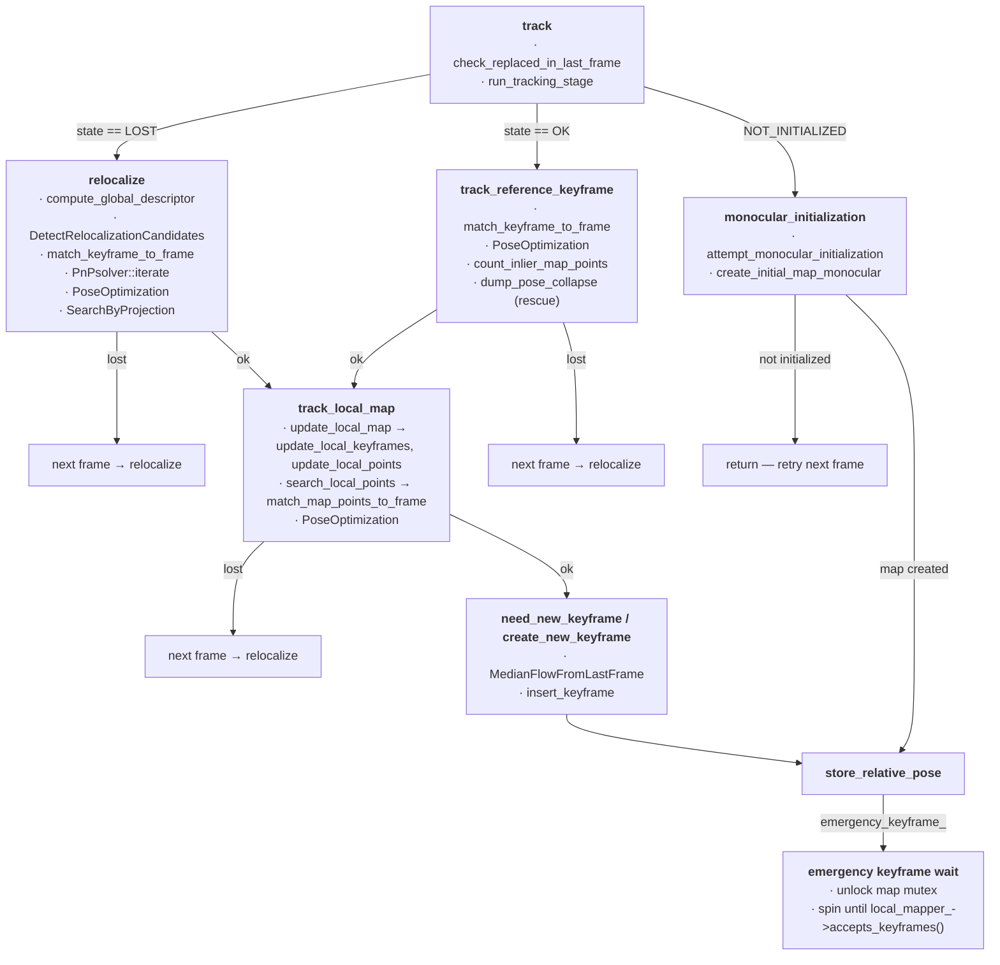

# AllFeature-VSLAM — `src/Tracking.cc`

Every function in `src/Tracking.cc`, grouped by role. (`run_tracking_stage`, `log_heartbeat`, `log_profile`, `dump_pose_collapse` live in `src/Tracking_aux.cc` and are referenced where called.)

---

## Setup / configuration

### `Tracking::LoadParameters(fSettings)` — static
Reads the `Tracking.Init*` keys from the settings `cv::FileStorage` into the static `params` struct, only overwriting a field if the key is present (missing keys keep compiled-in defaults).

```text
LoadParameters(fSettings)
└── for each Tracking.Init* key: if present in yaml → overwrite params field
    (InitMinKeypoints, InitSigma, InitMinMatches, InitRansacIterations,
     InitMinMedianDisparity, InitGbaIterations, InitMinTrackedPoints, InitMinDepthSamples)
```

### `Tracking::Tracking(...)` — constructor
```text
Tracking(vocabulary, drawers, map, keyframe_db, calibration, settings, feature_settings, sensor, featureTypes, fix_image_size)
├── loadCameraParameters(calibration, settings)
├── minFrames = 0; maxFrames = fps          # keyframe/reloc frame windows
├── for each feature type ft:
│   ├── feature_extractor_left_[ft] = getFeatureExtractor(1, ...)                        # normal
│   └── init_feature_extractor_[ft] = getFeatureExtractor(scaleNumFeaturesMonocular, ...) # denser, for init
└── matcher_ = FeatureMatcher(image size, featureTypes)
```

### `loadCameraParameters(calibrationPath, settingsPath)`
```text
loadCameraParameters()
├── read settings yaml → cam_mono name; find that camera in calibration yaml
├── build mK (intrinsics), image_width_/image_height_
├── if fix_image_size_ → rescale to ~307200 px area, scale mK accordingly
├── mDistCoef from distortion_coefficients (zeros if absent)
├── fps (fallback fps0 if 0), is_rgb_ from cam_type
└── AF_CONFIG print of all camera parameters
```

### `ChangeCalibration(settingsPath)`
Legacy ORB-SLAM2-style reload of `mK`/`mDistCoef`/`mbf` from flat `Camera.*` keys; sets `Frame::mbInitialComputations = true` so the next frame recomputes the undistortion grid.

### `getFeatureExtractor(scale, settingsYaml, featureType)` — static
Builds `FeatureExtractorSettings` from the per-feature yaml, multiplies `maxNumFeatures` by `scale`, and asks the `Feature` singleton (via `get_feature`) to `createExtractor`.

### `getGrayImage(im, rgb)` — static
3-channel → `RGB2GRAY`/`BGR2GRAY`, 4-channel → `RGBA2GRAY`/`BGRA2GRAY`, by the `rgb` flag.

---

## Per-frame pipeline

### `grab_image(im, timestamp)` — entry point per frame
```text
grab_image(im, timestamp) → Tcw
├── im.GetGrayImage(is_rgb_); if fix_image_size_ → im.FixImageSize()
├── stash gray_image_ / mask_image_ / image_name_
├── current_frame_ = Frame(im, timestamp, extractors, ...)   # feature extraction
│     extractors = init_feature_extractor_ if NOT_INITIALIZED/NO_IMAGES_YET
│                  else feature_extractor_left_
├── track()
├── viewer_->set_grab_image_time_median(...)   # if viewer
├── log_profile(); record grab_image_times_ if state_ == OK
└── return current_frame_.Tcw
```

### `track()` — per-frame state machine
```text
track()
├── NO_IMAGES_YET → NOT_INITIALIZED
├── lock map_->map_update_mutex_
├── NOT_INITIALIZED ── monocular_initialization() ─ return
└── initialized
    ├── state_ == OK ── check_replaced_in_last_frame()
    │                   ok = run_tracking_stage(track_reference_keyframe)   # catches TrackingLostException
    │  └── else (LOST) ── ok = relocalize()
    ├── ok ─── ok = run_tracking_stage(track_local_map)
    ├── state_ = ok ? OK : LOST
    ├── frame_drawer_->update(this)
    ├── ok:
    │   ├── log_heartbeat(); map_drawer_->set_current_camera_pose()
    │   ├── current_frame_.drop_unobserved_points()
    │   ├── need_new_keyframe() ── create_new_keyframe()
    │   └── current_frame_.drop_outlier_points()   # outliers stay only for the new KF's BA
    ├── last_frame_ = Frame(current_frame_)
    ├── store_relative_pose()
    └── emergency_keyframe_ ── unlock, spin until local_mapper_->accepts_keyframes()
```

### `store_relative_pose()`
```text
store_relative_pose()
└── pose valid (Tcw(3,3)==1) → last_frame_relative_pose_ = Tcw * ref_keyframe⁻¹   # Tlr
      # lost frames store nothing: the seed that consumes this is only reached
      # when the previous frame tracked OK
```

---

## Initialization

### `monocular_initialization()`
Wrapper: `attempt_monocular_initialization()`, then `frame_drawer_->update()`, and if the map was just created (`state_ == OK`) stores the first relative pose via `store_relative_pose()`.

### `attempt_monocular_initialization()`
```text
attempt_monocular_initialization()
├── no initializer_ yet:
│   └── total keypoints > init_min_keypoints → set initial_frame_, create Initializer, return
└── have a reference frame:
    ├── too few keypoints → drop initializer_, restart search
    ├── match_frames_for_initialization(initial_frame_, current_frame_)
    │     fill matches_per_feature_ (per-ft) and init_matches_ (flat across fts)
    ├── matches < init_min_matches → drop initializer_, restart search
    ├── disparity gate: median keypoint displacement < init_min_median_disparity
    │     → return, KEEP reference frame (camera not moving yet — zero-baseline guard)
    └── initializer_->initialize(...) success:
        ├── clear non-triangulated matches
        ├── initial_frame_ pose = I, current_frame_ pose = [Rcw|tcw]
        └── create_initial_map_monocular()
```

### `create_initial_map_monocular()`
```text
create_initial_map_monocular()
├── make KeyFrames from initial_frame_ + current_frame_; compute global descriptors; add to map
├── for each triangulated match: keyframe_cur->create_monocular_map_point(...), add to map
├── update_connections() on both KFs
├── Optimizer::global_bundle_adjustment(map_, init_gba_iterations)
├── degenerate check: median_depth < 0 or tracked points < init_min_tracked_points → reset(), return
├── scale selection:
│   ├── default: inv_median_depth = 1 / median scene depth       (monocular convention)
│   └── if ≥ init_min_depth_samples points have sensor depth →
│         median of (sensor depth / triangulated depth) ratios   (depth-verified metric scale)
├── scale keyframe_cur baseline + all map points by inv_median_depth
├── insert both KFs into local mapper
└── seed tracking state: last_keyframe_, local_keyframes_, local_points_, ref_keyframe_,
    last_frame_, map drawer pose, keyframe_origins_ … state_ = OK
```

---

## Frame-to-frame tracking

### `check_replaced_in_last_frame()`
For every map point in `last_frame_`, swap in its replacement (`GetReplaced()`) if Local Mapping fused it away.

### `track_reference_keyframe()`
```text
track_reference_keyframe()
├── match_keyframe_to_frame(ref_keyframe_, current_frame_) → pts/outliers per feature type
├── num_matches < MIN_MATCHES_HIGH (15) → throw TrackingLostException
├── seed pose = Tlr × ref_KF current pose   # computed on the fly: absorbs BA/loop corrections;
│     (last_frame_relative_pose_)         # constant-position, deliberately no motion prior
├── Optimizer::PoseOptimization(&current_frame_)
├── num_map_inliers = current_frame_.count_inlier_map_points()
├── divergence rescue: inliers < MIN_MATCHES_LOW (10) but raw ≥ 3×HIGH
│   ├── dump_pose_collapse()   # per-match residuals at seed pose → collapse_frame_<id>.csv
│   ├── clear outlier flags, re-seed pose
│   └── PoseOptimization(useDepthChannel=false)          # pure 2D retry
├── discard outliers (null the point, mark idLastFrameSeen)
├── inliers < MIN_MATCHES_LOW → throw TrackingLostException
└── return true
```

### `track_local_map()`
```text
track_local_map()
├── update_local_map()          # local KFs + local points
├── search_local_points()       # project + match local points into the frame
├── Optimizer::PoseOptimization(&current_frame_)
├── IncreaseFound() per non-outlier match; num_inlier_matches_ = count_inlier_map_points()
├── recently relocalized && inliers < HIGH (50) → throw TrackingLostException
├── inliers < LOW (30)                          → throw TrackingLostException
└── return true
```

### `search_local_points()`
```text
search_local_points()
├── already-matched frame points: IncreaseVisible(), mark idLastFrameSeen, mbTrackInView=false
├── for each local_points_ pt not seen this frame, not bad:
│   └── current_frame_.isInFrustum(pt, viewingCosLimit) → IncreaseVisible(), nToMatch++
└── nToMatch > 0 → matcher_->match_map_points_to_frame(current_frame_, local_points_)
```

### `update_local_map()`
Publishes `local_points_` to the map for visualization, then `update_local_keyframes()` + `update_local_points()`.

### `update_local_keyframes()`
```text
update_local_keyframes()
├── each current-frame map point votes for the KFs observing it
├── local_keyframes_ = all voting KFs (skip bad); track keyframeMaxObs
├── ref_keyframe_ = KF sharing the most points (also set on current_frame_)
└── expand (until _maxNumKey_): per local KF add ONE best-covisible neighbor,
    ONE child, and the parent, if not already included
```

### `update_local_points()`
`local_points_` = union of all map points of all `local_keyframes_` (deduplicated by `ptId`, skipping bad ones).

---

## Keyframe policy

### `MedianFlowFromLastFrame()` — const
```text
MedianFlowFromLastFrame() → median px displacement of map points shared with last_frame_
├── hash last frame's map points → pixel position
├── flows = |kp_now − kp_last| for shared points
└── < minSharedPtsForFlow shared → return -1 (unknown), else median
```

### `need_new_keyframe()`
```text
need_new_keyframe()
├── Local Mapping stopped/stopping (loop closure) → false
├── reloc embargo: within maxFrames of relocalization AND map big enough
│     → false, UNLESS inliers ≥ 2× trackLocalMap-high (embargo bypass, issue #9)
├── nRefMatches = ref KF's tracked points (nMinObs high, or low for a young map)
├── bNeedToInsertClose: close-point RGB-D heuristic (counts currently hardcoded 0 → inert)
├── conditions:
│   ├── c1: inliers < refRatio_high × nRefMatches (or close-point need) AND inliers > min
│   ├── c2/c3: compile-time forced-cadence keyframes (ALLFEATURE_EVALUATION / MAX_KEYFRAMES)
│   └── c4: frame overlap with ref KF < 0.7
├── update recentInliersHistory; medianRecentInliers over it
├── stationarity gate: medianFlow valid and < minMedianFlow (and not c2/c3) → false
│     # static camera ⇒ zero-baseline triangulation would poison the map
└── c1|c2|c3|c4:
    ├── Local Mapping idle → true
    └── busy → emergency keyframe ONLY if
        inliers < 0.5 × medianRecentInliers (stable reference, not self-inflating)
        AND past emergencyKFCooldown since the last one
        → set emergency_keyframe_, true; else false
```

### `create_new_keyframe()`
```text
create_new_keyframe()
├── local_mapper_->SetNotStop(true) fails → return
├── keyframe = KeyFrame(current_frame_); becomes ref_keyframe_ (frame + tracker)
└── insert into local mapper; SetNotStop(false); update last_keyframe_/last_keyframe_id_
```

---

## Recovery

### `relocalize()`
```text
relocalize()
├── vocabulary inactive (no VPR backend) → false
├── current_frame_.compute_global_descriptor()
├── candidates = keyframe_db_->DetectRelocalizationCandidates(); empty → false
├── per candidate: match_keyframe_to_frame (vocabulary featureType only)
│   ├── matches < minNmatches → discard
│   └── else → PnPsolver with RANSAC params
└── while candidates remain and no match:
    └── per candidate: pSolver->iterate(numItpSolver)
        ├── bNoMore (RANSAC budget exhausted) → discard candidate
        └── pose hypothesis:
            ├── apply inlier matches; nGood = PoseOptimization()
            ├── nGood < low (10) → next candidate
            ├── nGood < high (50) → SearchByProjection coarse window, re-optimize
            │   └── still medium<nGood<high → SearchByProjection narrow window, final optimize
            └── nGood ≥ high → AF_INFO success line (+ cout flush), bMatch, break
├── !bMatch → false
└── success → lastRelocFrameId = frame_id, true
```

### `reset()`
```text
reset()
├── stop viewer (if any), wait
├── RequestReset: Local Mapping, Loop Closing
├── keyframe_db_->clear(); map_->clear()
├── KeyFrame/Frame id counters = 0; state_ = NO_IMAGES_YET; initializer_ = nullptr
├── clear all profiling histograms
└── viewer_->Release()
```

---

## Call graph


