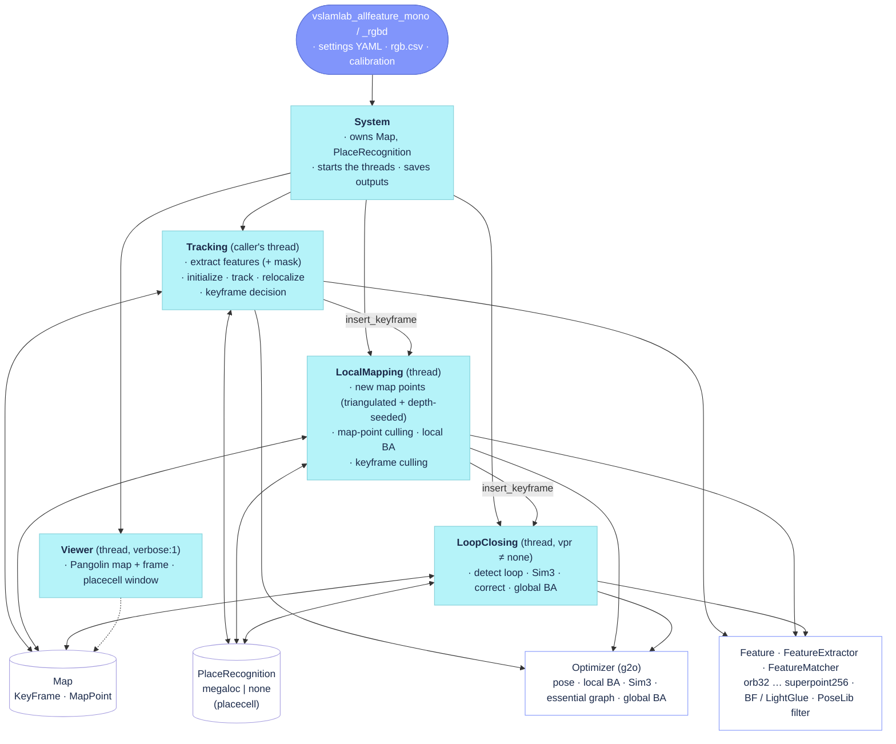

# AllFeature-VSLAM

A multi-feature Visual SLAM system built on ORB-SLAM2: several classical and learned feature types
run side by side, place recognition is a MegaLoc image embedding, and keyframes are inserted and
culled by the information they add to the map. It runs as the `allfeature-dev` baseline of
[VSLAM-LAB](https://github.com/VSLAM-LAB/VSLAM-LAB).

This site is the living documentation of the code, built from the `docs/` folder of the
[repository](https://github.com/alejandrofontan/AllFeature-VSLAM):

| Chapter | What it holds |
|---|---|
| [Reference](reference/) | what each source file does today: call graph, flow diagram, one entry per function, the settings it reads |
| [Review](review/) | the author's dated reading notes per file, pinned to the commit that was read |
| [Gym](gym/) | changes made because of a failure on a VSLAM-LAB sequence, with the measured effect |
| [Notes](notes/) | dated investigations |
| [Plans](plans/) | design plans and their status |

Click a component in the diagram to open its reference page; on a reference page, click a node of
the flow diagram to jump to the function.

## Pipeline pages

| Page | Sources | Thread |
|---|---|---|
| [System](reference/System.md) | `src/System.cc`, `include/System.h` | caller's |
| [Tracking](reference/Tracking.md) | `src/Tracking.cc`, `src/Tracking_aux.cc`, `include/Tracking.h` | caller's (per frame) |
| [LocalMapping](reference/LocalMapping.md) | `src/LocalMapping.cc`, `src/LocalMapping_aux.cc`, `include/LocalMapping.h` | local-mapping |
| [LoopClosing](reference/LoopClosing.md) | `src/LoopClosing.cc`, `src/LoopClosing_aux.cc`, `include/LoopClosing.h` | loop-closing (+ GBA thread) |
| [Viewer](reference/Viewer.md) | `src/Viewer.cc`, `include/Viewer.h` | viewer |
| [Settings](reference/settings.md) | every settings key, where it is read, the dev YAML value | — |

## Working with the docs

- `python docs/tools/resolve_links.py` refreshes the line numbers of every source link.
- `python docs/tools/review_checklist.py --all` refreshes the function checklists of the review pages.
- `python docs/tools/settings_keys.py` regenerates the settings page from the code and the YAML.
- `python docs/tools/gym_compare.py <before> <after>` prints a gym entry's before/after table.
- `pixi run docs-serve` previews this site locally; it is deployed by GitHub Actions on push to `main`.

The plan behind this structure: [Documentation plan](plans/documentation_plan.md).
