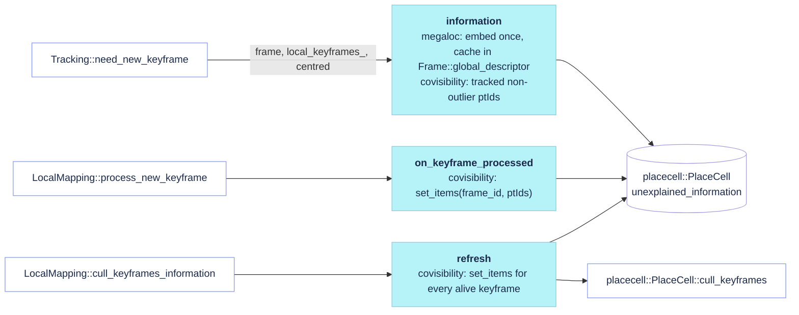

# `src/KeyframeInformation.cc`

The keyframe **information kernel** of the system: one `placecell::PlaceCell` store over the
keyframes whose similarity kernel answers Tracking's insertion question (how much of the current
view is not explained by the local keyframes, [`information`](#information)) and LocalMapping's
culling question (which alive keyframe every view ever inserted can spare, through
[`place_cell`](#place_cell) and `placecell::PlaceCell::cull_keyframes`). `System` builds one
backend from `LocalMapping.InformationKernel` and hands it to `Tracking` (query, decision
history) and `LocalMapping` (registration, refresh, cull); the Viewer's placecell panels and
`System::SavePlaceCellDiagnostics` read the same store. The maths lives in placecell
(`Thirdparty/placecell`, its `CLAUDE.md`); this file translates between SLAM objects and
placecell ids: `frame_id` is the external id of a keyframe, `MapPoint::ptId` the item id.

| Backend | Settings value | Store | Kernel | Needs |
|---|---|---|---|---|
| `KeyframeInformationMegaLoc` | `megaloc` (compiled default) | the `vpr: megaloc` retrieval store (`System::place_cell`) | MegaLoc cosine of image embeddings, centred by default (common-mode floor) | `vpr: megaloc`; with `vpr: none` the system has no kernel |
| `KeyframeInformationCovisibility` | `covisibility` | its own item-mode store (`placecell::PlaceCell::set_items`) | cosine of the keyframes' map-point indicator vectors, `K_ij = |P_i ∩ P_j| / sqrt(|P_i| |P_j|)`, raw by default (exactly 0 for keyframes sharing nothing) | nothing (works with `vpr: none`) |

Design: [`docs/plans/covisibility_kernel.md`](../plans/covisibility_kernel.md).

## Call graph

- **[`information`](https://github.com/alejandrofontan/AllFeature-VSLAM/blob/main/src/KeyframeInformation.cc#L86)** (tracking thread) — `window_ids`, `placecell::PlaceCell::unexplained_information` (descriptor or item overload), `to_value`.
- **[`on_keyframe_processed`](https://github.com/alejandrofontan/AllFeature-VSLAM/blob/main/src/KeyframeInformation.cc#L161)** (local-mapping thread) — `observed_point_ids`, `placecell::PlaceCell::set_items`.
- **[`refresh`](https://github.com/alejandrofontan/AllFeature-VSLAM/blob/main/src/KeyframeInformation.cc#L171)** (local-mapping thread) — `observed_point_ids`, `placecell::PlaceCell::is_culled`, `set_items`.
- Not in the graph: [`record_thresholds`](#record_thresholds), [`record_decision`](#record_decision) (Recorder feed), [`clear`](#clear), [`place_cell`](#place_cell).

## Flow



## Interface (`include/KeyframeInformation.h`)

### `KeyframeInformationValue`

```cpp
struct KeyframeInformationValue { float unexplained; int explainers; FrameId best_explainer; float best_similarity; };
```
- what `information` returns: `unexplained` = `v ∈ [0,1]` (1 = nothing in the window resembles the view), `explainers` = window keyframes with a usable row, `best_explainer` = `frame_id` of the most similar one and its similarity on the kernel used (centred or raw).

### `information`

```cpp
virtual std::optional<KeyframeInformationValue> information(Frame& frame, const std::vector<Keyframe>& window, bool centred) = 0;
```
- unexplained information of the frame's view given the alive keyframes of `window` (Tracking's local map), on the kernel keyframe culling marginalises; `centred` is `LocalMapping.KeyframeCullingCentred`. Read-only for the store (the frame is never inserted). `std::nullopt` when the view cannot be measured or the store cannot compare it (NaN).
- `megaloc`: reuses `Frame::global_descriptor` when present, else embeds `Frame::image` through `MegaLocPlaceCell::unexplained_information` and caches the embedding there so a keyframe made from the frame is not embedded twice (`PlaceRecognitionMegaLoc::compute(KeyFrame&)` stores that copy); a frame without image warns once and returns `std::nullopt`.
- `covisibility`: the item set is the frame's map points that are non-null, non-bad and not flagged outlier by the pose optimisation, over every feature type (`Frame::pts` / `Frame::outliers`, the same points `Tracking::update_local_keyframes` votes with), as `MapPoint::ptId`; an empty set returns `std::nullopt` (nothing tracked, no cosine) instead of asking placecell. `k_i = |Q ∩ P_i| / sqrt(|Q| |P_i|)` per window keyframe; with a single explainer `v = 1 − k²`.
- called from: [`Tracking::need_new_keyframe`](Tracking.md#need_new_keyframe), once per tracked frame.

### `on_keyframe_processed`

```cpp
virtual void on_keyframe_processed(const Keyframe& keyframe) = 0;
```
- a keyframe finished `process_new_keyframe` (observations registered, connections updated, in the map): make the store explain the next frames with it.
- `covisibility`: `set_items(frame_id, observed_point_ids)` — the first call for a `frame_id` appends the row, so the store is in item mode from the first keyframe; the set is the keyframe's observations at that moment, `refresh` picks up the points `create_new_map_points` / `search_in_neighbors` add later.
- `megaloc`: nothing — `KeyFrame::compute_global_descriptor` (earlier in `process_new_keyframe`) stored the descriptor in the shared store.
- called from: [`LocalMapping::process_new_keyframe`](LocalMapping.md#process_new_keyframe), last statement.

### `refresh`

```cpp
virtual void refresh(const std::vector<Keyframe>& alive) = 0;
```
- bring the store up to date with the map before a cull; `alive` are the map's non-bad keyframes.
- `covisibility`: re-sends every alive, not-yet-culled keyframe's current map-point set (`observed_point_ids`: non-null, non-bad points of every feature type, by-value snapshots of `KeyFrame::get_map_point_matches`). placecell diffs each set against what it holds (an unchanged set costs one vector compare) and moves the shared counts through its inverted index; the float kernel is rebuilt once, by the cull that follows. Cost O(total observations) per keyframe cycle.
- `megaloc`: nothing — descriptors do not move.
- called from: [`LocalMapping::cull_keyframes_information`](LocalMapping.md#cull_keyframes_information), after the reconciliation of externally removed keyframes and before `cull_keyframes`.

### `clear`

```cpp
virtual void clear() = 0;
```
- system reset: forget every keyframe. `covisibility` clears its store; `megaloc` does nothing because `PlaceRecognitionMegaLoc::clear` (same object) already did.
- called from: [`Tracking::reset`](Tracking.md#reset), right after `PlaceRecognition::clear`.

### `place_cell`

```cpp
virtual placecell::PlaceCell& place_cell() = 0;
```
- the store behind the kernel. `LocalMapping::cull_keyframes_information` reconciles and culls on it directly, `System::GetPlaceCell` hands it to the Viewer panels, `System::Shutdown` prints its profile, `System::SavePlaceCellDiagnostics` dumps it.

### `record_thresholds`

```cpp
void record_thresholds(float tau, float min_information);
```
- forwards the thresholds Tracking's keyframe policy applies (τ = `LocalMapping.KeyframeCullingMaxUnexplained`, `Tracking.KeyframeMinInformation`) to the store's `placecell::Recorder`, which keeps a change history so the plots draw steps; a no-op while `PlaceCell.Record` is off. Called once per tracked frame.

### `record_decision`

```cpp
void record_decision(FrameId frame_id, bool inserted, std::optional<float> unexplained, const std::string& reason);
```
- the per-frame insertion decision with its reason string and information value (NaN when none), drawn as insertion markers on the information plot.

## Settings read by this file

None. The backend is chosen by `LocalMapping.InformationKernel` and configured by
`LocalMapping.KeyframeCullingCentred` / `LocalMapping.KeyframeCullingMaxUnexplained` (per-kernel
defaults, [LocalMapping](LocalMapping.md#loadparameters)); the store's managers by the `PlaceCell.*`
block ([System](System.md#system)).
