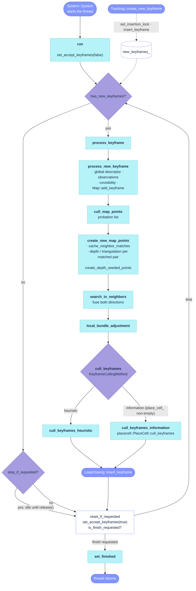

# `src/LocalMapping.cc`

The map back-end. `LocalMapping::run` is the body of the local-mapping thread started by
[`System::System`](https://github.com/alejandrofontan/AllFeature-VSLAM/blob/main/src/System.cc#L201 "mptLocalMapping = make_shared<thread>"):
it drains the keyframe queue that Tracking fills and, for every keyframe, computes its global
descriptor, culls the map points on probation, creates new map points (from sensor depth and by
two-view triangulation), fuses duplicates with the covisible neighbours, runs the local bundle
adjustment, culls redundant keyframes and hands the keyframe to LoopClosing. It owns the queue
(`new_keyframes_`), the probation list (`recent_map_points_`), its own `FeatureMatcher`, and a
shared pointer to the placecell store (`place_cell_`) that the information culler marginalises.
The stop / reset / finish protocols that LoopClosing, Tracking and System drive live in
`src/LocalMapping_aux.cc` together with `LoadParameters` and the profiling output. The sources
carry no `// #` section banners, so this page groups the functions by call-graph order.

## Call graph

- **[`run`](https://github.com/alejandrofontan/AllFeature-VSLAM/blob/main/src/LocalMapping.cc#L43)** — [`set_accept_keyframes`](https://github.com/alejandrofontan/AllFeature-VSLAM/blob/main/src/LocalMapping_aux.cc#L140), [`has_new_keyframes`](https://github.com/alejandrofontan/AllFeature-VSLAM/blob/main/src/LocalMapping_aux.cc#L80), [`process_keyframe`](https://github.com/alejandrofontan/AllFeature-VSLAM/blob/main/src/LocalMapping.cc#L86), [`stop_if_requested`](https://github.com/alejandrofontan/AllFeature-VSLAM/blob/main/src/LocalMapping_aux.cc#L92), [`is_stopped`](https://github.com/alejandrofontan/AllFeature-VSLAM/blob/main/src/LocalMapping_aux.cc#L104), [`reset_if_requested`](https://github.com/alejandrofontan/AllFeature-VSLAM/blob/main/src/LocalMapping_aux.cc#L173), [`is_finish_requested`](https://github.com/alejandrofontan/AllFeature-VSLAM/blob/main/src/LocalMapping_aux.cc#L201), [`set_finished`](https://github.com/alejandrofontan/AllFeature-VSLAM/blob/main/src/LocalMapping_aux.cc#L207)
- **[`process_keyframe`](https://github.com/alejandrofontan/AllFeature-VSLAM/blob/main/src/LocalMapping.cc#L86)** — [`process_new_keyframe`](https://github.com/alejandrofontan/AllFeature-VSLAM/blob/main/src/LocalMapping.cc#L114), [`cull_map_points`](https://github.com/alejandrofontan/AllFeature-VSLAM/blob/main/src/LocalMapping.cc#L154), [`create_new_map_points`](https://github.com/alejandrofontan/AllFeature-VSLAM/blob/main/src/LocalMapping.cc#L189) → [`cache_neighbor_matches`](https://github.com/alejandrofontan/AllFeature-VSLAM/blob/main/src/LocalMapping.cc#L324), [`create_depth_seeded_points`](https://github.com/alejandrofontan/AllFeature-VSLAM/blob/main/src/LocalMapping.cc#L397); [`search_in_neighbors`](https://github.com/alejandrofontan/AllFeature-VSLAM/blob/main/src/LocalMapping.cc#L428), [`local_bundle_adjustment`](https://github.com/alejandrofontan/AllFeature-VSLAM/blob/main/src/LocalMapping.cc#L497), [`cull_keyframes`](https://github.com/alejandrofontan/AllFeature-VSLAM/blob/main/src/LocalMapping.cc#L508) → [`cull_keyframes_heuristic`](https://github.com/alejandrofontan/AllFeature-VSLAM/blob/main/src/LocalMapping.cc#L529) | [`cull_keyframes_information`](https://github.com/alejandrofontan/AllFeature-VSLAM/blob/main/src/LocalMapping.cc#L583); `LoopClosing::insert_keyframe`; [`log_profile`](https://github.com/alejandrofontan/AllFeature-VSLAM/blob/main/src/LocalMapping_aux.cc#L223)
- **Called from other threads** — queue: [`insert_keyframe`](https://github.com/alejandrofontan/AllFeature-VSLAM/blob/main/src/LocalMapping_aux.cc#L74), [`accepts_keyframes`](https://github.com/alejandrofontan/AllFeature-VSLAM/blob/main/src/LocalMapping_aux.cc#L134), [`set_insertion_lock`](https://github.com/alejandrofontan/AllFeature-VSLAM/blob/main/src/LocalMapping_aux.cc#L146) (Tracking); stop: [`request_stop`](https://github.com/alejandrofontan/AllFeature-VSLAM/blob/main/src/LocalMapping_aux.cc#L86), [`is_stop_requested`](https://github.com/alejandrofontan/AllFeature-VSLAM/blob/main/src/LocalMapping_aux.cc#L110), [`release`](https://github.com/alejandrofontan/AllFeature-VSLAM/blob/main/src/LocalMapping_aux.cc#L116) (LoopClosing); reset: [`request_reset`](https://github.com/alejandrofontan/AllFeature-VSLAM/blob/main/src/LocalMapping_aux.cc#L156), [`is_reset_requested`](https://github.com/alejandrofontan/AllFeature-VSLAM/blob/main/src/LocalMapping_aux.cc#L167) (Tracking); finish: [`request_finish`](https://github.com/alejandrofontan/AllFeature-VSLAM/blob/main/src/LocalMapping_aux.cc#L195), [`is_finished`](https://github.com/alejandrofontan/AllFeature-VSLAM/blob/main/src/LocalMapping_aux.cc#L215) (System)
- Not in the graph (setup): [`LocalMapping`](https://github.com/alejandrofontan/AllFeature-VSLAM/blob/main/src/LocalMapping.cc#L36) (constructor), [`LoadParameters`](https://github.com/alejandrofontan/AllFeature-VSLAM/blob/main/src/LocalMapping_aux.cc#L27)

## Flow



## Thread body and keyframe processing

### `LocalMapping`

```cpp
LocalMapping::LocalMapping(std::shared_ptr<Map> map, const std::vector<FeatureType>& feature_types,
                           const int image_width, const int image_height)
```
- stores the map and builds this thread's own `FeatureMatcher` (labelled `"LocalMapping"`) for the
  given feature types and image size. The loop closer, viewer and placecell store are injected
  afterwards through `set_loop_closer` / `set_viewer` / `set_placecell` (header inlines), because
  `LoopClosing` is constructed after `LocalMapping` and the viewer and store are optional.
- called from: [`System::System`](https://github.com/alejandrofontan/AllFeature-VSLAM/blob/main/src/System.cc#L200 "localMapper = make_shared<LocalMapping>"),
  which then starts [`run`](#run) on its own `std::thread` and wires the three setters
  ([`System.cc`](https://github.com/alejandrofontan/AllFeature-VSLAM/blob/main/src/System.cc#L228 "localMapper->set_loop_closer") — `set_placecell` only when a store exists, i.e. `vpr: megaloc`).

### `run`

```cpp
void LocalMapping::run()
```
- thread body. First statement clears `finished_` under `finish_mutex_` so `System::Shutdown`
  cannot read a stale `true` while the loop is alive; last statement is [`set_finished`](#set_finished).
- one iteration: publish "busy" ([`set_accept_keyframes`](#set_accept_keyframes)`(false)`); if a
  keyframe is queued, [`process_keyframe`](#process_keyframe) it; otherwise, if a stop is pending
  ([`stop_if_requested`](#stop_if_requested)), idle in a 3 ms poll until [`release`](#release) or a
  finish request. Then [`reset_if_requested`](#reset_if_requested), publish "idle", break on a finish
  request, and sleep 3 ms only when the queue is empty, so a queued keyframe is processed at once.
- Tracking reads the busy flag to choose between a normal and an emergency insertion
  ([`Tracking::need_new_keyframe`](https://github.com/alejandrofontan/AllFeature-VSLAM/blob/main/src/Tracking.cc#L1010 "if(local_mapper_->accepts_keyframes())"))
  and to wait after an emergency insertion
  ([`Tracking::track`](https://github.com/alejandrofontan/AllFeature-VSLAM/blob/main/src/Tracking.cc#L245 "while(!local_mapper_->accepts_keyframes())")).
- differs from ORB-SLAM2: the busy flag is toggled once per iteration around the whole
  iteration, not around `ProcessNewKeyFrame` only; the stop branch is taken only when the queue
  is empty, so a queued keyframe is always processed before the thread pauses for a loop closure.

### `process_keyframe`

```cpp
void LocalMapping::process_keyframe()
```
- one full mapping iteration for the keyframe at the head of the queue, always all six stages in
  this order: [`process_new_keyframe`](#process_new_keyframe), [`cull_map_points`](#cull_map_points),
  [`create_new_map_points`](#create_new_map_points), [`search_in_neighbors`](#search_in_neighbors),
  [`local_bundle_adjustment`](#local_bundle_adjustment), [`cull_keyframes`](#cull_keyframes); then the
  keyframe is queued for loop detection
  ([`LoopClosing::insert_keyframe`](https://github.com/alejandrofontan/AllFeature-VSLAM/blob/main/src/LoopClosing_aux.cc#L42)).
- records the iteration's total time in `local_mapping_times_` (`LocalMappingProfiler`,
  [`LocalMapping_aux.h`](https://github.com/alejandrofontan/AllFeature-VSLAM/blob/main/include/LocalMapping_aux.h#L22 "struct LocalMappingProfiler")),
  always, because the viewer shows its median (`set_runLocalMapping_time_median`, computed before
  this iteration is added); the per-stage histograms are `PROFILING_EXHAUSTIVE`-only and printed by
  [`log_profile`](#log_profile).
- differs from ORB-SLAM2: the refinement stages (fuse, local BA, keyframe culling) are never skipped
  when another keyframe is already queued, and the local BA is not aborted by a pending keyframe
  (there is no `mbAbortBA` flag); the queue is drained one full iteration at a time.
- called from: [`run`](#run).

### `process_new_keyframe`

```cpp
void LocalMapping::process_new_keyframe()
```
- pops the front keyframe into `current_keyframe_` (under `new_keyframes_mutex_`), computes its
  global descriptor ([`KeyFrame::compute_global_descriptor`](https://github.com/alejandrofontan/AllFeature-VSLAM/blob/main/src/KeyFrame.cc#L70) → the VPR backend; for `megaloc` this stores the
  descriptor in placecell, which grows the keyframe kernel by itself), registers the keyframe as an
  observer of every map point Tracking matched into it ([`MapPoint::add_observation`](https://github.com/alejandrofontan/AllFeature-VSLAM/blob/main/src/MapPoint.cc#L73), which also refreshes the
  point's descriptor and normal/depth), updates the covisibility graph
  ([`KeyFrame::update_connections`](https://github.com/alejandrofontan/AllFeature-VSLAM/blob/main/src/KeyFrame.cc#L333)) and inserts the keyframe into the map.
- a matched point that already observes this keyframe (created *with* it by the initializer) is
  not re-registered; it enters the probation list `recent_map_points_` instead.
- runs per feature type over `current_keyframe_->featureTypes`; each `get_map_point_matches` call is
  a by-value snapshot taken under the keyframe's mutex.
- differs from ORB-SLAM2: the BoW computation is replaced by the backend-agnostic global
  descriptor; the observation loop is per feature type.
- called from: [`process_keyframe`](#process_keyframe).

## Map-point probation and creation

### `cull_map_points`

```cpp
void LocalMapping::cull_map_points()
```
- walks the probation list `recent_map_points_` once and removes a point from it when: it is already
  bad; its found/visible ratio ([`MapPoint::get_found_ratio`](https://github.com/alejandrofontan/AllFeature-VSLAM/blob/main/src/MapPoint.cc#L239)) is below
  `MapPointCullingMinFoundRatio` (point set bad); it is `MapPointCullingObservationTestAge` keyframes
  old or older and has at most `MapPointCullingMinObservations` weighted observations
  ([`MapPoint::number_of_observations`](https://github.com/alejandrofontan/AllFeature-VSLAM/blob/main/src/MapPoint.cc#L147), where a depth-verified observation counts twice) (point set bad); or it
  reached `MapPointCullingProbationAge` (graduates, stays in the map). Age is measured in keyframe ids
  from `first_keyframe_id`.
- differs from ORB-SLAM2: the found-ratio test applies to every feature type uniformly (the
  earlier per-`featureTypes[0]` exemption is gone, issue #11); the observation threshold is the
  weighted count, so an RGB-D point with one depth-verified observation passes a threshold of 2; all
  four thresholds are settings keys instead of constants.
- settings: `LocalMapping.MapPointCullingMinFoundRatio` (0.25), `LocalMapping.MapPointCullingMinObservations` (2),
  `LocalMapping.MapPointCullingObservationTestAge` (2), `LocalMapping.MapPointCullingProbationAge` (3).
- called from: [`process_keyframe`](#process_keyframe).

### `create_new_map_points`

```cpp
void LocalMapping::create_new_map_points()
```
- takes the `CreateNewMapPointsKeyframes` best covisible neighbours, caches brute-force matches
  against them ([`cache_neighbor_matches`](#cache_neighbor_matches)), then for each neighbour whose
  baseline over its median scene depth ([`KeyFrame::compute_scene_median_depth`](https://github.com/alejandrofontan/AllFeature-VSLAM/blob/main/src/KeyFrame.cc#L685)) is at least
  `CreateNewMapPointsMinBaselineDepthRatio`, fetches the matched keypoint pairs per feature type
  ([`FeatureMatcher::match_keyframes_for_triangulation`](https://github.com/alejandrofontan/AllFeature-VSLAM/blob/main/src/FeatureMatcher.cpp#L403)) and places each pair in 3D.
- 3D position, in priority order: both views have sensor depth (`inv_depth > 0`) → back-project from
  each and average; one view has depth → back-project from that view; neither → linear two-view
  triangulation (SVD of the 4×4 system) only if `0 < cos(parallax) < CreateNewMapPointsMaxParallaxCos`;
  otherwise the pair is skipped.
- every candidate must lie in front of both cameras and reproject within a 2-DoF chi-square gate
  (`CHI2_2DOF` × the keypoint's `sigma2`) in *both* views — this is what cross-validates a
  depth-seeded position against the second view. Survivors become two-observation points
  ([`KeyFrame::create_monocular_map_point`](https://github.com/alejandrofontan/AllFeature-VSLAM/blob/main/src/KeyFrame.cc#L217)) and enter the probation list.
- ends with [`create_depth_seeded_points`](#create_depth_seeded_points) for the keypoints that got no
  match at all; records `create_new_map_points_times_`.
- differs from ORB-SLAM2: sensor depth is used per keypoint pair before falling back to
  triangulation (stock ORB-SLAM2 RGB-D creates depth points at keyframe insertion in Tracking and
  triangulates only when both views lack a close depth); the ORB scale-consistency ratio test between
  the two views is not applied; the number of neighbours and both geometric gates are settings keys;
  matching is the cached brute-force matcher, not the BoW-guided epipolar search.
- settings: `LocalMapping.CreateNewMapPointsKeyframes` (5), `LocalMapping.CreateNewMapPointsMinBaselineDepthRatio` (0.01),
  `LocalMapping.CreateNewMapPointsMaxParallaxCos` (0.9998).
- called from: [`process_keyframe`](#process_keyframe).

### `cache_neighbor_matches`

```cpp
void LocalMapping::cache_neighbor_matches(const std::vector<Keyframe>& neighbors)
```
- for every (neighbour, feature type) pair the current keyframe has no cached matches with yet, runs
  the brute-force descriptor matcher ([`FeatureMatcher::serialFeatureMatching`](https://github.com/alejandrofontan/AllFeature-VSLAM/blob/main/include/FeatureMatcher.h#L65)) in an OpenMP
  `collapse(2)` parallel loop, then stores the results serially: per feature type in both keyframes'
  `cache_matched_pairs_feat_type` (reversed for the neighbour) and stacked over feature types with
  keypoint-index offsets in `cache_matched_pairs` (reversed via
  [`FeatureMatcher::swap_match_direction`](https://github.com/alejandrofontan/AllFeature-VSLAM/blob/main/src/FeatureMatcher.cpp#L99)).
- the cache is what `match_keyframes_for_triangulation` reads; a neighbour already cached (for
  example by the matcher itself in an earlier call) is skipped.
- differs from ORB-SLAM2: no counterpart (stock uses the BoW feature vector to restrict matching).
- called from: [`create_new_map_points`](#create_new_map_points).

### `create_depth_seeded_points`

```cpp
void LocalMapping::create_depth_seeded_points()
```
- for every keypoint of the current keyframe (all feature types) that has a valid sensor depth
  (`inv_depth > 0`) and no map point yet (neither from Tracking nor from the triangulation loop),
  back-projects it from the keyframe's own depth and creates a single-observation map point
  ([`KeyFrame::create_map_point`](https://github.com/alejandrofontan/AllFeature-VSLAM/blob/main/src/KeyFrame.cc#L235)), added to the probation list.
- trust policy is the same as the depth branches of [`create_new_map_points`](#create_new_map_points):
  any positive inverse depth, no range gate and no count cap. A single-observation point is validated
  later by [`cull_map_points`](#cull_map_points) (it must be re-observed) rather than at creation.
- differs from ORB-SLAM2: stock RGB-D creates the depth points in `Tracking::CreateNewKeyFrame`,
  restricted to the closest `ThDepth` points and capped at 100; here they are created on the
  local-mapping thread, for every keypoint with depth, after triangulation has had its turn.
  Background: [`docs/plans/rgbd_depth_integration.md`](../plans/rgbd_depth_integration.md).
- called from: [`create_new_map_points`](#create_new_map_points).

## Fusion and local bundle adjustment

### `search_in_neighbors`

```cpp
void LocalMapping::search_in_neighbors()
```
- builds the fuse-target set once for all feature types: the `SearchInNeighborsKeyframes` best
  covisible keyframes plus, for each, its `SearchInNeighborsSecondKeyframes` best covisible
  keyframes, deduplicated with the `fuse_target_for_keyframe` mark (the current keyframe excluded).
- per feature type: projects the current keyframe's map points into every target and fuses
  duplicates ([`FeatureMatcher::fuse_map_points_to_keyframe`](https://github.com/alejandrofontan/AllFeature-VSLAM/blob/main/src/FeatureMatcher.cpp#L442), radius
  `SearchInNeighborsRadius`); collects the targets' map points (deduplicated with
  `fuse_candidate_for_keyframe`) and fuses them into the current keyframe; then recomputes the
  descriptor and normal/depth of every surviving match. Finally refreshes the covisibility graph.
- the target set is collected *outside* the feature-type loop on purpose: the mark would make every
  pass after the first come up empty.
- differs from ORB-SLAM2: per-feature-type fusion; the two neighbourhood sizes and the radius are
  settings keys; the second-degree neighbours are marked too, so a keyframe reachable through two
  neighbours is fused once.
- settings: `LocalMapping.SearchInNeighborsKeyframes` (20), `LocalMapping.SearchInNeighborsSecondKeyframes` (5),
  `LocalMapping.SearchInNeighborsRadius` (5.0).
- called from: [`process_keyframe`](#process_keyframe).

### `local_bundle_adjustment`

```cpp
void LocalMapping::local_bundle_adjustment()
```
- runs [`Optimizer::LocalBundleAdjustment`](https://github.com/alejandrofontan/AllFeature-VSLAM/blob/main/src/Optimizer.cc#L585) on the current keyframe when the map holds more than
  `LOCAL_BA_MIN_KEYFRAMES` (2) keyframes; records `local_ba_times_`.
- differs from ORB-SLAM2: no abort flag is passed, so a keyframe queued during the BA does not
  interrupt it (see [`process_keyframe`](#process_keyframe)).
- called from: [`process_keyframe`](#process_keyframe).

## Keyframe culling

### `cull_keyframes`

```cpp
void LocalMapping::cull_keyframes()
```
- dispatch on `KeyframeCullingMethod`: `information` →
  [`cull_keyframes_information`](#cull_keyframes_information) when a placecell store exists and holds at
  least one descriptor, else [`cull_keyframes_heuristic`](#cull_keyframes_heuristic) with a one-time
  `AF_WARN` (the information method needs `vpr: megaloc`); anything else → the heuristic.
- differs from ORB-SLAM2: stock has the heuristic only.
- settings: `LocalMapping.KeyframeCullingMethod` (`heuristic`).
- called from: [`process_keyframe`](#process_keyframe).

### `cull_keyframes_heuristic`

```cpp
void LocalMapping::cull_keyframes_heuristic()
```
- for every covisible keyframe of the current one except keyframe 0, per feature type: a map point
  is redundant when at least `KeyframeCullingMinObservations` *other* non-bad keyframes observe it
  (points with a weighted observation count at or below that threshold are skipped outright); the
  keyframe is set bad ([`KeyFrame::set_bad_flag`](https://github.com/alejandrofontan/AllFeature-VSLAM/blob/main/src/KeyFrame.cc#L498)) when more than
  `KeyframeCullingRedundancyRatio` of its non-bad points are redundant for *any* one feature type.
- `set_bad_flag` is deferred by the keyframe itself while LoopClosing holds it
  (`set_not_erase`), so a cull can be postponed to `set_erase`.
- differs from ORB-SLAM2: the per-feature-type test (a keyframe redundant for one feature type is
  culled); the stock requirement that the other observations be at the same or a finer scale level
  is not applied; both thresholds are settings keys.
- settings: `LocalMapping.KeyframeCullingRedundancyRatio` (0.9), `LocalMapping.KeyframeCullingMinObservations` (3).
- called from: [`cull_keyframes`](#cull_keyframes).

### `cull_keyframes_information`

```cpp
void LocalMapping::cull_keyframes_information()
```
- host adapter for the joint-information culler in placecell
  ([`placecell::PlaceCell::cull_keyframes`](https://github.com/alejandrofontan/AllFeature-VSLAM/blob/main/Thirdparty/placecell/include/placecell/placecell.h#L251 "struct CullParameters")): the maths ("gram-greedy" on the
  keyframe similarity kernel, optionally double-centred) lives there; this function supplies
  parameters, the window, the cull callback and the logging.
- reconciliation first: every stored row (`external_ids`, keyed by `frame_id`) that no longer
  resolves to a live keyframe was removed outside this culler (heuristic method, loop closing) and
  is marked culled in placecell (`set_culled`) so it becomes culling history there too.
- parameters: `max_unexplained` = `KeyframeCullingMaxUnexplained` (τ, atomic — the Viewer's "Cull Max
  Unexplained" slider writes it live, [`Viewer.cc`](https://github.com/alejandrofontan/AllFeature-VSLAM/blob/main/src/Viewer.cc#L369 "keyframe_culling_max_unexplained.store")), `centred` =
  `KeyframeCullingCentred`, `min_keyframes`, `protect_last` = max(`KeyframeCullingMinAge`, 1) so the
  current keyframe is never culled, `max_per_call`. With `KeyframeCullingScope: local` the window is the
  current keyframe plus its covisible keyframes; with `map` the whole alive set.
- the cull callback sets the keyframe bad and reports success only if it *is* bad afterwards; a
  keyframe whose erase is deferred by LoopClosing stays alive and placecell does not retry it within
  the call.
- logs one `AF_INFO` per culled keyframe (unique information, worst unexplained keyframe after the
  cull, alive count) and one summary per call with culls; when nothing is culled and the history
  holds keyframes above τ (threshold lowered after earlier culls), reports that once per change.
- the same τ and centring drive keyframe *insertion* in
  [`Tracking::need_new_keyframe`](https://github.com/alejandrofontan/AllFeature-VSLAM/blob/main/src/Tracking.cc#L938 "const float tau = LocalMapping::params.keyframe_culling_max_unexplained.load()"),
  so insertion and culling maintain one invariant from both ends. Design background:
  [`docs/notes/2026-08-28_place_recognition_megaloc.md`](../notes/2026-08-28_place_recognition_megaloc.md),
  [`docs/notes/2026-09-03_keyframe_information_policy.md`](../notes/2026-09-03_keyframe_information_policy.md).
- differs from ORB-SLAM2: no counterpart.
- settings: `LocalMapping.KeyframeCullingMaxUnexplained` (0.3), `LocalMapping.KeyframeCullingMinAge` (5),
  `LocalMapping.KeyframeCullingMinKeyframes` (5), `LocalMapping.KeyframeCullingScope` (`map`),
  `LocalMapping.KeyframeCullingMaxPerCall` (5), `LocalMapping.KeyframeCullingCentred` (1).
- called from: [`cull_keyframes`](#cull_keyframes).

## Keyframe queue and busy flag

### `insert_keyframe`

```cpp
void LocalMapping::insert_keyframe(const Keyframe& keyframe)
```
- appends to `new_keyframes_` under `new_keyframes_mutex_`. Nothing else: the keyframe is processed
  by [`run`](#run) on the local-mapping thread.
- called from: [`Tracking::create_new_keyframe`](https://github.com/alejandrofontan/AllFeature-VSLAM/blob/main/src/Tracking.cc#L1045 "local_mapper_->insert_keyframe(keyframe)") (wrapped in
  [`set_insertion_lock`](#set_insertion_lock)), and
  [`Tracking::create_initial_map`](https://github.com/alejandrofontan/AllFeature-VSLAM/blob/main/src/Tracking.cc#L554 "local_mapper_->insert_keyframe(keyframe_ini)") for the two initial keyframes.
- differs from ORB-SLAM2: the `mbAbortBA = true` side effect is gone (no BA interruption).

### `has_new_keyframes`

```cpp
bool LocalMapping::has_new_keyframes() const
```
- `!new_keyframes_.empty()` under the queue mutex (`mutable`, so the query is `const`).
- called from: [`run`](#run) (twice per iteration: to process, and to decide whether to sleep) and
  [`Tracking::wait_for_idle_local_mapper`](https://github.com/alejandrofontan/AllFeature-VSLAM/blob/main/src/Tracking.cc#L1052), which spins until the
  queue is empty *and* the thread is idle (sequential mode).

### `accepts_keyframes`

```cpp
bool LocalMapping::accepts_keyframes() const
```
- the busy flag under `accept_mutex_`: `false` from the start of a [`run`](#run) iteration until
  its work is done.
- called from: [`Tracking::need_new_keyframe`](https://github.com/alejandrofontan/AllFeature-VSLAM/blob/main/src/Tracking.cc#L1010 "if(local_mapper_->accepts_keyframes())") (busy → only an
  emergency keyframe may be inserted), [`Tracking::track`](https://github.com/alejandrofontan/AllFeature-VSLAM/blob/main/src/Tracking.cc#L245 "while(!local_mapper_->accepts_keyframes())") (wait after an
  emergency insertion), [`Tracking::wait_for_idle_local_mapper`](https://github.com/alejandrofontan/AllFeature-VSLAM/blob/main/src/Tracking.cc#L1052).

### `set_accept_keyframes`

```cpp
void LocalMapping::set_accept_keyframes(const bool accept)
```
- writes the busy flag under `accept_mutex_`.
- called from: [`run`](#run) only (false at the top of an iteration, true after `reset_if_requested`).

### `set_insertion_lock`

```cpp
bool LocalMapping::set_insertion_lock(const bool locked)
```
- under `stop_mutex_`: refuses (`false`) to lock when the thread is already stopped; otherwise sets
  `insertion_locked_`, which [`stop_if_requested`](#stop_if_requested) honours by deferring a pending
  stop until the lock is released.
- called from: [`Tracking::create_new_keyframe`](https://github.com/alejandrofontan/AllFeature-VSLAM/blob/main/src/Tracking.cc#L1037 "if(!local_mapper_->set_insertion_lock(true))") around
  `insert_keyframe`; a `false` return skips the insertion (a loop closure holds the mapper).
- differs from ORB-SLAM2: replaces `SetNotStop(bool)`; same contract, returns the refusal instead of
  relying on the caller to check `isStopped()` first.

## Stop protocol (loop closing)

### `request_stop`

```cpp
void LocalMapping::request_stop()
```
- raises `stop_requested_` under `stop_mutex_`. The thread pauses at its next idle point
  ([`stop_if_requested`](#stop_if_requested)); the caller waits on [`is_stopped`](#is_stopped).
- called from: [`LoopClosing::correct_loop`](https://github.com/alejandrofontan/AllFeature-VSLAM/blob/main/src/LoopClosing.cc#L387 "local_mapper_->request_stop()") and
  [`LoopClosing::apply_gba_correction`](https://github.com/alejandrofontan/AllFeature-VSLAM/blob/main/src/LoopClosing.cc#L598 "local_mapper_->request_stop()"), so no keyframe is
  inserted while the map is corrected. (`System::TrackStereo`/`TrackRGBD` carry the same calls
  commented out.)
- differs from ORB-SLAM2: no `mbAbortBA` side effect.

### `stop_if_requested`

```cpp
bool LocalMapping::stop_if_requested()
```
- under `stop_mutex_`: returns `false` unless a stop is requested *and* no insertion lock is held;
  otherwise marks `stopped_`, logs `[LocalMapping] stopped` (flushing stdout) and returns `true`.
- called from: [`run`](#run), only when the queue is empty.

### `is_stopped`

```cpp
bool LocalMapping::is_stopped() const
```
- `stopped_` under `stop_mutex_`.
- called from: [`run`](#run) (idle loop), [`Tracking::need_new_keyframe`](https://github.com/alejandrofontan/AllFeature-VSLAM/blob/main/src/Tracking.cc#L872 "local_mapper_->is_stopped()") (no keyframes while
  frozen), [`LoopClosing::correct_loop`](https://github.com/alejandrofontan/AllFeature-VSLAM/blob/main/src/LoopClosing.cc#L402 "while(!local_mapper_->is_stopped())") and
  [`LoopClosing::apply_gba_correction`](https://github.com/alejandrofontan/AllFeature-VSLAM/blob/main/src/LoopClosing.cc#L599 "while(!local_mapper_->is_stopped()") (wait for the pause;
  the latter also accepts `is_finished` so shutdown cannot deadlock it).

### `is_stop_requested`

```cpp
bool LocalMapping::is_stop_requested() const
```
- `stop_requested_` under `stop_mutex_`.
- called from: [`Tracking::need_new_keyframe`](https://github.com/alejandrofontan/AllFeature-VSLAM/blob/main/src/Tracking.cc#L872 "local_mapper_->is_stop_requested()"): a pending stop
  already blocks keyframe insertion, before the thread has actually paused.

### `release`

```cpp
void LocalMapping::release()
```
- ends a pause: under `stop_mutex_` + `finish_mutex_` (a `scoped_lock`, because
  [`set_finished`](#set_finished) takes the same two in the other order), clears `stopped_` and
  `stop_requested_`, drops every keyframe queued meanwhile (their map is being replaced by the
  correction) and logs `[LocalMapping] released`. No-op once finished.
- called from: [`LoopClosing::correct_loop`](https://github.com/alejandrofontan/AllFeature-VSLAM/blob/main/src/LoopClosing.cc#L509 "local_mapper_->release()") and
  [`LoopClosing::apply_gba_correction`](https://github.com/alejandrofontan/AllFeature-VSLAM/blob/main/src/LoopClosing.cc#L651 "local_mapper_->release()").
- differs from ORB-SLAM2: stock only clears the queue and the two flags; here the two mutexes are
  taken together and the finished case is guarded.

## Reset protocol (tracking)

### `request_reset`

```cpp
void LocalMapping::request_reset()
```
- raises `reset_requested_` under `reset_mutex_`, then blocks (3 ms polls of
  [`is_reset_requested`](#is_reset_requested)) until the local-mapping thread has performed the reset.
  Blocking matters: `Tracking::reset` clears the map right after this returns.
- called from: [`Tracking::reset`](https://github.com/alejandrofontan/AllFeature-VSLAM/blob/main/src/Tracking.cc#L1249 "local_mapper_->request_reset()").

### `is_reset_requested`

```cpp
bool LocalMapping::is_reset_requested() const
```
- the flag under its mutex; the wait condition of [`request_reset`](#request_reset).

### `reset_if_requested`

```cpp
void LocalMapping::reset_if_requested()
```
- thread side, once per [`run`](#run) iteration: when a reset is pending, clears the keyframe
  queue (under its own mutex), the probation list and the four timing histograms, then clears the
  request. The placecell store is *not* cleared here: `PlaceRecognitionMegaLoc::clear`, called from
  `Tracking::reset`, does that.
- differs from ORB-SLAM2: also resets the profiling histograms.

## Finish protocol (shutdown)

### `request_finish`

```cpp
void LocalMapping::request_finish()
```
- raises `finish_requested_` under `finish_mutex_`; [`run`](#run) exits at its next check, also
  from inside the stop idle loop.
- called from: [`System::Shutdown`](https://github.com/alejandrofontan/AllFeature-VSLAM/blob/main/src/System.cc#L397 "localMapper->request_finish()").

### `is_finish_requested`

```cpp
bool LocalMapping::is_finish_requested() const
```
- the flag under `finish_mutex_`; polled by [`run`](#run) twice per iteration (idle loop and tail).

### `set_finished`

```cpp
void LocalMapping::set_finished()
```
- publishes the exit under `finish_mutex_` + `stop_mutex_` (`scoped_lock`, same pair as
  [`release`](#release)): `finished_ = true` and `stopped_ = true`, the latter so a LoopClosing
  waiting on [`is_stopped`](#is_stopped) is released.
- called from: [`run`](#run), last statement.

### `is_finished`

```cpp
bool LocalMapping::is_finished() const
```
- `finished_` under `finish_mutex_`. Starts `true` (`finished_{true}`) and is cleared by
  [`run`](#run)'s first statement.
- called from: [`System::Shutdown`](https://github.com/alejandrofontan/AllFeature-VSLAM/blob/main/src/System.cc#L407 "while(!localMapper->is_finished()") (spin, then join the
  thread), [`LoopClosing::apply_gba_correction`](https://github.com/alejandrofontan/AllFeature-VSLAM/blob/main/src/LoopClosing.cc#L599 "!local_mapper_->is_finished()"),
  [`release`](#release).

## Parameters and profiling

### `LoadParameters`

```cpp
void LocalMapping::LoadParameters(const cv::FileStorage &fSettings)
```
- fills the static `LocalMapping::params` (`LocalMappingParameters`,
  [`LocalMapping.h`](https://github.com/alejandrofontan/AllFeature-VSLAM/blob/main/include/LocalMapping.h#L59 "struct LocalMappingParameters")) from the
  `LocalMapping.*` keys present in the settings file; a missing key keeps the compiled default.
  `KeyframeCullingMethod` and `KeyframeCullingScope` are validated against their option lists
  (`AF_ERROR` otherwise); `KeyframeCullingCentred` is read as an int (`cv::FileStorage` has no bool
  reader); `KeyframeCullingMaxUnexplained` goes through the atomic's load/store.
- called from: [`System::System`](https://github.com/alejandrofontan/AllFeature-VSLAM/blob/main/src/System.cc#L54 "LocalMapping::LoadParameters(fsSettings)"), before any thread starts.
- settings: the whole table below.

### `log_profile`

```cpp
void LocalMapping::log_profile()
```
- `PROFILING_EXHAUSTIVE` only: prints the cumulative per-stage histograms (`Create New Map Points`,
  `Search in Neighbors`, `Local Bundle Adjustment`, `Local Mapping`) through the `AF_PROFILE` sink.
  The histograms accumulate over the run, so the last block in a log is the whole-run distribution
  (see [`docs/gym/protocol.md`](../gym/protocol.md) for how they are read).
- called from: [`process_keyframe`](#process_keyframe), once per keyframe.

## Settings read by this file

| Key | Default | Read in | Effect |
|---|---|---|---|
| `LocalMapping.KeyframeCullingMethod` | `heuristic` | [`LoadParameters`](#loadparameters) | `heuristic` or `information` culling ([`cull_keyframes`](#cull_keyframes)) |
| `LocalMapping.MapPointCullingMinFoundRatio` | 0.25 | [`LoadParameters`](#loadparameters) | probation point culled below this found/visible ratio ([`cull_map_points`](#cull_map_points)) |
| `LocalMapping.MapPointCullingMinObservations` | 2 | [`LoadParameters`](#loadparameters) | culled when, at the test age, weighted observations are at most this |
| `LocalMapping.MapPointCullingObservationTestAge` | 2 | [`LoadParameters`](#loadparameters) | keyframes after creation at which the observation test applies |
| `LocalMapping.MapPointCullingProbationAge` | 3 | [`LoadParameters`](#loadparameters) | keyframes after creation at which a survivor leaves probation |
| `LocalMapping.CreateNewMapPointsKeyframes` | 5 | [`LoadParameters`](#loadparameters) | covisible neighbours matched per new keyframe ([`create_new_map_points`](#create_new_map_points)) |
| `LocalMapping.CreateNewMapPointsMinBaselineDepthRatio` | 0.01 | [`LoadParameters`](#loadparameters) | neighbours with baseline / median depth below this are skipped |
| `LocalMapping.CreateNewMapPointsMaxParallaxCos` | 0.9998 | [`LoadParameters`](#loadparameters) | two-view triangulation needs cos(parallax) below this |
| `LocalMapping.SearchInNeighborsKeyframes` | 20 | [`LoadParameters`](#loadparameters) | covisible keyframes fused with the new keyframe ([`search_in_neighbors`](#search_in_neighbors)) |
| `LocalMapping.SearchInNeighborsSecondKeyframes` | 5 | [`LoadParameters`](#loadparameters) | second-degree neighbours added per covisible keyframe |
| `LocalMapping.SearchInNeighborsRadius` | 5.0 | [`LoadParameters`](#loadparameters) | projection search radius (px) for fusion |
| `LocalMapping.KeyframeCullingRedundancyRatio` | 0.9 | [`LoadParameters`](#loadparameters) | heuristic: cull above this fraction of redundant points ([`cull_keyframes_heuristic`](#cull_keyframes_heuristic)) |
| `LocalMapping.KeyframeCullingMinObservations` | 3 | [`LoadParameters`](#loadparameters) | heuristic: a point is redundant with this many other observers |
| `LocalMapping.KeyframeCullingMaxUnexplained` | 0.3 | [`LoadParameters`](#loadparameters) | τ: culling budget and insertion novelty threshold; live via the Viewer slider ([`cull_keyframes_information`](#cull_keyframes_information)) |
| `LocalMapping.KeyframeCullingMinAge` | 5 | [`LoadParameters`](#loadparameters) | information: the last this-many keyframes are never culled |
| `LocalMapping.KeyframeCullingMinKeyframes` | 5 | [`LoadParameters`](#loadparameters) | information: never cull below this many alive keyframes |
| `LocalMapping.KeyframeCullingScope` | `map` | [`LoadParameters`](#loadparameters) | information: marginalise over all alive keyframes or the covisible window |
| `LocalMapping.KeyframeCullingMaxPerCall` | 5 | [`LoadParameters`](#loadparameters) | information: culls per call (0 = unlimited) |
| `LocalMapping.KeyframeCullingCentred` | 1 | [`LoadParameters`](#loadparameters) | information: double-centred kernel (1) or raw cosine (0) |
