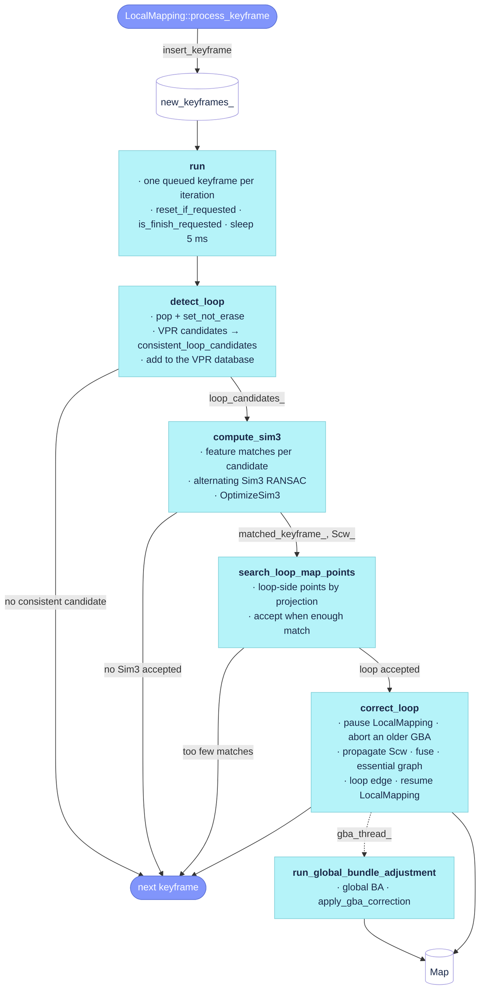
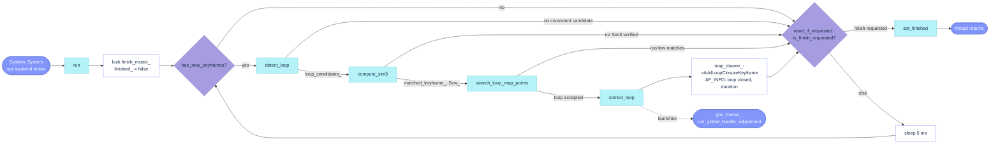
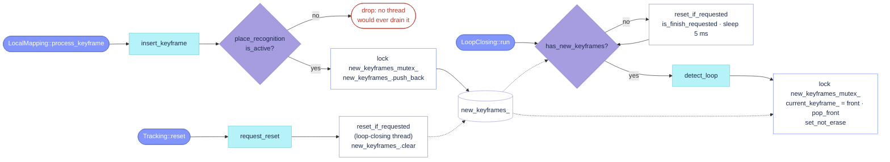
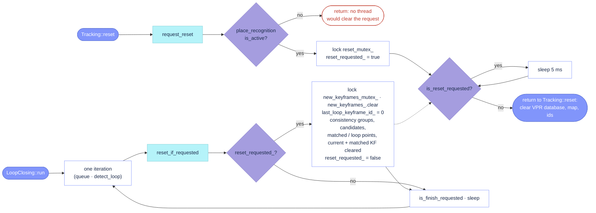
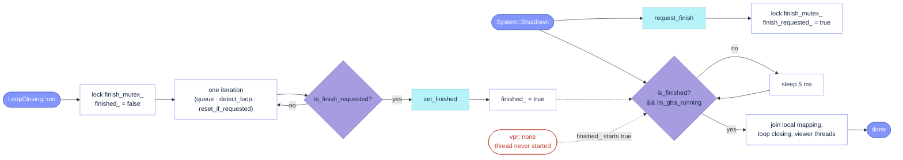

# `src/LoopClosing.cc`

The loop-closing thread. It consumes the keyframes LocalMapping hands over after their mapping
iteration, asks the VPR backend (`PlaceRecognition`) for loop candidates, verifies the consistent
ones geometrically (Sim3 RANSAC, Sim3 optimization, projection search), corrects the map around
an accepted loop (Sim3 propagation to the covisible keyframes and their points, point fusion,
essential-graph optimization) and launches a global bundle adjustment in a second thread of its
own. The loop pipeline lives in `src/LoopClosing.cc`; parameter loading and the thread protocols
(keyframe queue, global-BA status, reset, finish) in `src/LoopClosing_aux.cc`; the class and its
`LoopClosingParameters` in `include/LoopClosing.h`. The thread is started only when the VPR
backend is active (`vpr: megaloc`); with `vpr: none` the object exists but never runs.

## Call graph

- **[`run`](https://github.com/alejandrofontan/AllFeature-VSLAM/blob/main/src/LoopClosing.cc#L74)** (thread body) — [`has_new_keyframes`](https://github.com/alejandrofontan/AllFeature-VSLAM/blob/main/src/LoopClosing_aux.cc#L53), [`detect_loop`](https://github.com/alejandrofontan/AllFeature-VSLAM/blob/main/src/LoopClosing.cc#L109) → [`consistent_loop_candidates`](https://github.com/alejandrofontan/AllFeature-VSLAM/blob/main/src/LoopClosing.cc#L170), [`compute_sim3`](https://github.com/alejandrofontan/AllFeature-VSLAM/blob/main/src/LoopClosing.cc#L226) → [`release_loop_candidates`](https://github.com/alejandrofontan/AllFeature-VSLAM/blob/main/src/LoopClosing.cc#L369), [`search_loop_map_points`](https://github.com/alejandrofontan/AllFeature-VSLAM/blob/main/src/LoopClosing.cc#L334) → [`release_loop_candidates`](https://github.com/alejandrofontan/AllFeature-VSLAM/blob/main/src/LoopClosing.cc#L369), [`correct_loop`](https://github.com/alejandrofontan/AllFeature-VSLAM/blob/main/src/LoopClosing.cc#L381) → [`search_and_fuse`](https://github.com/alejandrofontan/AllFeature-VSLAM/blob/main/src/LoopClosing.cc#L537), [`loop_connections_after_fusion`](https://github.com/alejandrofontan/AllFeature-VSLAM/blob/main/src/LoopClosing.cc#L516); then [`reset_if_requested`](https://github.com/alejandrofontan/AllFeature-VSLAM/blob/main/src/LoopClosing_aux.cc#L93), [`is_finish_requested`](https://github.com/alejandrofontan/AllFeature-VSLAM/blob/main/src/LoopClosing_aux.cc#L127), [`set_finished`](https://github.com/alejandrofontan/AllFeature-VSLAM/blob/main/src/LoopClosing_aux.cc#L133)
- **[`run_global_bundle_adjustment`](https://github.com/alejandrofontan/AllFeature-VSLAM/blob/main/src/LoopClosing.cc#L562)** (`gba_thread_`, launched by `correct_loop`) — [`apply_gba_correction`](https://github.com/alejandrofontan/AllFeature-VSLAM/blob/main/src/LoopClosing.cc#L593)
- Called from other threads: [`insert_keyframe`](https://github.com/alejandrofontan/AllFeature-VSLAM/blob/main/src/LoopClosing_aux.cc#L42) (LocalMapping), [`request_reset`](https://github.com/alejandrofontan/AllFeature-VSLAM/blob/main/src/LoopClosing_aux.cc#L71) → [`is_reset_requested`](https://github.com/alejandrofontan/AllFeature-VSLAM/blob/main/src/LoopClosing_aux.cc#L87) (Tracking), [`request_finish`](https://github.com/alejandrofontan/AllFeature-VSLAM/blob/main/src/LoopClosing_aux.cc#L121), [`is_finished`](https://github.com/alejandrofontan/AllFeature-VSLAM/blob/main/src/LoopClosing_aux.cc#L139), [`is_gba_running`](https://github.com/alejandrofontan/AllFeature-VSLAM/blob/main/src/LoopClosing_aux.cc#L62) (System::Shutdown)
- Not in the graph (setup): [`LoadParameters`](https://github.com/alejandrofontan/AllFeature-VSLAM/blob/main/src/LoopClosing_aux.cc#L21), [`LoopClosing`](https://github.com/alejandrofontan/AllFeature-VSLAM/blob/main/src/LoopClosing.cc#L49), [`~LoopClosing`](https://github.com/alejandrofontan/AllFeature-VSLAM/blob/main/src/LoopClosing.cc#L64)

## Flow



## Construction

No banner in the source: the constructor and destructor precede `# Main loop`.

### `LoopClosing`

```cpp
LoopClosing::LoopClosing(std::shared_ptr<Map> map, std::shared_ptr<PlaceRecognition> place_recognition,
                         std::shared_ptr<LocalMapping> local_mapper, std::shared_ptr<MapDrawer> map_drawer,
                         const bool fix_scale, const std::vector<FeatureType>& feature_types,
                         const int image_width, const int image_height)
```
- stores the collaborators (map, VPR backend, LocalMapping to pause around corrections, MapDrawer to record closed loops) and builds its own `FeatureMatcher` for the loop matching. `verification_feature_` is the local feature the VPR backend names for geometric verification (`PlaceRecognition::verification_feature`, the `feature_vpr` setting).
- `fix_scale_` (stereo/RGB-D: `mSensor != MONOCULAR`) makes every Sim3 of the pipeline an SE3 with scale 1.
- called from: [`System::System`](https://github.com/alejandrofontan/AllFeature-VSLAM/blob/main/src/System.cc#L207 "loopCloser =  make_shared<LoopClosing>"), always, even with `vpr: none` (other threads hold the pointer and call `insert_keyframe`/`request_reset`, which early-return).

### `~LoopClosing`

```cpp
LoopClosing::~LoopClosing()
```
- joins `gba_thread_` when it is joinable: a completed global BA leaves its thread joinable (a superseded one was detached by `correct_loop`). `System::Shutdown` waits for `is_gba_running()` to clear first, so the join returns at once.
- differs from ORB-SLAM2: stock has no destructor; a finished GBA thread object stays joinable until program exit.

## `# Main loop`

**Section:** [`# Main loop`](https://github.com/alejandrofontan/AllFeature-VSLAM/blob/main/src/LoopClosing.cc#L73)


### `run`

```cpp
void LoopClosing::run()
```
- thread body, started by System's constructor ([`System.cc`](https://github.com/alejandrofontan/AllFeature-VSLAM/blob/main/src/System.cc#L211 "mptLoopClosing = make_shared<thread>")) only when the VPR backend is active; with `vpr: none` it never runs and `finished_` stays at its initial `true` (see `# Finish protocol`). First statement clears `finished_` under `finish_mutex_` ([`LoopClosing.cc`](https://github.com/alejandrofontan/AllFeature-VSLAM/blob/main/src/LoopClosing.cc#L78 "finished_ = false;")) so `System::Shutdown` cannot read a stale `true` while the loop is alive.
- one queued keyframe per iteration, as a short-circuit chain ([`LoopClosing.cc`](https://github.com/alejandrofontan/AllFeature-VSLAM/blob/main/src/LoopClosing.cc#L84 "if(has_new_keyframes() && detect_loop()")): [`has_new_keyframes`](#has_new_keyframes) → [`detect_loop`](#detect_loop) pops the keyframe, votes its candidates and adds it to the VPR database → [`compute_sim3`](#compute_sim3) verifies them with RANSAC + Sim3 optimization → [`search_loop_map_points`](#search_loop_map_points) projects the loop side into the keyframe and accepts the loop. Each stage returning `false` ends the iteration for that keyframe, having already lifted the erase guards it set (`set_erase`), so a rejected keyframe is cullable again at once.
- on acceptance: [`correct_loop`](#correct_loop) corrects the map around the loop and launches the global BA in `gba_thread_`, the closed loop is handed to the viewer ([`LoopClosing.cc`](https://github.com/alejandrofontan/AllFeature-VSLAM/blob/main/src/LoopClosing.cc#L88 "AddLoopClosureKeyframe")) and one `AF_INFO` line reports both keyframe ids and the duration ([`LoopClosing.cc`](https://github.com/alejandrofontan/AllFeature-VSLAM/blob/main/src/LoopClosing.cc#L90 "loop closed: keyframes")). The duration covers correction + essential-graph optimization only; the BA runs concurrently in its own thread and reports through its own lines.
- iteration tail, keyframe or not: [`reset_if_requested`](#reset_if_requested) then [`is_finish_requested`](#is_finish_requested); `true` breaks the loop, so a loop closure in flight always completes before the thread exits. Otherwise the thread sleeps 5 ms ([`LoopClosing.cc`](https://github.com/alejandrofontan/AllFeature-VSLAM/blob/main/src/LoopClosing.cc#L100 "sleep_for(std::chrono::milliseconds(5))")) — unconditionally, unlike `LocalMapping::run`, which only yields when its queue is empty.
- last statement: [`set_finished`](#set_finished) publishes the exit that `System::Shutdown` waits for ([`System.cc`](https://github.com/alejandrofontan/AllFeature-VSLAM/blob/main/src/System.cc#L407 "loopCloser->is_gba_running()")) alongside [`is_gba_running`](#is_gba_running): the thread returning does not stop a running global BA, so `Shutdown` waits for that separately, and the destructor ([`~LoopClosing`](https://github.com/alejandrofontan/AllFeature-VSLAM/blob/main/src/LoopClosing.cc#L64)) joins the finished BA thread.

## `# Loop detection`

**Section:** [`# Loop detection`](https://github.com/alejandrofontan/AllFeature-VSLAM/blob/main/src/LoopClosing.cc#L108)

### `detect_loop`

```cpp
bool LoopClosing::detect_loop()
```
- pops the front keyframe into `current_keyframe_` under `new_keyframes_mutex_` and marks it `set_not_erase` ([`LoopClosing.cc`](https://github.com/alejandrofontan/AllFeature-VSLAM/blob/main/src/LoopClosing.cc#L118 "current_keyframe_->set_not_erase();")) so keyframe culling cannot delete it while this thread works on it; a culling deferred meanwhile is applied when `set_erase` lifts the guard.
- asks the VPR backend for candidates (`PlaceRecognition::detect_loop_candidates`, covisible keyframes excluded) and keeps the ones that pass [`consistent_loop_candidates`](#consistent_loop_candidates), but only when `keyId >= last_loop_keyframe_id_ + MinKeyframesBetweenLoops` ([`LoopClosing.cc`](https://github.com/alejandrofontan/AllFeature-VSLAM/blob/main/src/LoopClosing.cc#L128 "current_keyframe_->keyId >= last_loop_keyframe_id_")): no detection right after a loop closure, nor for the first keyframes of a map (keyIds start at 0, so one counter serves both gates). While gated, `consistent_groups_` is left untouched.
- adds the keyframe to the VPR database after its own query ([`LoopClosing.cc`](https://github.com/alejandrofontan/AllFeature-VSLAM/blob/main/src/LoopClosing.cc#L132 "place_recognition_->add(current_keyframe_);")), so it cannot retrieve itself; every keyframe enters the database here, gated or not.
- returns `true` when `loop_candidates_` is non-empty; otherwise lifts the current keyframe's erase guard and returns `false`.
- differs from ORB-SLAM2: retrieval is the abstract VPR backend (MegaLoc similarity) instead of the DBoW2 `KeyFrameDatabase` query with the covisibility-derived minimum BoW score; the "10 keyframes since the last loop" gate is the `LoopClosing.MinKeyframesBetweenLoops` setting.
- settings: `LoopClosing.MinKeyframesBetweenLoops` (10).

### `consistent_loop_candidates`

```cpp
std::vector<Keyframe> LoopClosing::consistent_loop_candidates(const std::vector<Keyframe>& candidates)
```
- the covisibility-consistency vote of ORB-SLAM2: each candidate expands to its covisibility group (the candidate plus its connected keyframes, as sorted ids); a group consistent with a group kept from the previous keyframe (they share a keyframe, tested by the file-local `share_keyframe` merge walk) inherits that group's count plus one; a count reaching `CovisibilityConsistencyThreshold` makes the candidate a loop candidate.
- the groups built here replace `consistent_groups_` for the next keyframe (no candidates → no groups). Rules kept from the original: a previous group passes its count to the first candidate consistent with it only (`carried`), so the same group is never carried twice; a candidate consistent with several previous groups is stored once per group and enters the result once; a candidate consistent with no previous group starts a new group with count 0.
- called from: [`detect_loop`](#detect_loop), only when the loop-detection gate is open.
- differs from ORB-SLAM2: the threshold is a setting (stock hardcodes `mnCovisibilityConsistencyTh = 3`); groups are id vectors compared by a sorted merge instead of `set<KeyFrame*>` intersection.
- settings: `LoopClosing.CovisibilityConsistencyThreshold` (3).

## `# Sim3 verification`

**Section:** [`# Sim3 verification`](https://github.com/alejandrofontan/AllFeature-VSLAM/blob/main/src/LoopClosing.cc#L217)

File-local constants of the section ([`LoopClosing.cc`](https://github.com/alejandrofontan/AllFeature-VSLAM/blob/main/src/LoopClosing.cc#L220 "sim3_ransac_probability")): RANSAC probability 0.99, minimum inliers 20, at most 300 iterations, 5 iterations per round, and `sim3_optimization_chi2 = 10` as the `Optimizer::OptimizeSim3` outlier threshold. They are not settings.

### `compute_sim3`

```cpp
bool LoopClosing::compute_sim3()
```
- one `Sim3Solver` per loop candidate with enough feature matches to the current keyframe: every candidate is guarded with `set_not_erase`; a non-bad candidate is matched with `match_keyframes_for_compute_sim3` for every feature type, but only `verification_feature_`'s pairs drive the Sim3 (the other types fill the match cache and are unused downstream); the pairs become `matches`, one slot per keypoint of the current keyframe. Candidates below `Sim3MinMatches` pairs get no solver.
- RANSAC rounds alternate over the surviving candidates (5 iterations each) until one candidate's consensus Sim3, optimized by `Optimizer::OptimizeSim3` over its inlier matches (which nulls the matches it rejects), keeps at least `Sim3MinInliers` inliers, or every candidate has exhausted its budget (`no_more` → its solver is dropped).
- on success: `matched_keyframe_`, `g2o_Scw_ = Scm * Smw` (world → current keyframe through the loop side), its 4×4 form `Scw_`, and `loop_matched_points_` (the optimized inlier matches) are set; on failure [`release_loop_candidates`](#release_loop_candidates) lifts every guard.
- called from: [`run`](#run), after `detect_loop` returned `true`.
- differs from ORB-SLAM2: matching is the multi-feature `FeatureMatcher` (LightGlue for learned features) instead of `SearchByBoW`; there is no `SearchBySim3` refinement between the RANSAC consensus and `OptimizeSim3`; the projection search that stock runs at the end of `ComputeSim3` is the separate [`search_loop_map_points`](#search_loop_map_points); the two count thresholds are settings.
- settings: `LoopClosing.Sim3MinMatches` (20), `LoopClosing.Sim3MinInliers` (20).

### `search_loop_map_points`

```cpp
bool LoopClosing::search_loop_map_points()
```
- collects `loop_map_points_`: the `verification_feature_` map points of the matched keyframe and its covisible keyframes, each once per loop (`MapPoint::loop_point_for_keyframe` stamped with the current keyframe's id), remembering which loop keyframe each point came from. `match_keyframes` is called per loop keyframe for its side effect only: it fills the current keyframe's match cache that `search_by_projection_for_compute_sim3` reads.
- projects those points into the current keyframe with `Scw_` and extends `loop_matched_points_` beyond the RANSAC inliers; the loop is accepted when the matched count reaches `LoopMinMatches`.
- lifts the erase guards either way through [`release_loop_candidates`](#release_loop_candidates) (matched keyframe excepted on acceptance).
- called from: [`run`](#run), after `compute_sim3` returned `true`.
- differs from ORB-SLAM2: this is the tail of stock `ComputeSim3` (its `SearchByProjection` with radius 10 and the `nTotalMatches >= 40` test) as a separate stage; the threshold is a setting; the projection search goes through the multi-feature matcher's cache.
- settings: `LoopClosing.LoopMinMatches` (40).

### `release_loop_candidates`

```cpp
void LoopClosing::release_loop_candidates(const bool loop_accepted)
```
- lifts the erase guards set for the verification: every candidate's, except the matched keyframe's when the loop is accepted, and the current keyframe's when it is rejected. An accepted loop keeps both guarded until `correct_loop` pins them with the loop edge.
- called from: [`compute_sim3`](#compute_sim3) (on failure) and [`search_loop_map_points`](#search_loop_map_points) (always).

## `# Loop correction`

**Section:** [`# Loop correction`](https://github.com/alejandrofontan/AllFeature-VSLAM/blob/main/src/LoopClosing.cc#L380)

### `correct_loop`

```cpp
void LoopClosing::correct_loop()
```
- pauses LocalMapping (`request_stop`, then waits for `is_stopped`) so no keyframe is inserted while the map is corrected; a global BA still running belongs to a superseded loop: `gba_stop_` makes g2o abort it, `gba_generation_` is bumped so it drops its result, and its thread is detached ([`LoopClosing.cc`](https://github.com/alejandrofontan/AllFeature-VSLAM/blob/main/src/LoopClosing.cc#L397 "gba_thread_.detach();")).
- under `map_update_mutex_`: the current keyframe takes `g2o_Scw_` and every covisible keyframe the composition of its relative pose to the current keyframe with `Scw` (`corrected_poses`), the old poses kept as `uncorrected_poses`; every map point seen by these keyframes — all feature types — is un-projected with the old pose and re-projected with the corrected one, once each (`MapPoint::corrected_by_keyframe` stamp); the keyframes take the corrected SE3 (`[R | t/s]`) and refresh their connections; the loop-side points matched into the current keyframe replace its own (`MapPoint::replace`) or fill the keypoints that had none.
- then, outside the map lock: [`search_and_fuse`](#search_and_fuse) merges duplicates in every corrected keyframe; [`loop_connections_after_fusion`](#loop_connections_after_fusion) turns the covisibility links gained by the fusion into the loop edges of `Optimizer::OptimizeEssentialGraph`, run over the uncorrected/corrected poses; `Map::InformNewBigChange`; a loop edge is added on both keyframes ([`LoopClosing.cc`](https://github.com/alejandrofontan/AllFeature-VSLAM/blob/main/src/LoopClosing.cc#L495 "matched_keyframe_->add_loop_edge(current_keyframe_);")), which also pins them against culling.
- launches [`run_global_bundle_adjustment`](#run_global_bundle_adjustment) in `gba_thread_` ([`LoopClosing.cc`](https://github.com/alejandrofontan/AllFeature-VSLAM/blob/main/src/LoopClosing.cc#L506 "gba_thread_ = std::thread(")) after joining a finished previous one, sets `gba_running_`, releases LocalMapping and records `last_loop_keyframe_id_` (the detection gate of [`detect_loop`](#detect_loop)).
- called from: [`run`](#run), once per accepted loop.
- differs from ORB-SLAM2: the point correction covers every feature type of a keyframe (stock: the ORB points only); a superseded BA is tracked by an integer generation instead of the `mnFullBAIdx` counter; the SE3/Sim3 choice (`fix_scale_`) is decided once in the constructor.

### `loop_connections_after_fusion`

```cpp
std::map<KeyframeId, LoopConnections> LoopClosing::loop_connections_after_fusion(const std::vector<Keyframe>& connected_keyframes)
```
- for each corrected keyframe: refresh its connections, then keep the connected keyframes it did not have before the fusion, minus the corrected keyframes themselves. These are the links that the loop created, the loop edges the essential graph optimizes over.
- called from: [`correct_loop`](#correct_loop), after `search_and_fuse`.

### `search_and_fuse`

```cpp
void LoopClosing::search_and_fuse(const KeyframePoses& corrected_poses)
```
- for every corrected keyframe, projects `loop_map_points_` into it with its corrected Sim3 (`fuse_map_points_to_keyframe`, radius `FuseRadius`, `verification_feature_` only) and, under `map_update_mutex_`, replaces the duplicates found there by the loop-side point.
- called from: [`correct_loop`](#correct_loop).
- differs from ORB-SLAM2: the radius is a setting (stock hardcodes 4).
- settings: `LoopClosing.FuseRadius` (4.0).

## `# Global bundle adjustment`

**Section:** [`# Global bundle adjustment`](https://github.com/alejandrofontan/AllFeature-VSLAM/blob/main/src/LoopClosing.cc#L557)

### `run_global_bundle_adjustment`

```cpp
void LoopClosing::run_global_bundle_adjustment(const KeyframeId loop_keyframe_id)
```
- body of `gba_thread_`: snapshots `gba_generation_`, runs `Optimizer::global_bundle_adjustment` over the whole map with `GbaIterations` iterations and `gba_stop_` as g2o's force-stop flag ([`LoopClosing.cc`](https://github.com/alejandrofontan/AllFeature-VSLAM/blob/main/src/LoopClosing.cc#L573 "Optimizer::global_bundle_adjustment(map_")); the BA writes its result into the `Tcw_gba`/`position_gba` members stamped with `loop_keyframe_id`, not into the live poses.
- under `gba_mutex_`: returns without touching anything when the generation changed meanwhile ([`LoopClosing.cc`](https://github.com/alejandrofontan/AllFeature-VSLAM/blob/main/src/LoopClosing.cc#L579 "if(generation != gba_generation_)")) — a newer loop closure owns the running flag and the map; otherwise, unless the BA was stopped, [`apply_gba_correction`](#apply_gba_correction) commits the result, and `gba_running_` is cleared.
- called from: the thread started in [`correct_loop`](#correct_loop).
- differs from ORB-SLAM2: the map update is a separate function; the superseded check compares an integer generation.
- settings: `LoopClosing.GbaIterations` (10).

### `apply_gba_correction`

```cpp
void LoopClosing::apply_gba_correction(const KeyframeId loop_keyframe_id)
```
- runs under `gba_mutex_`: pauses LocalMapping (`request_stop`, wait for `is_stopped` or `is_finished`) and takes `map_update_mutex_`, since LocalMapping kept working during the BA and what it created meanwhile is not part of the result.
- keyframes, breadth-first from `keyframe_origins_` along the spanning tree: a child not in the BA (`ba_global_for_keyframe != loop_keyframe_id`) inherits its parent's correction through their relative pose (`Tcw_gba = T_child_parent * parent.Tcw_gba`); every keyframe keeps `Tcw_before_gba` and takes `Tcw_gba`.
- map points: optimized ones take `position_gba`; the others are un-projected with their reference keyframe's `Tcw_before_gba` and re-projected with its corrected pose (skipped when the reference was not in the BA either).
- `Map::InformNewBigChange`, LocalMapping released.
- called from: [`run_global_bundle_adjustment`](#run_global_bundle_adjustment), only when the BA finished without being superseded or stopped.

## `# Parameters`

**Section:** [`# Parameters`](https://github.com/alejandrofontan/AllFeature-VSLAM/blob/main/src/LoopClosing_aux.cc#L18)

### `LoadParameters`

```cpp
void LoopClosing::LoadParameters(const cv::FileStorage& fSettings)
```
- overwrites the compiled-in defaults of the static `LoopClosing::params` (`LoopClosingParameters`, `include/LoopClosing.h`) with the `LoopClosing.*` keys present in the settings file; a missing key keeps its default, so settings files without the block work unchanged.
- called from: [`System::System`](https://github.com/alejandrofontan/AllFeature-VSLAM/blob/main/src/System.cc#L55 "LoopClosing::LoadParameters(fsSettings);"), before any thread starts.
- differs from ORB-SLAM2: stock has no loop-closing settings; every threshold is a literal in the code.
- settings: the seven keys of the table below.

## `# Keyframe queue`

**Section:** [`# Keyframe queue`](https://github.com/alejandrofontan/AllFeature-VSLAM/blob/main/src/LoopClosing_aux.cc#L41)


### `insert_keyframe`

```cpp
void LoopClosing::insert_keyframe(const Keyframe& keyframe)
```
- producer side of the loop-closing keyframe queue: appends the keyframe to `new_keyframes_` under `new_keyframes_mutex_`. Every keyframe is queued, keyframe 0 included.
- early-returns when the VPR backend is inactive (`vpr: none`): System's constructor then never starts the loop-closing thread ([`System.cc`](https://github.com/alejandrofontan/AllFeature-VSLAM/blob/main/src/System.cc#L210 "if(place_recognition->is_active())")), so a queued keyframe would never be popped and its `shared_ptr` would pin the keyframe, culled or not, for the whole run.
- called from: [`LocalMapping::process_keyframe`](https://github.com/alejandrofontan/AllFeature-VSLAM/blob/main/src/LocalMapping.cc#L105 "loop_closer_->insert_keyframe(current_keyframe_);"), once per keyframe after its full mapping iteration (map points created and fused, local BA, keyframe culling), so the keyframe reaches loop detection already refined.
- differs from ORB-SLAM2: the stock `mnId != 0` filter is gone, so keyframe 0 enters the VPR database like any other.

### `has_new_keyframes`

```cpp
bool LoopClosing::has_new_keyframes() const
```
- consumer-side poll: `!new_keyframes_.empty()` under the same mutex (`mutable`, so the query stays `const`). Only reports; the pop happens in [`detect_loop`](#detect_loop), which takes the front keyframe, marks it `set_not_erase` so culling cannot delete it mid-detection, and runs the loop pipeline on it.
- called from: [`run`](#run), once per 5 ms iteration; `false` means the thread only services `reset_if_requested`/`is_finish_requested` and sleeps.
- queue lifetime: cleared by [`reset_if_requested`](#reset_if_requested) (on the loop-closing thread, under the queue mutex) when `Tracking::reset` calls `request_reset`; that call returns at once when the backend is inactive, since no thread would ever clear the request.

## `# Global bundle adjustment status`

**Section:** [`# Global bundle adjustment status`](https://github.com/alejandrofontan/AllFeature-VSLAM/blob/main/src/LoopClosing_aux.cc#L61)

### `is_gba_running`

```cpp
bool LoopClosing::is_gba_running() const
```
- `gba_running_` under `gba_mutex_`: `true` from the launch in [`correct_loop`](#correct_loop) until [`run_global_bundle_adjustment`](#run_global_bundle_adjustment) clears it (a superseded BA leaves it to the newer one).
- called from: [`System::Shutdown`](https://github.com/alejandrofontan/AllFeature-VSLAM/blob/main/src/System.cc#L407 "loopCloser->is_gba_running()"), in the wait before joining the threads: `request_finish` does not stop a running BA, so the BA has to finish on its own before shutdown proceeds.

## `# Reset protocol`

**Section:** [`# Reset protocol`](https://github.com/alejandrofontan/AllFeature-VSLAM/blob/main/src/LoopClosing_aux.cc#L70)


### `request_reset`

```cpp
void LoopClosing::request_reset()
```
- caller side of the round trip: raises `reset_requested_` under `reset_mutex_`, then blocks (5 ms polls of `is_reset_requested`) until the loop-closing thread has performed the reset. Blocking matters: `Tracking::reset` wipes the VPR database and the map right after this call ([`Tracking.cc`](https://github.com/alejandrofontan/AllFeature-VSLAM/blob/main/src/Tracking.cc#L1257 "place_recognition_->clear();")), so the loop-closing thread must have dropped every reference to the old map first.
- early-returns when the VPR backend is inactive (`vpr: none`): the thread was never started, so nobody would ever clear the request and the caller would spin forever. There is nothing to reset in that case either.
- called from: [`Tracking::reset`](https://github.com/alejandrofontan/AllFeature-VSLAM/blob/main/src/Tracking.cc#L1253 "loop_closing_->request_reset();"), after LocalMapping's `request_reset` has returned.

### `is_reset_requested`

```cpp
bool LoopClosing::is_reset_requested() const
```
- the flag under its mutex (`mutable`, so the query stays `const`); the wait condition of `request_reset`. Protected: only the two protocol functions use it.

### `reset_if_requested`

```cpp
void LoopClosing::reset_if_requested()
```
- thread side: once per [`run`](#run) iteration ([`LoopClosing.cc`](https://github.com/alejandrofontan/AllFeature-VSLAM/blob/main/src/LoopClosing.cc#L95 "reset_if_requested();")), after the queue has been serviced and before the finish check. Early-returns when nothing is pending; otherwise, under `reset_mutex_`, it clears the keyframe queue (under its own mutex), resets `last_loop_keyframe_id_` so the `MinKeyframesBetweenLoops` gate restarts, and clears the request.
- also drops the loop-detection state of the wiped map (`consistent_groups_`, `loop_candidates_`, `loop_matched_points_`, `loop_map_points_`, `current_keyframe_`, `matched_keyframe_`): keyframe ids restart at 0 after a reset, so stale consistency groups (keyed by id) could vote for the new map's first candidates, and the vectors would keep the old map's keyframes and points alive until the next loop closure.
- runs between iterations, when the thread holds no other loop state, so the clear is safe without further locking.
- differs from ORB-SLAM2: stock clears the queue and `mLastLoopKFid` only and leaves the detection state in place.

## `# Finish protocol`

**Section:** [`# Finish protocol`](https://github.com/alejandrofontan/AllFeature-VSLAM/blob/main/src/LoopClosing_aux.cc#L120)


### `request_finish`

```cpp
void LoopClosing::request_finish()
```
- raises `finish_requested_` under `finish_mutex_`. It only asks: [`run`](#run) notices at the end of its current iteration, so a loop closure in flight completes first. A running global BA is not stopped by this, which is why `Shutdown` also waits on [`is_gba_running`](#is_gba_running).
- called from: [`System::Shutdown`](https://github.com/alejandrofontan/AllFeature-VSLAM/blob/main/src/System.cc#L398 "loopCloser->request_finish();"), right after LocalMapping's `request_finish`.

### `is_finish_requested`

```cpp
bool LoopClosing::is_finish_requested() const
```
- the thread's own poll of that flag, once per iteration in [`run`](#run) ([`LoopClosing.cc`](https://github.com/alejandrofontan/AllFeature-VSLAM/blob/main/src/LoopClosing.cc#L97 "if(is_finish_requested())")) after `reset_if_requested`; `true` breaks the loop. Protected: nobody outside the thread needs it.

### `set_finished`

```cpp
void LoopClosing::set_finished()
```
- publishes the exit: `finished_ = true` under the mutex, the last statement of [`run`](#run) ([`LoopClosing.cc`](https://github.com/alejandrofontan/AllFeature-VSLAM/blob/main/src/LoopClosing.cc#L103 "set_finished();")). Its counterpart at the top of `run` clears the flag under the same mutex, so `Shutdown` can never read a stale `true` while the loop is alive.

### `is_finished`

```cpp
bool LoopClosing::is_finished() const
```
- what `Shutdown` spins on ([`System.cc`](https://github.com/alejandrofontan/AllFeature-VSLAM/blob/main/src/System.cc#L407 "loopCloser->is_finished()")), together with LocalMapping's `is_finished` and [`is_gba_running`](#is_gba_running). Starts `true` (`finished_{true}`): with `vpr: none` the thread is never started and the wait passes immediately.
- after the wait, `Shutdown` joins the three worker threads ([`System.cc`](https://github.com/alejandrofontan/AllFeature-VSLAM/blob/main/src/System.cc#L414 "for(const auto& thread : {mptLocalMapping, mptLoopClosing, mptViewer})")), so no `std::thread` is destroyed joinable.

## Settings read by this file

All keys are read by [`LoadParameters`](#loadparameters) into `LoopClosing::params`; every key is optional.

| Key | Default | Read in | Effect |
|---|---|---|---|
| `LoopClosing.CovisibilityConsistencyThreshold` | 3 | [`LoadParameters`](https://github.com/alejandrofontan/AllFeature-VSLAM/blob/main/src/LoopClosing_aux.cc#L30 "CovisibilityConsistencyThreshold") | consecutive keyframes whose candidates must hit a covisibility group before it yields a loop candidate ([`consistent_loop_candidates`](#consistent_loop_candidates)) |
| `LoopClosing.MinKeyframesBetweenLoops` | 10 | [`LoadParameters`](https://github.com/alejandrofontan/AllFeature-VSLAM/blob/main/src/LoopClosing_aux.cc#L31 "MinKeyframesBetweenLoops") | no loop detection for this many keyframes after a loop closure and at the start of a map ([`detect_loop`](#detect_loop)) |
| `LoopClosing.Sim3MinMatches` | 20 | [`LoadParameters`](https://github.com/alejandrofontan/AllFeature-VSLAM/blob/main/src/LoopClosing_aux.cc#L32 "Sim3MinMatches") | candidates with fewer feature matches to the current keyframe get no Sim3 solver ([`compute_sim3`](#compute_sim3)) |
| `LoopClosing.Sim3MinInliers` | 20 | [`LoadParameters`](https://github.com/alejandrofontan/AllFeature-VSLAM/blob/main/src/LoopClosing_aux.cc#L33 "Sim3MinInliers") | inliers of the optimized Sim3 that accept a candidate ([`compute_sim3`](#compute_sim3)) |
| `LoopClosing.LoopMinMatches` | 40 | [`LoadParameters`](https://github.com/alejandrofontan/AllFeature-VSLAM/blob/main/src/LoopClosing_aux.cc#L34 "LoopMinMatches") | loop-side points matched into the current keyframe (RANSAC inliers + projection search) that accept the loop ([`search_loop_map_points`](#search_loop_map_points)) |
| `LoopClosing.FuseRadius` | 4.0 | [`LoadParameters`](https://github.com/alejandrofontan/AllFeature-VSLAM/blob/main/src/LoopClosing_aux.cc#L35 "FuseRadius") | projection search radius (px) when fusing the loop-side points into the corrected keyframes ([`search_and_fuse`](#search_and_fuse)) |
| `LoopClosing.GbaIterations` | 10 | [`LoadParameters`](https://github.com/alejandrofontan/AllFeature-VSLAM/blob/main/src/LoopClosing_aux.cc#L36 "GbaIterations") | global bundle adjustment iterations after a loop closure ([`run_global_bundle_adjustment`](#run_global_bundle_adjustment)) |
