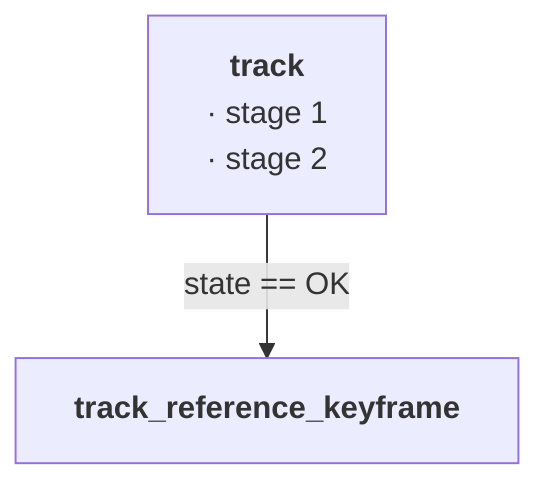

# Reference pages — format

One page per source-file family: `src/Tracking.cc` + `src/Tracking_aux.cc` + `include/Tracking.h`
→ `docs/reference/Tracking.md`. A page says what the code does *today*; it carries no history
(that is the review log's job) and no measurements (the gym's). When a commit changes behaviour,
the same commit updates the page, or its message says why not.

The `/document-file` command (`.claude/commands/document-file.md`) drafts a page in this format
from the sources. `python docs/tools/resolve_links.py` refreshes every line number before a docs
commit; `--check` is the CI form.

## Page skeleton

````markdown
# `src/Tracking.cc`

One paragraph: the role of the file, which thread runs it, what it owns.

## Call graph

- **[`track`](…/src/Tracking.cc#L152)** — [`check_replaced_in_last_frame`](…#L576), …
- Not in the graph (setup / recovery): [`LoadParameters`](…#L37), …

## Flow



## `# Main loop`            ← one H2 per `// # banner` of the .cc, in file order

**Section:** [`# Main loop`](…/src/LoopClosing.cc#L73)

Optional section diagram (flowchart LR) when the section has control flow worth drawing.

### `run`                    ← one H3 per function, named after the function

```cpp
void LoopClosing::run()
```
- what it does, in one to three bullets; the first bullet is the contract, later ones the mechanism
- called from: [`System::System`](…/src/System.cc#L211 "loop_closing_thread_ = "), once, only when …
- differs from ORB-SLAM2: … (only when it does; say what and why)
- settings: `LoopClosing.MinKeyframesBetweenLoops` (10) — …

## Settings read by this file

| Key | Default | Read in | Effect |
|---|---|---|---|
| `Tracking.TrackRefMinMatches` | 15 | [`LoadParameters`](…#L37) | raw matches below this → lost ([`track_reference_keyframe`](#track_reference_keyframe)) |
````

Rules of thumb:

- **Headings are anchors.** Every function entry is an H3 named exactly after the function
  (`### \`track\``), so `#track` works on GitHub and on the site and mermaid `click` lines can
  target it. Section headings are the banner text (`## \`# Main loop\``). A file without banners
  groups its functions by the call-graph order instead, under H2s the author chooses.
- **Signature block first, bullets after.** The signature is copied from the source, not the
  header, so default arguments and `const` match the definition.
- **Bullets, not prose.** One idea per bullet. A bullet that needs more than three lines is two
  bullets.
- **Say what, then why it differs.** Every function that has a stock ORB-SLAM2 counterpart gets a
  "differs from ORB-SLAM2" bullet when the behaviour differs; nothing when it does not. The
  reference copy is a plain clone of `raulmur/ORB_SLAM2` at `../ORB-SLAM2-DEV` (i.e.
  `VSLAM-LAB/Baselines/ORB-SLAM2-DEV`, gitignored by the parent; `../ORB-SLAM2` is the conda-packaged
  baseline and has no sources). A bullet written without the side-by-side read says so.
- **Settings are documented where they are read.** The per-file settings table at the bottom is
  the source for the site's settings page; the function bullet that uses the key links back to the
  table row is not required, naming the key is enough.
- **No history, no numbers.** "Fixed 2026-08-13" belongs to the review log, "73 ms median" to a
  gym entry. A reference bullet may link to either.

## Links into the code

Links point at GitHub, absolute, on `main`:

```
[`track`](https://github.com/alejandrofontan/AllFeature-VSLAM/blob/main/src/Tracking.cc#L152)
```

The line number is *derived*. `docs/tools/resolve_links.py` rewrites it from what identifies the
target, in this order:

1. a **link title** — the quoted string after the URL — used as a literal substring:
   `[`Tracking.cc`](…/src/Tracking.cc#L238 "else if (emergency_keyframe_)")`. Use this for any
   link whose text is not the target's name (a statement, a member, a file name).
2. a link text that is an **identifier**: the definition `name(` at column 0, else any
   `::name(`, else the word.
3. a link text starting with **`# `**: the banner `// # name`.

When a pattern matches several lines, the line nearest the current number wins, so a link stays on
"its" occurrence across edits. Relative targets (`src/File.cc#L1`) are rewritten to the absolute
form. Ranges (`#L10-L20`) are kept as written. File-name links without a title are reported as
unresolvable: give them a title.

## Diagrams

Mermaid, rendered on GitHub and on the site (`click` lines work only on the site; GitHub ignores
them). Three zoom levels: the system diagram on the landing page clicks to a component page, the
component `## Flow` diagram clicks to function headings, function bullets link to source lines.

Palette (VSLAM-LAB logo colours), one `classDef` block per diagram:

```
%% VSLAM-LAB logo squares: cyan #b5f3f9, periwinkle #8195fb, lavender #a59ddf
classDef entry fill:#8195fb,stroke:#5f74d6,color:#fff
classDef step fill:#b5f3f9,stroke:#7fcfd8,color:#1b2a4a
classDef check fill:#a59ddf,stroke:#7e75c4,color:#1b2a4a
classDef cmd fill:#fff,stroke:#8195fb,color:#1b2a4a
classDef stop fill:#fff,stroke:#c0392b,color:#c0392b
classDef store fill:#fff,stroke:#a59ddf,color:#1b2a4a
```

| class | use for |
|---|---|
| `entry` | where control comes from / goes to: thread bodies, callers in other files, terminal states |
| `step` | a function of this file |
| `check` | a decision |
| `cmd` | a statement worth showing (a lock, a flag, a sleep) |
| `stop` | an early return / drop / error exit |
| `store` | a data structure (queue, map, database) |

`flowchart TD` for the per-file flow (top to bottom reads as the frame's life), `flowchart LR` for
section diagrams (left to right reads as a protocol). Keep a diagram under ~15 nodes; split by
section instead of growing it.

## Media

A short `.mp4` (under 10 MB, committed under `docs/media/`) may sit under `## Flow` when the
behaviour is visual (the viewer during initialization, a loop closure firing, a cull). GitHub
renders it inline; the site embeds the same file. Record after the page is written, redo when the
UI changes.
