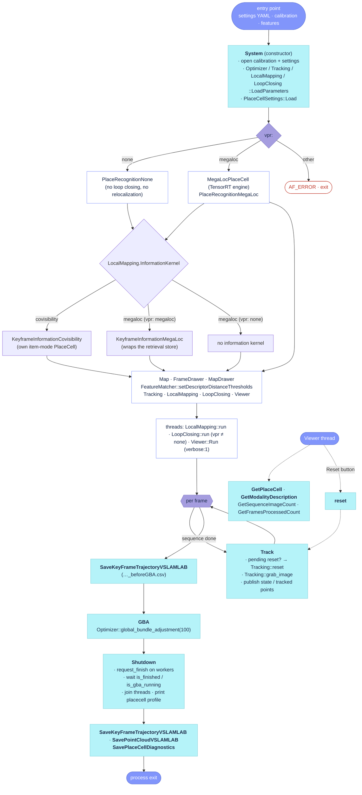

# `src/System.cc`

`System` is the façade the CLI entry points (`vslamlab_allfeature_mono`, `_rgbd`, `_mono_stream`)
talk to. Its constructor opens the calibration and settings files, loads every `*.LoadParameters`
block, selects the place-recognition backend, creates the `Map`, the drawers and the four workers
(`Tracking`, `LocalMapping`, `LoopClosing`, `Viewer`), and starts the three worker threads;
`Tracking` runs on the caller's thread inside `Track`. After the sequence, `GBA`, `Shutdown` and
the `Save*` functions write the outputs. `src/System.cc` has no `// #` section banners, so the
functions below are grouped by the call-graph order.

## Call graph

- **[`System`](https://github.com/alejandrofontan/AllFeature-VSLAM/blob/main/src/System.cc#L22)** (constructor) — `Optimizer::LoadParameters`, `Tracking::LoadParameters`, `LocalMapping::LoadParameters`, `LoopClosing::LoadParameters`, `PlaceCellSettings::Load`, `FeatureMatcher::setDescriptorDistanceThresholds`, then the constructors of `Map`, `FrameDrawer`, `MapDrawer`, `Tracking`, `LocalMapping`, `LoopClosing`, `Viewer`
- **[`Track`](https://github.com/alejandrofontan/AllFeature-VSLAM/blob/main/src/System.cc#L373)** — `Tracking::grab_image`; honours a pending [`reset`](https://github.com/alejandrofontan/AllFeature-VSLAM/blob/main/src/System.cc#L422)
- **[`GBA`](https://github.com/alejandrofontan/AllFeature-VSLAM/blob/main/src/System.cc#L723)** → **[`Shutdown`](https://github.com/alejandrofontan/AllFeature-VSLAM/blob/main/src/System.cc#L428)** → **[`SaveKeyFrameTrajectoryVSLAMLAB`](https://github.com/alejandrofontan/AllFeature-VSLAM/blob/main/src/System.cc#L527)**, **[`SavePointCloudVSLAMLAB`](https://github.com/alejandrofontan/AllFeature-VSLAM/blob/main/src/System.cc#L606)** (via the free helper [`write_ply_binary`](https://github.com/alejandrofontan/AllFeature-VSLAM/blob/main/src/System.cc#L579)), **[`SavePlaceCellDiagnostics`](https://github.com/alejandrofontan/AllFeature-VSLAM/blob/main/src/System.cc#L466)** — the end-of-run sequence the entry points call in this order
- Queries from the Viewer: [`GetPlaceCell`](https://github.com/alejandrofontan/AllFeature-VSLAM/blob/main/src/System.cc#L501), [`SetSequenceInfo`](https://github.com/alejandrofontan/AllFeature-VSLAM/blob/main/src/System.cc#L506), [`GetModalityDescription`](https://github.com/alejandrofontan/AllFeature-VSLAM/blob/main/src/System.cc#L512), plus the inline `GetPlaceCellSettings`, `GetSequenceImageCount`, `GetFramesProcessedCount` in `include/System.h`
- Not called by anything in this repo today: [`TrackStereo`](https://github.com/alejandrofontan/AllFeature-VSLAM/blob/main/src/System.cc#L266), [`TrackRGBD`](https://github.com/alejandrofontan/AllFeature-VSLAM/blob/main/src/System.cc#L320) (both `std::terminate` stubs), [`MapChanged`](https://github.com/alejandrofontan/AllFeature-VSLAM/blob/main/src/System.cc#L409), [`GetTrackingState`](https://github.com/alejandrofontan/AllFeature-VSLAM/blob/main/src/System.cc#L632), [`GetTrackedMapPoints`](https://github.com/alejandrofontan/AllFeature-VSLAM/blob/main/src/System.cc#L638), [`GetTrackedKeyPointsUn`](https://github.com/alejandrofontan/AllFeature-VSLAM/blob/main/src/System.cc#L644), [`SaveStatistics`](https://github.com/alejandrofontan/AllFeature-VSLAM/blob/main/src/System.cc#L650), [`setImageSize`](https://github.com/alejandrofontan/AllFeature-VSLAM/blob/main/src/System.cc#L718)

## Flow



## Construction

### `System`

```cpp
System::System(const string &strCalibrationFile, const string &strSettingsFile,
               const eSensor sensor,
               const bool activateVisualization,
               const vector<FeatureType>& featureTypes,
               const bool& fixImageSize)
```
- opens the calibration and settings files as `cv::FileStorage` (either missing → message on `cerr`, `exit(-1)`), then loads every parameter block in one place before any worker exists: [`Optimizer::LoadParameters`](https://github.com/alejandrofontan/AllFeature-VSLAM/blob/main/src/System.cc#L53 "Optimizer::LoadParameters(fsSettings)"), `Tracking::LoadParameters`, `LocalMapping::LoadParameters`, `LoopClosing::LoadParameters` and [`PlaceCellSettings::Load`](https://github.com/alejandrofontan/AllFeature-VSLAM/blob/main/src/System.cc#L57 "PlaceCellSettings::Load"). The worker threads start at the end of the constructor, so every thread sees fully populated parameters.
- selects the place-recognition backend from the settings, read a second time through yaml-cpp ([`System.cc`](https://github.com/alejandrofontan/AllFeature-VSLAM/blob/main/src/System.cc#L82 "YAML::LoadFile(strSettingsFile)")): `vpr: none` → `PlaceRecognitionNone`; `vpr: megaloc` → a `placecell::MegaLocPlaceCell` (TensorRT engine built or loaded from the cache next to the ONNX, CUDA warm-up in its constructor) wrapped in `PlaceRecognitionMegaLoc`; anything else, a missing ONNX file, a `feature_vpr` not listed in `features`, or an embedder exception is a hard error (`AF_ERROR`, `exit(-1)`). The chosen backend and the placecell diagnostics configuration are announced with `AF_INFO` and `std::cout.flush()` so the lines are visible during a long engine build under a redirected stdout.
- placecell's process-wide `Logger` level, `Profiler` and `Recorder` switches come from the `PlaceCell.*` settings ([`System.cc`](https://github.com/alejandrofontan/AllFeature-VSLAM/blob/main/src/System.cc#L116 "placecell::PlaceCell::Options placecell_options")), built once and applied to every store the system creates (`name` = `megaloc` / `covisibility`); `report_on_destruction` is off because [`Shutdown`](#shutdown) prints the profile tables itself. An unknown verbosity name warns and keeps placecell's default.
- builds the keyframe information kernel after the VPR backend ([`KeyframeInformation`](KeyframeInformation.md), `LocalMapping.InformationKernel`): `covisibility` → `KeyframeInformationCovisibility` with its own item-mode `placecell::PlaceCell`; `megaloc` → `KeyframeInformationMegaLoc` wrapping the retrieval store, or no kernel at all with `vpr: none` (one `AF_INFO`: insertion by the tracking triggers only, information culling falls back to the heuristic). One `AF_INFO` names the kernel, its centring and the tau in force.
- creates the `Map`, `FrameDrawer` and `MapDrawer`, loads each feature's matcher thresholds from its per-feature settings YAML ([`FeatureMatcher::setDescriptorDistanceThresholds`](https://github.com/alejandrofontan/AllFeature-VSLAM/blob/main/src/System.cc#L219 "setDescriptorDistanceThresholds")), then constructs `Tracking` (runs on the caller's thread), `LocalMapping` (+ thread), `LoopClosing` (+ thread **only if** `place_recognition->is_active()` — with `vpr: none` the object exists so the other workers can hold pointers to it, but its thread never starts and its `finished_` flag starts `true`, see the [LoopClosing page](LoopClosing.md)), and `Viewer` (+ thread) only when `activateVisualization` (`verbose:1`).
- wires the cross-pointers last: `Tracking` gets the local mapper, loop closer, viewer and the information kernel; `LocalMapping` gets the loop closer, viewer and the information kernel ([`System.cc`](https://github.com/alejandrofontan/AllFeature-VSLAM/blob/main/src/System.cc#L261 "set_keyframe_information")). `LoopClosing` receives `mSensor != MONOCULAR` as its fix-scale flag.
- called from: the three entry points, once ([`vslamlab_allfeature_mono.cpp`](https://github.com/alejandrofontan/AllFeature-VSLAM/blob/main/src/vslamlab_allfeature_mono.cpp#L158 "AF_VSLAM::System SLAM(")). `featureTypes` is parsed by the entry point from the settings' `features:` list; `fixImageSize` is the entry point's constant.
- differs from ORB-SLAM2: no `ORBVocabulary`/`KeyFrameDatabase` (place recognition is the `PlaceRecognition` backend); the loop-closing thread is conditional; the parameter blocks are loaded here rather than each class reading the file on its own; matcher thresholds are per feature type; no localization-mode flags are wired (the `mMutexMode` member survives unused).
- settings: `vpr` (`megaloc`), `feature_vpr` (first of `features`), `megaloc_onnx` (`megaloc_models/megaloc_322x322.onnx`), `megaloc_precision` (`fp16`), `PlaceRecognition.MegaLocMinSimilarity` (0.55), `PlaceRecognition.MaxCandidates` (10), and the `PlaceCell.*` block through `PlaceCellSettings::Load`. `Viewer.*` keys are read by `MapDrawer`/`Viewer`, `Camera.*` by `Tracking`, and the `Optimizer.*`/`Tracking.*`/`LocalMapping.*`/`LoopClosing.*` blocks by the respective `LoadParameters`.

## Per-frame entry

### `Track`

```cpp
mat4f System::Track(Image &im, const double &timestamp)
```
- the only live tracking entry point, for both `MONOCULAR` and `RGBD` (any other sensor → `cerr` + `exit(-1)`): applies a pending [`reset`](#reset) under `mMutexReset`, calls `Tracking::grab_image` on the caller's thread, and returns the camera pose `Tcw`.
- after tracking it bumps `mnFramesProcessed` (read by the Viewer HUD through `GetFramesProcessedCount`) and, under `mMutexState`, copies the tracking state and the current frame's map points / undistorted keypoints into the `mTracked*` members for [`GetTrackingState`](#gettrackingstate) and friends. The wall-clock duration of the call is appended to the public `trackingTime` vector (grows for the whole run; nothing reads it today).
- called from: the frame loops of [`vslamlab_allfeature_mono.cpp`](https://github.com/alejandrofontan/AllFeature-VSLAM/blob/main/src/vslamlab_allfeature_mono.cpp#L207 "SLAM.Track(im,tframe)"), [`vslamlab_allfeature_rgbd.cpp`](https://github.com/alejandrofontan/AllFeature-VSLAM/blob/main/src/vslamlab_allfeature_rgbd.cpp#L236 "SLAM.Track(im,tframe)") and [`vslamlab_allfeature_mono_stream.cpp`](https://github.com/alejandrofontan/AllFeature-VSLAM/blob/main/src/vslamlab_allfeature_mono_stream.cpp#L107 "SLAM.Track(im,tframe)").
- differs from ORB-SLAM2: replaces `TrackMonocular`/`TrackRGBD` with one call taking an `Image` (gray + optional depth + optional mask) — the RGB-D executable feeds depth through `Image`, not through a second `cv::Mat`; the localization-mode block (`ActivateLocalizationMode`) is gone.

### `reset`

```cpp
void System::reset()
```
- raises `mbReset` under `mMutexReset`; the reset itself (`Tracking::reset`, which resets the map, the workers and the VPR database) runs at the start of the next [`Track`](#track) on the tracking thread, never on the caller's.
- called from: the Viewer's "Reset" button ([`Viewer.cc`](https://github.com/alejandrofontan/AllFeature-VSLAM/blob/main/src/Viewer.cc#L422 "system->reset()")).

### `MapChanged`

```cpp
bool System::MapChanged()
```
- returns `true` once per big map change (loop closure or global BA, counted by `Map::InformNewBigChange`), tracked with a function-local static index; inherited from ORB-SLAM2 unchanged.
- called from: nothing in this repo.

## Shutdown and outputs

### `GBA`

```cpp
void System::GBA()
```
- runs `Optimizer::global_bundle_adjustment(mpMap, 100)` on the caller's thread, bracketed by two `AF_INFO` lines. It is called while the worker threads are still alive, before [`Shutdown`](#shutdown).
- called from: the entry points after the frame loop and after the `_beforeGBA` trajectory save ([`vslamlab_allfeature_mono.cpp`](https://github.com/alejandrofontan/AllFeature-VSLAM/blob/main/src/vslamlab_allfeature_mono.cpp#L235 "SLAM.GBA()")); not by the stream executable.
- differs from ORB-SLAM2: stock has no end-of-run global BA; its `GlobalBundleAdjustemnt` runs only inside `LoopClosing`.

### `Shutdown`

```cpp
void System::Shutdown()
```
- asks `LocalMapping` and `LoopClosing` to finish, waits for the Viewer first (5 ms polls of `isFinished`), then for `LocalMapping::is_finished`, `LoopClosing::is_finished` **and** `!LoopClosing::is_gba_running` — the loop-closing thread returning does not stop a global BA in flight, so it is waited for separately. With `vpr: none` the loop-closing checks pass immediately (its `finished_` starts `true`).
- joins the three worker `std::thread`s once they have returned, so none is destroyed joinable with `System` (issue #12: that is `std::terminate` at exit); the finished GBA thread is joined by `~LoopClosing`.
- rebinds Pangolin to the main viewer window (the viewer thread may have left the placecell window bound) and, with a placecell store and `PlaceCell.PrintProfile: 1`, flushes stdout and prints the profile table of the information store and, when it is a different object, of the retrieval store on stderr — complete only now that every placecell caller has stopped.
- called from: the mono and rgbd entry points after [`GBA`](#gba) ([`vslamlab_allfeature_mono.cpp`](https://github.com/alejandrofontan/AllFeature-VSLAM/blob/main/src/vslamlab_allfeature_mono.cpp#L238 "SLAM.Shutdown()")); the stream executable exits without calling it.
- differs from ORB-SLAM2: stock only waits and rebinds the Pangolin context; it never joins the threads.

### `SaveKeyFrameTrajectoryVSLAMLAB`

```cpp
void System::SaveKeyFrameTrajectoryVSLAMLAB(const string &filename)
```
- writes every non-bad keyframe, sorted by id, as one CSV row `ts (ns),tx (m),ty (m),tz (m),qx,qy,qz,qw` — timestamp in integer nanoseconds, translation = camera centre, quaternion of `R_wc` (the transpose of the keyframe's `R_cw`) — with the classic locale so the decimal separator is always `.`. The ORB-SLAM2 "move the first keyframe to the origin" step is present as commented-out code and not applied.
- called from: the mono and rgbd entry points twice — `<exp_id>_KeyFrameTrajectory_beforeGBA.csv` before [`GBA`](#gba) and `<exp_id>_KeyFrameTrajectory.csv` after [`Shutdown`](#shutdown) ([`vslamlab_allfeature_mono.cpp`](https://github.com/alejandrofontan/AllFeature-VSLAM/blob/main/src/vslamlab_allfeature_mono.cpp#L253 "KeyFrameTrajectory.csv")). VSLAM-LAB's evaluator reads the second.
- differs from ORB-SLAM2: replaces `SaveKeyFrameTrajectoryTUM` (space-separated seconds) with VSLAM-LAB's CSV; `SaveTrajectoryTUM`/`SaveTrajectoryKITTI` (per-frame trajectories through the relative-pose lists) do not exist here.

### `write_ply_binary`

```cpp
bool write_ply_binary(const std::string& path, const std::vector<PointRGB>& pts)
```
- free helper (file scope, not a `System` member): writes a binary little-endian PLY with `x y z` floats and `red green blue` bytes per vertex; returns the stream state so the caller can report a failed write.
- called from: [`SavePointCloudVSLAMLAB`](#savepointcloudvslamlab) only.

### `SavePointCloudVSLAMLAB`

```cpp
void System::SavePointCloudVSLAMLAB(const string &filename)
```
- exports every non-bad map point as a coloured PLY through [`write_ply_binary`](#write_ply_binary). The colour is `MapPoint::color` (BGR, sampled under the reference keypoint at creation), so no image is re-read and the export does not depend on the input files or the tracking resolution. A failed write is one `AF_WARN`.
- called from: the mono and rgbd entry points after the final trajectory save (`<exp_id>_PointCloud.ply`, [`vslamlab_allfeature_mono.cpp`](https://github.com/alejandrofontan/AllFeature-VSLAM/blob/main/src/vslamlab_allfeature_mono.cpp#L254 "PointCloud.ply")).
- differs from ORB-SLAM2: no counterpart.

### `SavePlaceCellDiagnostics`

```cpp
void System::SavePlaceCellDiagnostics(const std::string& directory)
```
- no-op without any placecell store or with `PlaceCell.Dump: 0`. Otherwise `PlaceCell::dump(directory)` of the information store (kernel `.npy` raw + centred, `views.csv` with the item-set sizes for `covisibility`, the recorder CSVs, `profile.csv`) followed by a windowless `placecell::viz::Visualizer` render of its three plots saved as PNGs at full size (`windows = false`, `max_hz = 0`, `kernel.centred` and `history.last_n` from the `PlaceCell.Visualize*` settings). When the `vpr: megaloc` retrieval store is a different object (`InformationKernel: covisibility`) it is dumped, without plots, into `directory/retrieval_megaloc`. Any exception is one `AF_WARN` and the function returns; nothing else is affected.
- called from: the mono and rgbd entry points as the very last step, directory `<exp_id>_placecell` ([`vslamlab_allfeature_mono.cpp`](https://github.com/alejandrofontan/AllFeature-VSLAM/blob/main/src/vslamlab_allfeature_mono.cpp#L257 "SavePlaceCellDiagnostics")). Must run after [`Shutdown`](#shutdown) so the store is quiescent.
- settings: `PlaceCell.Dump` (0), `PlaceCell.VisualizeCentred` (1), `PlaceCell.VisualizeHistoryLastN` (0).

## Queries from the Viewer

### `GetPlaceCell`

```cpp
const placecell::PlaceCell* System::GetPlaceCell() const
```
- non-owning pointer to the keyframe INFORMATION store ([`KeyframeInformation::place_cell`](KeyframeInformation.md#place_cell): the kernel insertion and culling read), null when the system has no information kernel; the Viewer builds its placecell panels on it. `System` outlives the Viewer ([`Shutdown`](#shutdown) joins its thread), so the raw pointer is safe. The inline `GetPlaceCellSettings` returns the `PlaceCell.*` settings the panels obey.
- called from: [`Viewer::Run`](https://github.com/alejandrofontan/AllFeature-VSLAM/blob/main/src/Viewer.cc#L233 "system->GetPlaceCell()").

### `SetSequenceInfo`

```cpp
void System::SetSequenceInfo(const size_t nImages, const bool useMasks)
```
- stores the sequence length (0 = unknown, the streaming case) and whether segmentation masks are fed with the images, in atomics polled by the Viewer HUD (`GetSequenceImageCount`, `GetFramesProcessedCount`, [`GetModalityDescription`](#getmodalitydescription)).
- called from: all three entry points right after construction ([`vslamlab_allfeature_mono.cpp`](https://github.com/alejandrofontan/AllFeature-VSLAM/blob/main/src/vslamlab_allfeature_mono.cpp#L164 "SLAM.SetSequenceInfo"); the stream passes `0`).

### `GetModalityDescription`

```cpp
std::string System::GetModalityDescription() const
```
- `"Monocular"`, `"Stereo"` or `"RGB-D"` from the sensor enum, with `" + masks"` appended when [`SetSequenceInfo`](#setsequenceinfo) said masks are in use.
- called from: the Viewer menu's `Modality` field ([`Viewer.cc`](https://github.com/alejandrofontan/AllFeature-VSLAM/blob/main/src/Viewer.cc#L189 "GetModalityDescription")).

### `GetTrackingState`

```cpp
int System::GetTrackingState()
```
- the tracking state captured by the last [`Track`](#track), under `mMutexState`. Inherited API; no caller in this repo.

### `GetTrackedMapPoints`

```cpp
std::map<FeatureType,std::vector<Pt>> System::GetTrackedMapPoints()
```
- copy of the last frame's per-feature-type map-point vector, under `mMutexState`. No caller in this repo.

### `GetTrackedKeyPointsUn`

```cpp
std::map<FeatureType, std::vector<cv::KeyPoint>> System::GetTrackedKeyPointsUn()
```
- copy of the last frame's per-feature-type undistorted keypoints, under `mMutexState`. No caller in this repo.

## Stubs and leftovers

### `TrackStereo`

```cpp
mat4f System::TrackStereo(const cv::Mat &, const cv::Mat &, const double &)
```
- prints a "not modified yet" line and `std::terminate()`s; the ORB-SLAM2 body (localization-mode switch, reset, `GrabImageStereo`) is kept as a comment. No caller.

### `TrackRGBD`

```cpp
mat4f System::TrackRGBD(const cv::Mat &, const cv::Mat &, const double &)
```
- same stub as [`TrackStereo`](#trackstereo). RGB-D tracking goes through [`Track`](#track) with the depth inside `Image`, so this signature is dead. No caller.

### `SaveStatistics`

```cpp
void System::SaveStatistics(const std::string &filename)
```
- the AnyFeature-VSLAM statistics writer, entirely commented out except the final `AF_INFO("<filename>.yaml file written successfully!")`, which reports a file that is never written. No caller.

### `setImageSize`

```cpp
void System::setImageSize(const int width, const int height)
```
- stores `image_width`/`image_height`; nothing calls it and nothing reads the members (the workers take the size from `Tracking::get_image_width/height`).

## Settings read by this file

Read directly by the constructor through yaml-cpp (all optional, defaults in brackets):

| Key | Default | Read in | Effect |
|---|---|---|---|
| `vpr` | `megaloc` | [`System`](#system) | place-recognition backend: `megaloc` or `none` (no loop closing, no relocalization); other values exit |
| `feature_vpr` | first of `features` | [`System`](#system) | local feature that geometrically verifies retrieved candidates (reloc PnP, loop Sim3); must be in `features` |
| `megaloc_onnx` | `megaloc_models/megaloc_322x322.onnx` | [`System`](#system) | MegaLoc model; a missing file exits with a hint on how to obtain it |
| `megaloc_precision` | `fp16` | [`System`](#system) | TensorRT engine precision; the engine cache is `<onnx>.<precision>.engine` |
| `PlaceRecognition.MegaLocMinSimilarity` | 0.55 | [`System`](#system) → `PlaceRecognitionMegaLocParameters` | cosine floor for a keyframe to be a relocalization/loop candidate |
| `PlaceRecognition.MaxCandidates` | 10 | [`System`](#system) → `PlaceRecognitionMegaLocParameters` | cap on candidates per query (0 = unlimited) |
| `PlaceCell.*` | see `include/PlaceCellSettings.h` | [`System`](#system) via `PlaceCellSettings::Load`; `PrintProfile` in [`Shutdown`](#shutdown), `Dump`/`VisualizeCentred`/`VisualizeHistoryLastN` in [`SavePlaceCellDiagnostics`](#saveplacecelldiagnostics) | placecell logger level, profiler, recorder, dump and visualizer switches, for every store |

Also read (owned by [LocalMapping](LocalMapping.md)): `LocalMapping.InformationKernel`, `LocalMapping.KeyframeCullingCentred` and `LocalMapping.KeyframeCullingMaxUnexplained` in [`System`](#system), to build and announce the information kernel.

Delegated (loaded here, documented on their own pages): `Optimizer.*` (`Optimizer::LoadParameters`), `Tracking.*` and `Camera.*` ([Tracking](Tracking.md)), `LocalMapping.*` ([LocalMapping](LocalMapping.md)), `LoopClosing.*` ([LoopClosing](LoopClosing.md)), `Viewer.*` (`MapDrawer`, [Viewer](Viewer.md)), `FeatureMatcher.*` from each feature's own settings YAML (`FeatureMatcher::setDescriptorDistanceThresholds`). `features:` itself is parsed by the entry points, not by `System`.
