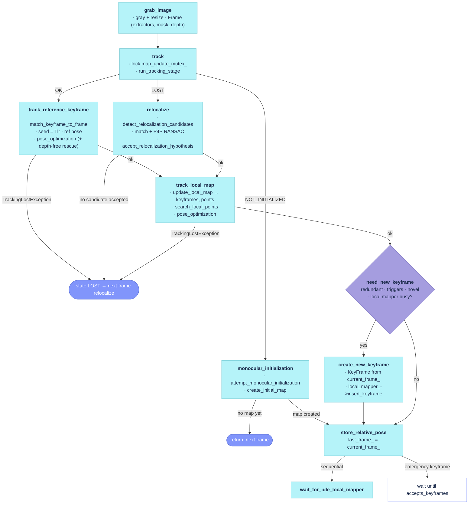

# `src/Tracking.cc`

The per-frame front end. `Tracking` runs on the caller's thread (the executable's frame loop,
through `System::Track`): it turns an `Image` into a `Frame` (feature extraction per feature type,
optional segmentation mask, optional depth), initializes the map from two views, tracks every
later frame against its reference keyframe and then the local map, decides whether the frame
becomes a keyframe, and recovers from a loss through relocalization. It owns the current and last
frame, the local map (`local_keyframes_`, `local_points_`), the reference keyframe, and the
`TrackingParameters` block. Auxiliary members (calibration loading, the extractor factory, the
exception wrapper, profiling) live in `src/Tracking_aux.cc`. The file has no `// #` section
banners; the sections below follow the call graph.

Sources: `src/Tracking.cc`, `src/Tracking_aux.cc`, `include/Tracking.h`, `include/Tracking_aux.h`
(profilers). Reading notes: [`docs/review/Tracking.md`](../review/Tracking.md).

## Call graph

- **[`grab_image`](https://github.com/alejandrofontan/AllFeature-VSLAM/blob/main/src/Tracking.cc#L114)** — builds the `Frame`, then [`track`](https://github.com/alejandrofontan/AllFeature-VSLAM/blob/main/src/Tracking.cc#L149), [`log_profile`](https://github.com/alejandrofontan/AllFeature-VSLAM/blob/main/src/Tracking_aux.cc#L136)
- **[`track`](https://github.com/alejandrofontan/AllFeature-VSLAM/blob/main/src/Tracking.cc#L149)** — [`monocular_initialization`](https://github.com/alejandrofontan/AllFeature-VSLAM/blob/main/src/Tracking.cc#L257) *or* [`check_replaced_in_last_frame`](https://github.com/alejandrofontan/AllFeature-VSLAM/blob/main/src/Tracking.cc#L573) + [`track_reference_keyframe`](https://github.com/alejandrofontan/AllFeature-VSLAM/blob/main/src/Tracking.cc#L583) *or* [`relocalize`](https://github.com/alejandrofontan/AllFeature-VSLAM/blob/main/src/Tracking.cc#L1056); then [`track_local_map`](https://github.com/alejandrofontan/AllFeature-VSLAM/blob/main/src/Tracking.cc#L673), [`log_heartbeat`](https://github.com/alejandrofontan/AllFeature-VSLAM/blob/main/src/Tracking_aux.cc#L119), [`need_new_keyframe`](https://github.com/alejandrofontan/AllFeature-VSLAM/blob/main/src/Tracking.cc#L866) → [`create_new_keyframe`](https://github.com/alejandrofontan/AllFeature-VSLAM/blob/main/src/Tracking.cc#L1031), [`store_relative_pose`](https://github.com/alejandrofontan/AllFeature-VSLAM/blob/main/src/Tracking.cc#L251), [`wait_for_idle_local_mapper`](https://github.com/alejandrofontan/AllFeature-VSLAM/blob/main/src/Tracking.cc#L1050) (sequential mode). Each tracking stage runs inside [`run_tracking_stage`](https://github.com/alejandrofontan/AllFeature-VSLAM/blob/main/src/Tracking_aux.cc#L106).
- **[`monocular_initialization`](https://github.com/alejandrofontan/AllFeature-VSLAM/blob/main/src/Tracking.cc#L257)** — [`attempt_monocular_initialization`](https://github.com/alejandrofontan/AllFeature-VSLAM/blob/main/src/Tracking.cc#L265) → [`create_initial_map`](https://github.com/alejandrofontan/AllFeature-VSLAM/blob/main/src/Tracking.cc#L363) (→ `reset` on a degenerate map)
- **[`track_local_map`](https://github.com/alejandrofontan/AllFeature-VSLAM/blob/main/src/Tracking.cc#L673)** — [`update_local_map`](https://github.com/alejandrofontan/AllFeature-VSLAM/blob/main/src/Tracking.cc#L716) → [`update_local_keyframes`](https://github.com/alejandrofontan/AllFeature-VSLAM/blob/main/src/Tracking.cc#L725), [`update_local_points`](https://github.com/alejandrofontan/AllFeature-VSLAM/blob/main/src/Tracking.cc#L808); [`search_local_points`](https://github.com/alejandrofontan/AllFeature-VSLAM/blob/main/src/Tracking.cc#L831)
- **[`need_new_keyframe`](https://github.com/alejandrofontan/AllFeature-VSLAM/blob/main/src/Tracking.cc#L866)** — no callees; the decision is the [`KeyframeInformation::information`](KeyframeInformation.md#information) query plus the tracking triggers
- **[`relocalize`](https://github.com/alejandrofontan/AllFeature-VSLAM/blob/main/src/Tracking.cc#L1056)** — [`accept_relocalization_hypothesis`](https://github.com/alejandrofontan/AllFeature-VSLAM/blob/main/src/Tracking.cc#L1133)
- Not in the graph (setup / recovery): [`LoadParameters`](https://github.com/alejandrofontan/AllFeature-VSLAM/blob/main/src/Tracking.cc#L36), [`Tracking`](https://github.com/alejandrofontan/AllFeature-VSLAM/blob/main/src/Tracking.cc#L90) → [`load_camera_parameters`](https://github.com/alejandrofontan/AllFeature-VSLAM/blob/main/src/Tracking_aux.cc#L20), [`get_feature_extractor`](https://github.com/alejandrofontan/AllFeature-VSLAM/blob/main/src/Tracking_aux.cc#L97); [`reset`](https://github.com/alejandrofontan/AllFeature-VSLAM/blob/main/src/Tracking.cc#L1199)

## Flow



## Frame entry

### `grab_image`

```cpp
mat4f Tracking::grab_image(Image &im, const double timestamp)
```
- the per-frame entry point: converts the image to gray (honouring the calibration's colour order), resizes it to the nominal area when `fix_image_size_` is set, keeps the gray image, the segmentation mask and the image name for the drawers, builds `current_frame_` and calls [`track`](#track). Returns `current_frame_.Tcw` (identity-less/unset when the frame did not track).
- feature extraction happens in the `Frame` constructor with one extractor per feature type; before the map exists the denser `init_feature_extractor_` set is used (`Tracking.InitExtractorFeaturesScale` times more keypoints), afterwards `feature_extractor_left_`.
- profiling: `GrabProfiler` ([`Tracking_aux.h`](https://github.com/alejandrofontan/AllFeature-VSLAM/blob/main/include/Tracking_aux.h#L92 "struct GrabProfiler")) fills the resize / frame-creation / tracking / total histograms; the total is only counted for frames that ended in state `OK`, and the running median is pushed to the viewer when one exists.
- called from: [`System::Track`](https://github.com/alejandrofontan/AllFeature-VSLAM/blob/main/src/System.cc#L393 "tracker->grab_image"), once per image.
- differs from ORB-SLAM2: one entry point for mono and RGB-D (`GrabImageMonocular`/`GrabImageRGBD` are gone; depth travels inside `Image` and becomes per-keypoint inverse depth in the `Frame`); the mask and the multi-feature extractor map are new.
- settings: `Tracking.InitExtractorFeaturesScale` (4).

### `track`

```cpp
void Tracking::track()
```
- the state machine. Under `map_->map_update_mutex_` for the whole frame: `NOT_INITIALIZED` → [`monocular_initialization`](#monocular_initialization) and return; `OK` → [`check_replaced_in_last_frame`](#check_replaced_in_last_frame) then [`track_reference_keyframe`](#track_reference_keyframe); `LOST` → [`relocalize`](#relocalize). A successful first stage continues with [`track_local_map`](#track_local_map). `state_` becomes `OK` or `LOST` from the combined result.
- both tracking stages run through [`run_tracking_stage`](#run_tracking_stage): a `TrackingLostException` thrown inside them is logged with its reason and turns into a failed stage. `relocalize` returns `false` silently (it is retried every frame while lost).
- on success: the frame drawer and map drawer are updated, points without a map observation are dropped from the frame, [`need_new_keyframe`](#need_new_keyframe) may call [`create_new_keyframe`](#create_new_keyframe), then the frame's Huber outliers are dropped so the next frame does not seed from them (they were allowed into the keyframe for bundle adjustment to judge).
- end of frame, every path: `current_frame_.ref_keyframe` is guaranteed, `last_frame_` is a copy of the frame, [`store_relative_pose`](#store_relative_pose) records `Tlr`. In sequential mode the map mutex is released and [`wait_for_idle_local_mapper`](#wait_for_idle_local_mapper) blocks until Local Mapping is idle; after an emergency keyframe the thread spins (mutex released) until Local Mapping accepts keyframes again.
- profiling: `TrackProfiler` ([`Tracking_aux.h`](https://github.com/alejandrofontan/AllFeature-VSLAM/blob/main/include/Tracking_aux.h#L23 "struct TrackProfiler")) reports a per-stage breakdown as `AF_WARN` for frames slower than its threshold (mutex wait, reference tracking, local map, emergency wait).
- differs from ORB-SLAM2: no `TrackWithMotionModel` and no `mbOnlyTracking` branch — every `OK` frame goes through `track_reference_keyframe`; the lost-with-small-map reset that stock ORB-SLAM2 performs here does not exist (a reset only happens from `create_initial_map`); the sequential and emergency waits are new.
- settings: `Tracking.Sequential` (0).

### `run_tracking_stage`

```cpp
bool Tracking::run_tracking_stage(const std::function<bool()>& stage)
```
- runs one stage and converts a `TrackingLostException` (`include/TrackingLostException.h`) into `false`, printing `Tracking lost — <reason>` with `AF_WARN`. The reason strings carry the statistic that failed (match count, inlier count, frame id, reference keyframe), so the log states why a loss happened.
- called from: [`track`](#track), around `track_reference_keyframe` and `track_local_map`.

### `store_relative_pose`

```cpp
void Tracking::store_relative_pose()
```
- stores `Tlr = Tcw · Trw⁻¹`, the frame's pose relative to its reference keyframe, in `last_frame_relative_pose_`, only when the frame has a pose (`Tcw(3,3) == 1`). [`track_reference_keyframe`](#track_reference_keyframe) recomposes it with the reference keyframe's *current* pose next frame, so corrections from local BA or a loop closure are absorbed into the seed without touching stored frames.
- called from: [`track`](#track) (every frame) and [`monocular_initialization`](#monocular_initialization) (once the map exists).
- differs from ORB-SLAM2: stock stores `mlRelativeFramePoses` for trajectory saving and seeds the next pose from `mVelocity`; here the relative pose *is* the seed and trajectories are saved from keyframes by `System`.

## Initialization

### `monocular_initialization`

```cpp
void Tracking::monocular_initialization()
```
- wrapper that always finishes the frame: runs [`attempt_monocular_initialization`](#attempt_monocular_initialization), updates the frame drawer, and once `state_` is `OK` stores the first relative pose.
- called from: [`track`](#track) while `state_ == NOT_INITIALIZED`.

### `attempt_monocular_initialization`

```cpp
void Tracking::attempt_monocular_initialization()
```
- two-view initialization with early returns. Without an `Initializer`: a frame with more than `Tracking.InitMinKeypoints` keypoints (pooled over feature types) becomes `initial_frame_` and arms the initializer (`Tracking.InitSigma`, `Tracking.InitRansacIterations`). With one: too few keypoints in the current frame disarms it; otherwise `match_frames_for_initialization` matches per feature type and the matches are flattened into `init_matches_` (the initializer's structure) and kept per feature in `matches_per_feature_` for [`create_initial_map`](#create_initial_map).
- gates on the pooled match count (`Tracking.InitMinMatches`, disarms) and on the median keypoint disparity (`Tracking.InitMinMedianDisparity`, keeps the reference frame and waits: a static camera cannot give a conditioned two-view geometry).
- on `Initializer::initialize` success, matches that were not triangulated are cleared, the initial frame is placed at the origin, the current frame at `[Rcw | tcw]`, and [`create_initial_map`](#create_initial_map) runs.
- differs from ORB-SLAM2: pooled multi-feature matching and gates; the disparity gate is new.
- settings: `Tracking.InitMinKeypoints` (100), `Tracking.InitSigma` (1.0), `Tracking.InitMinMatches` (100), `Tracking.InitRansacIterations` (200), `Tracking.InitMinMedianDisparity` (10.0).

### `create_initial_map`

```cpp
void Tracking::create_initial_map()
```
- builds the two founding keyframes (with their global descriptors), adds them to the map and creates one map point per triangulated match, observed by both.
- metric scale from depth: for every triangulated point of the reference keyframe with a valid sensor inverse depth, the ratio sensor depth / triangulated depth is collected; with at least `Tracking.InitMinDepthSamples` ratios the median rescales the baseline and the points to metric *before* bundle adjustment. Matched pairs the initializer could not triangulate are then back-projected from sensor depth (reference frame preferred, current frame as fallback) as two-observation points, so BA refines them too.
- `Optimizer::global_bundle_adjustment` with `Tracking.InitGbaIterations`; the map is rejected (and [`reset`](#reset) called) when the reference keyframe's median scene depth is negative or the current keyframe tracks fewer than `Tracking.InitMinTrackedPoints` points.
- without a metric scale, the monocular convention applies after BA: median scene depth normalized to 1. With one, unmatched keypoints of the current keyframe that carry depth become single-observation points after BA (the reference frame's are left out to avoid duplicating surfaces).
- both keyframes go to Local Mapping; the current keyframe becomes reference and last keyframe, the local map is seeded with every map point, `state_ = OK`.
- differs from ORB-SLAM2: depth-verified metric scale, depth-completed and depth-only points, per-feature map points, and the `AF_INFO` summary line; stock always normalizes to median depth 1.
- settings: `Tracking.InitGbaIterations` (20), `Tracking.InitMinTrackedPoints` (100), `Tracking.InitMinDepthSamples` (10).

## Frame-to-frame tracking

### `check_replaced_in_last_frame`

```cpp
void Tracking::check_replaced_in_last_frame()
```
- replaces every map point of `last_frame_` that Local Mapping fused into another point (`MapPoint::get_replaced`) with its replacement, so the last frame's matches stay valid.
- called from: [`track`](#track), before `track_reference_keyframe`.

### `track_reference_keyframe`

```cpp
bool Tracking::track_reference_keyframe()
```
- matches the reference keyframe's map points into the current frame with `FeatureMatcher::match_keyframe_to_frame` (global descriptor matching per feature type, geometrically filtered inside the matcher) and installs the matches as the frame's points. Fewer than `Tracking.TrackRefMinMatches` raw matches throws `TrackingLostException`.
- seed pose: `last_frame_relative_pose_ · ref_pose(last_frame_.ref_keyframe)`, i.e. the last frame's pose re-derived from its stored relative pose and the reference keyframe's current pose — a constant-position seed, deliberately without a velocity prior. Then `Optimizer::pose_optimization`.
- divergence rescue: when the inliers collapse below `Tracking.TrackRefMinInliers` although at least three times `Tracking.TrackRefMinMatches` raw matches exist, the outlier flags are cleared, the seed restored and the optimization repeated once with the RGB-D depth channel disabled (pure reprojection).
- outliers are removed from the frame and marked (`track_in_view = false`, `last_frame_seen = this frame`) so `search_local_points` neither revisits nor double-counts them. Fewer than `Tracking.TrackRefMinInliers` inliers throws `TrackingLostException`.
- called from: [`track`](#track) (through `run_tracking_stage`) while `state_ == OK`.
- differs from ORB-SLAM2: stock seeds from the last frame's absolute pose (or the motion model in `TrackWithMotionModel`) and matches by bag-of-words; here the matcher is descriptor-global, the seed is relative-pose based, and the depth-free retry and the typed exceptions are new.
- settings: `Tracking.TrackRefMinMatches` (15), `Tracking.TrackRefMinInliers` (10).

## Local map

### `track_local_map`

```cpp
bool Tracking::track_local_map()
```
- [`update_local_map`](#update_local_map), [`search_local_points`](#search_local_points), `Optimizer::pose_optimization`; every non-outlier match then gets `increase_found` (the found/visible ratio Local Mapping's point culling reads), and `num_inlier_matches_` is the inlier count.
- two loss conditions, both `TrackingLostException`: within `max_frames_` frames (one second at the camera rate) of a relocalization fewer than `Tracking.TrackLocalMapMinInliersAfterReloc` inliers; otherwise fewer than `Tracking.TrackLocalMapMinInliers`.
- called from: [`track`](#track) (through `run_tracking_stage`) after a successful first stage.
- settings: `Tracking.TrackLocalMapMinInliers` (30), `Tracking.TrackLocalMapMinInliersAfterReloc` (50).

### `update_local_map`

```cpp
void Tracking::update_local_map()
```
- publishes the current `local_points_` to the map as reference points (viewer), then [`update_local_keyframes`](#update_local_keyframes) and [`update_local_points`](#update_local_points).

### `update_local_keyframes`

```cpp
void Tracking::update_local_keyframes()
```
- every map point of the current frame votes for the keyframes observing it (bad points are dropped from the frame on the way). Every voting keyframe that is not bad joins `local_keyframes_`; the one sharing most points becomes `ref_keyframe_` (also set on the frame).
- expansion, capped at `Tracking.MaxLocalKeyframes`: for each local keyframe, one best covisible neighbour (out of `Tracking.BestCovisibleKeyframes`), one child, and the parent, each added once; the loop breaks after the first parent insertion, matching stock ORB-SLAM2. The vector grows while traversed, hence the indexed loop and the copied element.
- settings: `Tracking.MaxLocalKeyframes` (80), `Tracking.BestCovisibleKeyframes` (10).

### `update_local_points`

```cpp
void Tracking::update_local_points()
```
- `local_points_` = union of the map points of all local keyframes over all feature types, deduplicated by point id before the `is_bad` check (one lock per unique point).

### `search_local_points`

```cpp
void Tracking::search_local_points()
```
- marks the frame's already-matched points as visible and seen this frame (`track_in_view = false`), dropping bad ones; then projects every other local point with `Frame::is_in_frustum` (viewing-angle limit `Tracking.ViewingCosLimit`), counting visible ones; if any, `FeatureMatcher::match_map_points_to_frame` matches them into the frame.
- differs from ORB-SLAM2: stock passes a search radius that grows after a relocalization (`th = 5` vs `3`); here the matcher owns its radius and no relocalization-dependent widening exists.
- settings: `Tracking.ViewingCosLimit` (0.5).

## Keyframe policy

### `need_new_keyframe`

```cpp
bool Tracking::need_new_keyframe()
```
- no insertion while Local Mapping is stopped or asked to stop (loop closure), nor within `max_frames_` frames of a relocalization while the map is older than that — unless the frame already tracks at least twice `Tracking.TrackLocalMapMinInliersAfterReloc` inliers.
- tracking-health triggers: `weak_tracking` (inliers below `Tracking.RefMatchesRatio` × the reference keyframe's tracked points with at least `Tracking.MinObservationsHigh` observations, or `Tracking.MinObservationsLow` while the map has at most `Tracking.YoungMapKeyframes` keyframes, and above `Tracking.MinInliersForKeyframe`), `low_overlap` (`Frame::get_overlap` below `Tracking.MinRefOverlap`: the fraction of the image area around the frame's keypoints that is also covered by its tracked map points, both as fixed-radius discs), `forced` (every `ALLFEATURE_MAX_KEYFRAMES` frames when that compile flag is defined).
- information bands: [`KeyframeInformation::information`](KeyframeInformation.md#information) returns the view's unexplained information `v ∈ [0,1]` given `local_keyframes_` (placecell, on the kernel `LocalMapping.InformationKernel` selects — `megaloc`: the frame's MegaLoc embedding against the keyframes' descriptors; `covisibility`: the frame's tracked map points against the keyframes' point sets — with the same centring as keyframe culling). `v` below `Tracking.KeyframeMinInformation` → `redundant`, no keyframe unless forced; `v` above tau (`LocalMapping.KeyframeCullingMaxUnexplained`) → `novel`, a trigger on its own. Without a kernel (`keyframe_information_` null: `megaloc` kernel with `vpr: none`) or without a measurable view (no tracked points) there is no `v` and only the health triggers decide.
- with a trigger: sequential mode inserts; otherwise inserts when Local Mapping accepts keyframes; if it is busy, an *emergency* keyframe is inserted only when the inliers drop below `Tracking.EmergencyInlierDropRatio` × the median of the last `Tracking.InliersHistorySize` frames' inliers and at least `Tracking.EmergencyKeyframeCooldown` frames passed since the last emergency; it sets `emergency_keyframe_` so [`track`](#track) waits for Local Mapping.
- every decision (skips included) is recorded through `KeyframeInformation::record_decision` with its reason string (and the thresholds in force through `record_thresholds`); insertions always log one `AF_INFO` line with the information value, and `Tracking.LogKeyframeInformation` adds one line per tracked frame with flow, inliers, overlap and every trigger flag.
- differs from ORB-SLAM2: the information bands replace the frame-count conditions (`mMinFrames`/`mMaxFrames`) and there is no close-point RGB-D condition; the emergency trigger compares against recent frames instead of the reference keyframe's tracked points (which grow after each insertion) and has a cooldown; the reloc embargo has a strong-tracking bypass.
- settings: `Tracking.KeyframeMinInformation` (0.05), `Tracking.LogKeyframeInformation` (0), `Tracking.RefMatchesRatio` (0.9), `Tracking.MinInliersForKeyframe` (15), `Tracking.MinObservationsHigh` (3), `Tracking.MinObservationsLow` (2), `Tracking.YoungMapKeyframes` (2), `Tracking.MinRefOverlap` (0.7), `Tracking.EmergencyInlierDropRatio` (0.5), `Tracking.InliersHistorySize` (30), `Tracking.EmergencyKeyframeCooldown` (10); reads `LocalMapping.KeyframeCullingMaxUnexplained` and `LocalMapping.KeyframeCullingCentred`.

### `create_new_keyframe`

```cpp
void Tracking::create_new_keyframe()
```
- takes Local Mapping's insertion lock (`set_insertion_lock(true)`; skips the insertion if a loop closure already stopped it), builds a `KeyFrame` from `current_frame_` (the frame's cached global descriptor travels with it), makes it the reference keyframe, inserts it, releases the lock, and records it as `last_keyframe_`.
- differs from ORB-SLAM2: no RGB-D close-point creation here (depth-seeded points are created by Local Mapping).

### `wait_for_idle_local_mapper`

```cpp
void Tracking::wait_for_idle_local_mapper() const
```
- spins while Local Mapping has queued keyframes or does not accept keyframes. Must be called with the map mutex released. Sequential mode only.

## Relocalization

### `relocalize`

```cpp
bool Tracking::relocalize()
```
- impossible without an active VPR backend (`vpr: none` returns `false`). Computes the frame's global descriptor, asks `PlaceRecognition::detect_relocalization_candidates`, and matches each candidate's map points into the frame with the verification feature (`feature_vpr`) only; candidates that are bad or below `Tracking.RelocMinMatches` matches are discarded, the rest get a `PnPsolver` (P4P RANSAC: `Tracking.RelocRansacProbability`, `MinInliers`, `MaxIterations`, `Epsilon`, fixed minimal set 4 and chi² threshold).
- round-robin RANSAC over the surviving candidates, a few iterations each; an exhausted solver retires its candidate; every pose hypothesis goes to [`accept_relocalization_hypothesis`](#accept_relocalization_hypothesis), and the first accepted one sets `last_reloc_frame_id_` and returns `true`.
- called from: [`track`](#track) while `state_ == LOST`, every frame.
- differs from ORB-SLAM2: the candidate source is the VPR backend (MegaLoc image embeddings) instead of the DBoW2 database, matching is descriptor-global on one feature type instead of bag-of-words.
- settings: `Tracking.RelocMinMatches` (15), `Tracking.RelocRansacProbability` (0.99), `Tracking.RelocRansacMinInliers` (10), `Tracking.RelocRansacMaxIterations` (3000), `Tracking.RelocRansacEpsilon` (0.5).

### `accept_relocalization_hypothesis`

```cpp
bool Tracking::accept_relocalization_hypothesis(Keyframe candidate, const std::vector<Pt>& matches,
                                                const std::vector<bool>& inliers, const FeatureType feature_type)
```
- seeds the frame with the hypothesis' inlier matches and optimizes the pose; fewer than `Tracking.RelocInliersLow` inliers rejects the hypothesis. Below `Tracking.RelocInliersHigh`, a coarse projection search (`Tracking.RelocSearchRadiusCoarse`) against the candidate keyframe adds matches and re-optimizes; if the count lands between `Tracking.RelocInliersMedium` and `High`, a narrow search (`Tracking.RelocSearchRadiusNarrow`) and a final optimization follow. Accepted at `Tracking.RelocInliersHigh` inliers, logging one `AF_INFO` line (frame, feature, matched keyframe, inliers).
- differs from ORB-SLAM2: same escalation as stock `Relocalization`, extracted into a function and restricted to the verification feature.
- settings: `Tracking.RelocInliersHigh` (50), `Tracking.RelocInliersMedium` (30), `Tracking.RelocInliersLow` (10), `Tracking.RelocSearchRadiusCoarse` (10.0), `Tracking.RelocSearchRadiusNarrow` (3.0).

## Setup and reset

### `LoadParameters`

```cpp
void Tracking::LoadParameters(const cv::FileStorage &fSettings)
```
- fills the static `Tracking::params` (`TrackingParameters`, defaults in `include/Tracking.h`) from the `Tracking.*` keys present in the settings file; missing keys keep their compiled default. Booleans are read as `int`.
- called from: [`System::System`](https://github.com/alejandrofontan/AllFeature-VSLAM/blob/main/src/System.cc#L54 "Tracking::LoadParameters"), before any thread starts.

### `Tracking`

```cpp
Tracking::Tracking(std::shared_ptr<PlaceRecognition> place_recognition,
                   std::shared_ptr<FrameDrawer> frame_drawer, std::shared_ptr<MapDrawer> map_drawer,
                   std::shared_ptr<Map> map,
                   const std::string& calibration_yaml, const std::string& settings_yaml,
                   const std::map<FeatureType, std::string>& feature_settings_yaml_file,
                   const std::vector<FeatureType>& feature_types,
                   const bool fix_image_size)
```
- loads the camera ([`load_camera_parameters`](#load_camera_parameters)), sets `max_frames_` to one second of frames, builds the normal and the initialization extractor per feature type ([`get_feature_extractor`](#get_feature_extractor)) and the `FeatureMatcher`. Local Mapping, Loop Closing and the Viewer are attached later through the `set_*` setters.
- called from: [`System::System`](https://github.com/alejandrofontan/AllFeature-VSLAM/blob/main/src/System.cc#L224 "make_shared<Tracking>").

### `load_camera_parameters`

```cpp
void Tracking::load_camera_parameters(const std::string& calibration_yaml, const std::string& settings_yaml)
```
- finds the camera named by the settings' `cam_mono` in the calibration YAML's `cameras` list (hard exit when missing), fills `mK`, the image size, the distortion coefficients (zeros when none are declared), `fps_` (default when the file says 0) and the colour order (`cam_type` other than `bgr` is RGB). With `fix_image_size_`, the size is rescaled to the nominal area and the intrinsics with it. Prints the camera block.
- differs from ORB-SLAM2: reads VSLAM-LAB's calibration YAML instead of the ORB-SLAM2 settings file.

### `get_feature_extractor`

```cpp
std::shared_ptr<FeatureExtractor> Tracking::get_feature_extractor(const int scale_num_features,
                                                                  const std::string& feature_settings_yaml,
                                                                  const FeatureType feature_type)
```
- builds a `FeatureExtractorSettings` from the per-feature YAML, scales its `maxNumFeatures` by the factor, and asks the feature's factory for an extractor.

### `log_heartbeat`

```cpp
void Tracking::log_heartbeat()
```
- `PROFILING_EXHAUSTIVE` builds only: every hundredth frame, one `AF_INFO` line with inliers, information, local points, keyframes and map points, flushed.

### `log_profile`

```cpp
void Tracking::log_profile()
```
- `PROFILING_EXHAUSTIVE` builds only: the cumulative stage histograms (resize, frame creation, tracking, reference tracking, pose optimization, local map, grab) through `AF_PROFILE`.

### `reset`

```cpp
void Tracking::reset()
```
- stops the viewer, resets Local Mapping and Loop Closing (both block until done), clears the VPR database and the map, restarts the keyframe and frame id counters, returns to `NO_IMAGES_YET`, drops the initializer, and clears the per-run state anchored to frame ids (reloc embargo, emergency cooldown, inlier history) and the profiling histograms; releases the viewer. Every step logs before it runs.
- called from: [`create_initial_map`](#create_initial_map) on a degenerate map and [`System::reset`](https://github.com/alejandrofontan/AllFeature-VSLAM/blob/main/src/System.cc#L359 "tracker->reset").

## Settings read by this file

| Key | Default | Read in | Effect |
|---|---|---|---|
| `Tracking.Sequential` | 0 | [`LoadParameters`](#loadparameters) | deterministic mode: wait for Local Mapping after every frame, skip the busy-flag check ([`track`](#track), [`need_new_keyframe`](#need_new_keyframe)) |
| `Tracking.InitMinKeypoints` | 100 | [`LoadParameters`](#loadparameters) | keypoints a frame needs to be an init reference/candidate ([`attempt_monocular_initialization`](#attempt_monocular_initialization)) |
| `Tracking.InitSigma` | 1.0 | [`LoadParameters`](#loadparameters) | two-view initializer measurement sigma |
| `Tracking.InitMinMatches` | 100 | [`LoadParameters`](#loadparameters) | pooled correspondences below this disarm the initializer |
| `Tracking.InitRansacIterations` | 200 | [`LoadParameters`](#loadparameters) | initializer RANSAC budget |
| `Tracking.InitMinMedianDisparity` | 10.0 | [`LoadParameters`](#loadparameters) | px; median disparity below this skips the attempt (static camera) |
| `Tracking.InitGbaIterations` | 20 | [`LoadParameters`](#loadparameters) | global BA iterations on the initial map ([`create_initial_map`](#create_initial_map)) |
| `Tracking.InitMinTrackedPoints` | 100 | [`LoadParameters`](#loadparameters) | tracked points the current keyframe needs, else reset |
| `Tracking.InitMinDepthSamples` | 10 | [`LoadParameters`](#loadparameters) | depth-ratio samples needed to adopt the metric scale |
| `Tracking.InitExtractorFeaturesScale` | 4 | [`LoadParameters`](#loadparameters) | keypoint multiplier of the initialization extractors ([`grab_image`](#grab_image)) |
| `Tracking.TrackRefMinMatches` | 15 | [`LoadParameters`](#loadparameters) | raw matches to the reference keyframe below this → lost ([`track_reference_keyframe`](#track_reference_keyframe)) |
| `Tracking.TrackRefMinInliers` | 10 | [`LoadParameters`](#loadparameters) | pose-optimization inliers below this → lost (also the rescue threshold) |
| `Tracking.TrackLocalMapMinInliers` | 30 | [`LoadParameters`](#loadparameters) | local-map inliers below this → lost ([`track_local_map`](#track_local_map)) |
| `Tracking.TrackLocalMapMinInliersAfterReloc` | 50 | [`LoadParameters`](#loadparameters) | stricter bar within one second of a relocalization; twice this bypasses the keyframe embargo |
| `Tracking.MaxLocalKeyframes` | 80 | [`LoadParameters`](#loadparameters) | local-map expansion cap ([`update_local_keyframes`](#update_local_keyframes)) |
| `Tracking.BestCovisibleKeyframes` | 10 | [`LoadParameters`](#loadparameters) | covisible neighbours considered per local keyframe |
| `Tracking.ViewingCosLimit` | 0.5 | [`LoadParameters`](#loadparameters) | frustum viewing-angle limit ([`search_local_points`](#search_local_points)) |
| `Tracking.KeyframeMinInformation` | 0.05 | [`LoadParameters`](#loadparameters) | redundancy band: unexplained information below this → no keyframe ([`need_new_keyframe`](#need_new_keyframe)) |
| `Tracking.LogKeyframeInformation` | 0 | [`LoadParameters`](#loadparameters) | one diagnostic line per tracked frame |
| `Tracking.RefMatchesRatio` | 0.9 | [`LoadParameters`](#loadparameters) | weak tracking: inliers below ratio × reference-keyframe tracked points |
| `Tracking.MinInliersForKeyframe` | 15 | [`LoadParameters`](#loadparameters) | weak-tracking floor |
| `Tracking.MinObservationsHigh` | 3 | [`LoadParameters`](#loadparameters) | observations a reference-keyframe point needs to count as tracked |
| `Tracking.MinObservationsLow` | 2 | [`LoadParameters`](#loadparameters) | same, while the map is young |
| `Tracking.YoungMapKeyframes` | 2 | [`LoadParameters`](#loadparameters) | map is young at this many keyframes or fewer |
| `Tracking.MinRefOverlap` | 0.7 | [`LoadParameters`](#loadparameters) | low-overlap trigger threshold |
| `Tracking.EmergencyInlierDropRatio` | 0.5 | [`LoadParameters`](#loadparameters) | emergency keyframe: inliers below ratio × recent median |
| `Tracking.InliersHistorySize` | 30 | [`LoadParameters`](#loadparameters) | frames in the recent-inlier window |
| `Tracking.EmergencyKeyframeCooldown` | 10 | [`LoadParameters`](#loadparameters) | minimum frames between emergency keyframes |
| `Tracking.RelocMinMatches` | 15 | [`LoadParameters`](#loadparameters) | per-candidate matching gate ([`relocalize`](#relocalize)) |
| `Tracking.RelocInliersHigh` | 50 | [`LoadParameters`](#loadparameters) | inliers that accept a hypothesis ([`accept_relocalization_hypothesis`](#accept_relocalization_hypothesis)) |
| `Tracking.RelocInliersMedium` | 30 | [`LoadParameters`](#loadparameters) | enter the narrow-window search |
| `Tracking.RelocInliersLow` | 10 | [`LoadParameters`](#loadparameters) | below this the hypothesis is abandoned |
| `Tracking.RelocSearchRadiusCoarse` | 10.0 | [`LoadParameters`](#loadparameters) | first projection-search window |
| `Tracking.RelocSearchRadiusNarrow` | 3.0 | [`LoadParameters`](#loadparameters) | second projection-search window |
| `Tracking.RelocRansacProbability` | 0.99 | [`LoadParameters`](#loadparameters) | P4P RANSAC success probability |
| `Tracking.RelocRansacMinInliers` | 10 | [`LoadParameters`](#loadparameters) | P4P RANSAC minimum inliers |
| `Tracking.RelocRansacMaxIterations` | 3000 | [`LoadParameters`](#loadparameters) | P4P RANSAC iteration budget |
| `Tracking.RelocRansacEpsilon` | 0.5 | [`LoadParameters`](#loadparameters) | P4P RANSAC inlier-ratio prior |

Also read (owned by other files): `LocalMapping.KeyframeCullingMaxUnexplained` (tau of the novelty band) and `LocalMapping.KeyframeCullingCentred` in [`need_new_keyframe`](#need_new_keyframe); `cam_mono` from the settings and the camera block from the calibration YAML in [`load_camera_parameters`](#load_camera_parameters).
