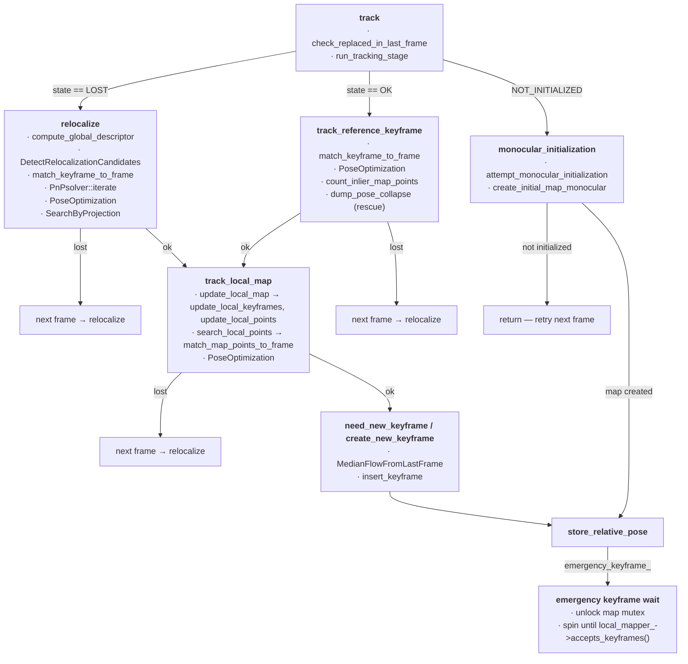

# `src/Tracking.cc`

<!-- Provenance: moved from the repo-root `allfeature.md` on 2026-09-19 (documentation plan). Function headings added for anchors; text otherwise verbatim. Line numbers are refreshed by docs/tools/resolve_links.py. -->

## Call graph

- **[`track`](https://github.com/alejandrofontan/AllFeature-VSLAM/blob/main/src/Tracking.cc#L117)** — [`check_replaced_in_last_frame`](https://github.com/alejandrofontan/AllFeature-VSLAM/blob/main/src/Tracking.cc#L430)
- **[`relocalize`](https://github.com/alejandrofontan/AllFeature-VSLAM/blob/main/src/Tracking.cc#L888)**
- **[`track_reference_keyframe`](https://github.com/alejandrofontan/AllFeature-VSLAM/blob/main/src/Tracking.cc#L450)**
- **[`monocular_initialization`](https://github.com/alejandrofontan/AllFeature-VSLAM/blob/main/src/Tracking.cc#L212)** — [`attempt_monocular_initialization`](https://github.com/alejandrofontan/AllFeature-VSLAM/blob/main/src/Tracking.cc#L220), [`create_initial_map_monocular`](https://github.com/alejandrofontan/AllFeature-VSLAM/blob/main/src/Tracking.cc#L318)
- **[`track_local_map`](https://github.com/alejandrofontan/AllFeature-VSLAM/blob/main/src/Tracking.cc#L541)** — [`update_local_map`](https://github.com/alejandrofontan/AllFeature-VSLAM/blob/main/src/Tracking.cc#L584), [`update_local_keyframes`](https://github.com/alejandrofontan/AllFeature-VSLAM/blob/main/src/Tracking.cc#L593), [`update_local_points`](https://github.com/alejandrofontan/AllFeature-VSLAM/blob/main/src/Tracking.cc#L676), [`search_local_points`](https://github.com/alejandrofontan/AllFeature-VSLAM/blob/main/src/Tracking.cc#L699)
- **[`need_new_keyframe`](https://github.com/alejandrofontan/AllFeature-VSLAM/blob/main/src/Tracking.cc#L734) / [`create_new_keyframe`](https://github.com/alejandrofontan/AllFeature-VSLAM/blob/main/src/Tracking.cc#L840)** — [`MedianFlowFromLastFrame`](https://github.com/alejandrofontan/AllFeature-VSLAM/blob/main/src/Tracking.cc#L855)
- **[`store_relative_pose`](https://github.com/alejandrofontan/AllFeature-VSLAM/blob/main/src/Tracking.cc#L206)**
- Not in the graph (setup / recovery): [`LoadParameters`](https://github.com/alejandrofontan/AllFeature-VSLAM/blob/main/src/Tracking.cc#L37), [`Tracking`](https://github.com/alejandrofontan/AllFeature-VSLAM/blob/main/src/Tracking.cc#L56), [`loadCameraParameters`](https://github.com/alejandrofontan/AllFeature-VSLAM/blob/main/src/Tracking.cc#L1149), [`ChangeCalibration`](https://github.com/alejandrofontan/AllFeature-VSLAM/blob/main/src/Tracking.cc#L1116), [`get_feature_extractor`](https://github.com/alejandrofontan/AllFeature-VSLAM/blob/main/src/Tracking_aux.cc#L91), [`grab_image`](https://github.com/alejandrofontan/AllFeature-VSLAM/blob/main/src/Tracking.cc#L82), [`reset`](https://github.com/alejandrofontan/AllFeature-VSLAM/blob/main/src/Tracking.cc#L1066)

