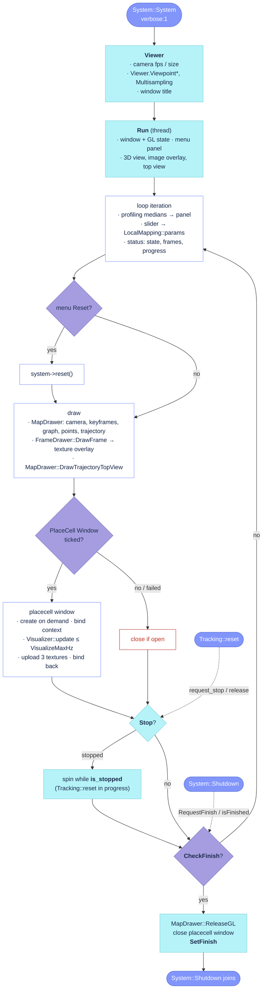

# `src/Viewer.cc`

The Pangolin front end: one thread that draws the map (through `MapDrawer`), the annotated current
frame (through `FrameDrawer`), a status/parameter panel, and, on demand, a second window with the
placecell diagnostics. It is created by `System` only when visualization is on (`verbose:1`);
without it nothing in the pipeline changes except that the two profiling medians it displays are
never pushed. The file has no `// #` section banners, so the functions below are grouped by role:
construction and settings, the render loop, the placecell window (a part of `Run`), and the
stop/finish protocol shared with `Tracking::reset` and `System::Shutdown`.

Sources: [`src/Viewer.cc`](https://github.com/alejandrofontan/AllFeature-VSLAM/blob/main/src/Viewer.cc#L40 "namespace AF_VSLAM"),
[`include/Viewer.h`](https://github.com/alejandrofontan/AllFeature-VSLAM/blob/main/include/Viewer.h#L40 "class Viewer").

## Call graph

- **[`Viewer`](https://github.com/alejandrofontan/AllFeature-VSLAM/blob/main/src/Viewer.cc#L43)** (constructor) — reads the camera and the `Viewer.*` viewpoint keys, builds the window title
- **[`Run`](https://github.com/alejandrofontan/AllFeature-VSLAM/blob/main/src/Viewer.cc#L125)** (thread body) — [`Stop`](https://github.com/alejandrofontan/AllFeature-VSLAM/blob/main/src/Viewer.cc#L594), [`is_stopped`](https://github.com/alejandrofontan/AllFeature-VSLAM/blob/main/src/Viewer.cc#L588), [`CheckFinish`](https://github.com/alejandrofontan/AllFeature-VSLAM/blob/main/src/Viewer.cc#L563), [`SetFinish`](https://github.com/alejandrofontan/AllFeature-VSLAM/blob/main/src/Viewer.cc#L569); delegates drawing to `MapDrawer::Draw*` and `FrameDrawer::DrawFrame`, the placecell panels to `placecell::viz::Visualizer`
- **Stop protocol** (caller: `Tracking::reset`): [`request_stop`](https://github.com/alejandrofontan/AllFeature-VSLAM/blob/main/src/Viewer.cc#L581) → [`is_stopped`](https://github.com/alejandrofontan/AllFeature-VSLAM/blob/main/src/Viewer.cc#L588) … [`release`](https://github.com/alejandrofontan/AllFeature-VSLAM/blob/main/src/Viewer.cc#L612)
- **Finish protocol** (caller: `System::Shutdown`): [`RequestFinish`](https://github.com/alejandrofontan/AllFeature-VSLAM/blob/main/src/Viewer.cc#L557) → [`isFinished`](https://github.com/alejandrofontan/AllFeature-VSLAM/blob/main/src/Viewer.cc#L575)
- Header-only, not drawn: `set_grab_image_time_median` / `set_runLocalMapping_time_median` (the two profiling feeds, [`Viewer.h`](https://github.com/alejandrofontan/AllFeature-VSLAM/blob/main/include/Viewer.h#L70 "set_grab_image_time_median")), `GetWindowTitle` ([`Viewer.h`](https://github.com/alejandrofontan/AllFeature-VSLAM/blob/main/include/Viewer.h#L64 "GetWindowTitle")); the file-local `trackingStateName` ([`Viewer.cc`](https://github.com/alejandrofontan/AllFeature-VSLAM/blob/main/src/Viewer.cc#L111 "std::string trackingStateName")) maps `TrackingState` to the status label.

## Flow



## Construction and settings

### `Viewer`

```cpp
Viewer::Viewer(System* system, std::shared_ptr<FrameDrawer> frameDrawer,
               std::shared_ptr<MapDrawer> mapDrawer, std::shared_ptr<Tracking> tracker,
               const string &strCalibrationPath, const string &strSettingPath,
               const vector<FeatureType>& featureTypes)
```
- stores the non-owning `System*` (System owns the Viewer and joins its thread, so it always outlives it) and the shared drawers and tracker; starts with `mbFinished = true`, `mbStopped = true`, so `isFinished`/`is_stopped` answer "idle" until `Run` clears them.
- reads the calibration with yaml-cpp: the camera whose `cam_name` equals the settings' `cam_mono`, its `fps` (values below 1 become 30) and `image_dimension`. `mT = 1000/fps`, `image_width`, `image_height` are stored but nothing in this file reads them afterwards ([`Viewer.cc`](https://github.com/alejandrofontan/AllFeature-VSLAM/blob/main/src/Viewer.cc#L66 "float fps = cam")).
- reads the viewpoint keys with `cv::FileStorage`: `Viewer.ViewpointX/Y/Z/F` unconditionally through the `cv::FileNode` float conversion (no missing-key guard), `Viewer.Multisampling` only if present, clamped at 0 ([`Viewer.cc`](https://github.com/alejandrofontan/AllFeature-VSLAM/blob/main/src/Viewer.cc#L83 "mViewpointX = fSettings")). Both blocks are echoed with `AF_CONFIG_*`.
- builds the window title `VSLAM-LAB | AllFeature-VSLAM ( <feature names> )`; `System::Shutdown` reads it back through `GetWindowTitle` to rebind the GL context after the thread has been joined ([`System.cc`](https://github.com/alejandrofontan/AllFeature-VSLAM/blob/main/src/System.cc#L452 "BindToContext(viewer->GetWindowTitle())")).
- called from: [`System::System`](https://github.com/alejandrofontan/AllFeature-VSLAM/blob/main/src/System.cc#L247 "viewer = make_shared<Viewer>"), only when `activateVisualization` (`verbose:1`); the same block starts the thread on `Run` and hands the viewer to `Tracking` and `LocalMapping` (`set_viewer`), which feed the two profiling medians.
- settings: `Viewer.ViewpointX`, `Viewer.ViewpointY`, `Viewer.ViewpointZ`, `Viewer.ViewpointF`, `Viewer.Multisampling` (see the table); `cam_mono` from the settings and `fps` / `image_dimension` from the calibration.

## Render loop

### `Run`

```cpp
void Viewer::Run()
```
- thread body, started by [`System::System`](https://github.com/alejandrofontan/AllFeature-VSLAM/blob/main/src/System.cc#L250 "mptViewer = make_shared<thread>"). Clears `mbFinished`/`mbStopped`, creates the main window (1.25 × 1280×720) and, when `Viewer.Multisampling > 0`, asks Pangolin for a multisampled framebuffer and logs whether the backend granted it (the shipped EGL-based X11 backend ignores the request; MSAA is enabled only when `GL_SAMPLES` reports samples). Depth test, alpha blending and point/line smoothing are enabled for the whole window.
- **layout**: a left menu panel of 28 % of the width; the 3D view (`d_cam`, `Handler3D` on the render state built from `Viewer.Viewpoint*`) fills the rest; the annotated frame is a texture overlay in the 3D view's top-right corner (`d_img`, 40 % of the view width, texture re-created lazily when the frame size changes); a top-down trajectory minimap sits in the bottom-right corner (`d_top`, square in pixels; `MapDrawer::DrawTrajectoryTopView` does the orthographic fit).
- **menu panel**, top to bottom ([`Viewer.cc`](https://github.com/alejandrofontan/AllFeature-VSLAM/blob/main/src/Viewer.cc#L189 "menuModality")):
  - status: `Modality` (`System::GetModalityDescription`), `Status` (tracking state name), `Frames Tracked` (`tracker->num_tracked_frames_ / System::GetSequenceImageCount`), `Progress %` (`System::GetFramesProcessedCount` over the sequence count), `Reset` button → `system->reset()` on this thread, flag cleared at once;
  - PERFORMANCE: read-only `Tracking (ms)` and `Local Mapping (ms)` from the two medians pushed under `mutexProfileStats` by `Tracking::grab_image` and `LocalMapping::process_keyframe`;
  - LOCAL MAPPING: slider `KF Max Unexplained` (tau), seeded from `LocalMapping::params.keyframe_culling_max_unexplained` and **written back every iteration** to that atomic, so the culler ([`LocalMapping.cc`](https://github.com/alejandrofontan/AllFeature-VSLAM/blob/main/src/LocalMapping.cc#L624 "cull_parameters.max_unexplained = params.keyframe_culling_max_unexplained.load()")) and the insertion policy ([`Tracking.cc`](https://github.com/alejandrofontan/AllFeature-VSLAM/blob/main/src/Tracking.cc#L937 "const float tau = LocalMapping::params.keyframe_culling_max_unexplained.load()")) follow the slider live; this is the only settings value the viewer edits;
  - VISUALIZATION: `Follow Camera`, `Aerial View` (switches the model-view between the configured viewpoint and a top-down look-at), `Dark Theme` (clear colour and `ViewerStyle::darkTheme`), `Depth Fog`; element toggles `Show Map Points` / `KeyFrames` / `Graph` / `Trajectory` / `Top View`; `PlaceCell Window` (created only when `System::GetPlaceCell()` is non-null, i.e. `vpr: megaloc`, seeded from `PlaceCell.Visualize`); `Color: Feature` / `Color: RGB` as two checkboxes behaving as radio buttons (exactly one on, seeded from `Viewer.PointColorMode`); sliders `Point Size`, `Trajectory Width`, `KeyFrame Width`, `Graph Width`, `Camera Width`, seeded from `MapDrawer::GetDefaultStyle()`.
- **per iteration**: clear with the theme colour; copy the medians into the panel; store the slider into `LocalMapping::params`; refresh the status strings; assemble a `ViewerStyle` from the widgets (sizes not exposed as widgets, `keyFrameSize`, `cameraSize`, `fogStart`, `fogEnd`, come from the drawer defaults); fetch `Twc` from `MapDrawer::GetCurrentOpenGLCameraMatrix`, apply aerial/follow; run the reset if requested; draw camera, keyframes+graph, points, trajectory through `MapDrawer`; upload `FrameDrawer::DrawFrame()` into the overlay texture; draw the top view; `pangolin::FinishFrame()`.
- **placecell window** (second Pangolin window, same thread, [`Viewer.cc`](https://github.com/alejandrofontan/AllFeature-VSLAM/blob/main/src/Viewer.cc#L463 "const bool wantPlaceCellWindow")): while the toggle is on and no failure was recorded, the window (1500×600) with its three views and textures is created lazily on the first iteration it is wanted, together with a windowless `placecell::viz::Visualizer` (`windows = false`, because the OpenCV in the pixi env is headless; `max_hz = 0`, throttled here instead); every later iteration binds its context. If `pangolin::ShouldQuit()` reports that the user closed it, the window is destroyed and the menu toggle unticked. Otherwise, at most every `1 / PlaceCell.VisualizeMaxHz` seconds, `Visualizer::update` is called and the kernel heatmap (left), alive-information strip (bottom right) and information history (above it) are uploaded as `GL_BGR` textures at 1:1 pixels; the three textures are drawn, the frame finished and the main context rebound. Any exception disables the window for the rest of the run with one `AF_WARN`. Unticking the toggle closes the window on the next iteration. Panel geometry (kernel side from the window height minus the title strip, plots split 64/36 of the remaining width) is fixed at `Run` start from `PlaceCell.VisualizeCentred` and `PlaceCell.VisualizeHistoryLastN`.
- **stop / finish**: after the frame, [`Stop`](#stop) turns a pending `request_stop` into `mbStopped = true` and the loop spins in 3 ms sleeps while [`is_stopped`](#is_stopped) (until `Tracking::reset` calls [`release`](#release)); then [`CheckFinish`](#checkfinish) breaks the loop. On exit, with the main context current: `MapDrawer::ReleaseGL()`, close the placecell window if open, [`SetFinish`](#setfinish).
- settings: `Viewer.Multisampling`, `Viewer.Viewpoint*` (from the constructor); the drawer defaults seeded from `Viewer.PointSize`, `Viewer.TrajectoryLineWidth`, `Viewer.KeyFrameLineWidth`, `Viewer.GraphLineWidth`, `Viewer.CameraLineWidth`, `Viewer.PointColorMode`, `Viewer.DepthFog` (read by `MapDrawer`); `PlaceCell.Visualize`, `PlaceCell.VisualizeMaxHz`, `PlaceCell.VisualizeCentred`, `PlaceCell.VisualizeHistoryLastN` (read by `PlaceCellSettings`, taken through `System::GetPlaceCellSettings`).

## Stop protocol

Used by `Tracking::reset` to freeze drawing while the map is wiped: the viewer thread parks inside `Run` and is released when the reset is done.

### `request_stop`

```cpp
void Viewer::request_stop()
```
- sets `mbStopRequested` under `mMutexStop`, unless the viewer is already stopped (then the request is a no-op and the caller's `is_stopped` wait passes at once).
- called from: [`Tracking::reset`](https://github.com/alejandrofontan/AllFeature-VSLAM/blob/main/src/Tracking.cc#L1207 "viewer_->request_stop()"), which then polls [`is_stopped`](#is_stopped) every 3 ms before touching the map.

### `is_stopped`

```cpp
bool Viewer::is_stopped()
```
- `mbStopped` under `mMutexStop`. `true` from construction until `Run` starts, then only between [`Stop`](#stop) accepting a request and [`release`](#release).
- called from: `Tracking::reset` (the wait), and `Run` itself (the spin while stopped).

### `Stop`

```cpp
bool Viewer::Stop()
```
- private, once per loop iteration after the frame is finished. Takes both mutexes (`mMutexStop`, then `mMutexFinish`): a pending finish wins over a pending stop (`false`, so the loop proceeds to [`CheckFinish`](#checkfinish) and exits instead of parking); otherwise a pending stop request becomes `mbStopped = true`, the request is cleared and `true` tells `Run` to spin.

### `release`

```cpp
void Viewer::release()
```
- clears `mbStopped` under `mMutexStop`; `Run`'s spin sees `is_stopped() == false` and resumes drawing.
- called from: [`Tracking::reset`](https://github.com/alejandrofontan/AllFeature-VSLAM/blob/main/src/Tracking.cc#L1250 "viewer_->release()"), after the map, the VPR database and the ids have been reset.

## Finish protocol

Used by `System::Shutdown` to end the thread before joining it.

### `RequestFinish`

```cpp
void Viewer::RequestFinish()
```
- sets `mbFinishRequested` under `mMutexFinish`. `Run` notices at the end of its current iteration; a parked (stopped) viewer is not woken by this, `Stop` merely stops re-parking once the request is set.
- called from: [`System::Shutdown`](https://github.com/alejandrofontan/AllFeature-VSLAM/blob/main/src/System.cc#L434 "viewer->RequestFinish()"), which then polls [`isFinished`](#isfinished) every 5 ms and joins the thread afterwards.

### `CheckFinish`

```cpp
bool Viewer::CheckFinish()
```
- private, `mbFinishRequested` under `mMutexFinish`; the loop's exit condition in `Run`.

### `SetFinish`

```cpp
void Viewer::SetFinish()
```
- private, `mbFinished = true` under `mMutexFinish`; the last statement of `Run`, after `MapDrawer::ReleaseGL` and the placecell window teardown, so `Shutdown` sees the GL objects already freed when the wait returns.

### `isFinished`

```cpp
bool Viewer::isFinished()
```
- `mbFinished` under `mMutexFinish`. Starts `true` (constructor), cleared by `Run`'s first statement, set by [`SetFinish`](#setfinish).
- called from: [`System::Shutdown`](https://github.com/alejandrofontan/AllFeature-VSLAM/blob/main/src/System.cc#L435 "while(!viewer->isFinished())").

## Settings read by this file

| Key | Default | Read in | Effect |
|---|---|---|---|
| `Viewer.ViewpointX` | 0 (header `mViewpointX`; a missing key reads as 0) | [`Viewer`](#viewer) | eye position of the initial 3D view, restored when `Aerial View` is unticked |
| `Viewer.ViewpointY` | -0.7 (header; missing key → 0) | [`Viewer`](#viewer) | as above; also the height of the aerial look-at |
| `Viewer.ViewpointZ` | -1.8 (header; missing key → 0) | [`Viewer`](#viewer) | as above |
| `Viewer.ViewpointF` | 500 (header; missing key → 0) | [`Viewer`](#viewer) | focal length of the 3D view's projection matrix |
| `Viewer.Multisampling` | 0 | [`Viewer`](#viewer) | MSAA samples requested for the main window in [`Run`](#run); advisory on the shipped Pangolin, outcome logged |
| `cam_mono` (settings), `fps`, `image_dimension` (calibration) | — | [`Viewer`](#viewer) | selects the camera; `fps < 1` is treated as 30; the values are stored but not used by this file |

Consumed through other classes (documented where they are read): `Viewer.KeyFrameSize`,
`Viewer.KeyFrameLineWidth`, `Viewer.GraphLineWidth`, `Viewer.PointSize`, `Viewer.CameraSize`,
`Viewer.CameraLineWidth`, `Viewer.TrajectoryLineWidth`, `Viewer.PointColorMode`,
`Viewer.MapPointsRefreshHz`, `Viewer.DepthFog`, `Viewer.FogStart`, `Viewer.FogEnd` → `MapDrawer`
(`GetDefaultStyle` seeds the widgets); `PlaceCell.Visualize`, `PlaceCell.VisualizeMaxHz`,
`PlaceCell.VisualizeCentred`, `PlaceCell.VisualizeHistoryLastN` → `PlaceCellSettings`
(`System::GetPlaceCellSettings`); `LocalMapping.KeyframeCullingMaxUnexplained` → `LocalMapping::LoadParameters`
(the `KF Max Unexplained` slider's seed and target).
